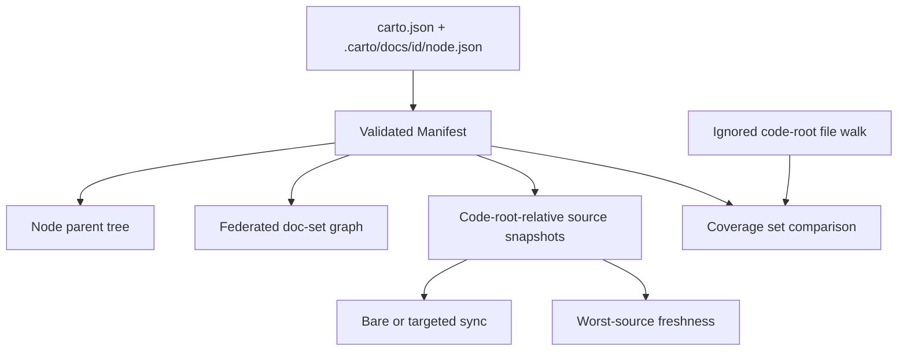

# One manifest, several derived views

The [overview](carto:overview) places this model in the wider system. Inside the core, the central idea is narrower: Carto assembles one validated `Manifest`, then derives navigation, federation, source synchronization, freshness, and coverage from it without collapsing those concerns into one structure. The runtime types make this composition explicit: a manifest is the validated configuration plus an ordered array of nodes, and each node is validated metadata plus the id supplied by its directory. `packages/core/src/schema.ts:80-87`

## Assembly establishes the shared input

`carto.json` defines the locale and federation-level configuration, while the path module fixes each authored bundle at `.carto/docs/<id>` and each `node.json` defines that node's optional parent and source list. Defaults are applied during schema parsing, including empty `sources` and `federated` arrays; cross-field checks reject invalid locale relationships, the reserved federation alias `self`, and duplicate aliases. `packages/core/src/paths.ts:1-16` `packages/core/src/schema.ts:43-77`

Manifest loading parses `carto.json`, discovers valid node-id directories through the canonical `.carto/docs/` path, sorts those ids, and loads their `node.json` files in that order. The directory name becomes the node id only after the node metadata has passed validation; malformed configuration or node metadata becomes a `ManifestError`, while a directory without `node.json` contributes no node. `packages/core/src/paths.ts:1-16` `packages/core/src/manifest.ts:21-35` `packages/core/src/manifest.ts:68-80` `packages/core/src/manifest.ts:82-131`

Everything below is therefore a derived structure or operation over the same manifest, not another competing source of truth. The tree follows node parents, the federation graph follows doc-set entries, source operations compare file bytes with stored snapshots, and coverage compares declared paths with a separately walked file set. `packages/core/src/tree.ts:3-29` `packages/core/src/graph.ts:44-88` `packages/core/src/manifest.ts:208-236` `packages/core/src/status.ts:27-53` `packages/core/src/coverage.ts:60-68`

## The node tree is not the federation graph

The node tree relates pages inside one manifest. A node's optional `parent` is enough to compute children and a root-to-node chain, but the schema checks only that the parent has a valid id shape. A separate structural pass reports dangling parents and deduplicated parent cycles, so schema validity does not imply tree validity. `packages/core/src/schema.ts:43-46` `packages/core/src/tree.ts:3-29` `packages/core/src/tree.ts:32-68`

The federation graph operates on a different unit: each vertex is a `DocSet` containing a document root, its own manifest, a route prefix, and aliases to other doc-set identities. File-based federation entries are resolved from the current document root; identity is an eight-character SHA-256 prefix of the root-relative real path. `packages/core/src/graph.ts:7-19` `packages/core/src/graph.ts:28-42`

Graph loading indexes a doc set before descending through its federation entries. Repeated or cyclic references to the same identity therefore reuse the indexed doc set instead of recursively creating another one. After loading, the root receives either an empty prefix or `/self`, while each federated child receives a stable prefix based on its lexicographically smallest alias and identity hash. `packages/core/src/graph.ts:44-88`

The practical distinction is simple: changing a node's `parent` changes its place in that manifest's page tree; changing federation changes which whole manifests participate in the doc-set graph. Neither structure is a substitute for the other. `packages/core/src/tree.ts:9-29` `packages/core/src/graph.ts:7-19`

## Sources are code-root-relative snapshots

A source `file` must use a non-empty relative path with forward slashes and no `..` segment. Its stored `hash` is optional, and a stored `commit` is allowed only when a hash is present. The configured code root resolves relative to the document root and defaults to the document root itself. `packages/core/src/schema.ts:5-25` `packages/core/src/manifest.ts:6-8`

The hash is content identity, not a path or commit identity: Carto reads the raw file bytes, computes SHA-256, and stores the first 16 hexadecimal characters. Synchronization resolves each declared file beneath the supplied code root and can record the current commit beside that hash. `packages/core/src/hash.ts:4-10` `packages/core/src/manifest.ts:169-185`

Bare and targeted synchronization intentionally answer different requests. With no targets, Carto hashes only sources that lack a stored hash, leaving already-synchronized entries untouched. Once targets are supplied, it rejects unknown node ids and re-hashes every source of each selected node, so a stale snapshot can be deliberately refreshed. Sources outside the selected nodes remain unchanged. `packages/core/src/manifest.ts:187-205` `packages/core/src/manifest.ts:208-232`

If a declared file is missing, its existing metadata is retained while the missing path is collected, and the synchronization operation ultimately fails rather than returning a partially successful manifest. `packages/core/src/manifest.ts:169-185` `packages/core/src/manifest.ts:233-236`

## Freshness is the worst source state

Freshness re-hashes every declared source beneath the supplied code root. An absent file is `missing`; an existing file without a stored hash is `unsynced`; otherwise byte-hash equality selects `fresh` or `stale`. Commit metadata is carried into the report, but it does not participate in that decision. `packages/core/src/status.ts:27-46`

A node receives the worst state among its sources under the explicit priority `fresh < unsynced < stale < missing`. The report applies that classification to every manifest node in manifest order. Thus one missing source makes the whole node missing even if every other source is fresh. `packages/core/src/status.ts:5-21` `packages/core/src/status.ts:27-33` `packages/core/src/status.ts:49-53`

## Coverage is a separate set comparison

Coverage does not inspect stored hashes or freshness states. It builds an ignore matcher from built-in exclusions plus `.gitignore` and `.cartoignore`, recursively walks non-ignored regular files beneath the code root, and normalizes their relative paths. `packages/core/src/coverage.ts:10-14` `packages/core/src/coverage.ts:20-57`

It then optionally excludes a nested document root, creates a set of every declared source path, and subtracts that set from the walked files. `total` is the walked-file count, `uncovered` is the sorted difference, and `covered` is `total` minus that difference. A project can therefore have fresh documentation sources and still have uncovered code, because freshness asks whether declared snapshots match bytes while coverage asks whether walked files are declared at all. `packages/core/src/coverage.ts:60-68` `packages/core/src/status.ts:27-52`

Continue with the [CLI workflow](carto:cli-workflow) for the command-facing use of these operations, or [site rendering](carto:site-rendering) for the downstream documentation surface.
