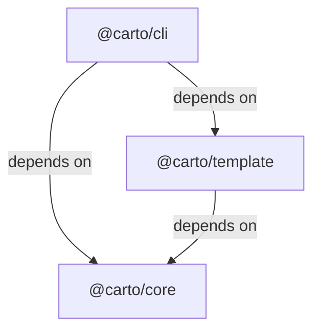

# Carto architecture

Carto separates **documentation judgment**, **repository semantics**, **command orchestration**, and **site rendering**. The author or coding agent decides what deserves a page and writes the localized, evidence-backed source. The packages then turn that authored bundle into a checked model and, when requested, a published site. This boundary is the useful starting point: Carto automates the deterministic mechanics, but it does not replace the author’s understanding of the codebase. `skills/carto/SKILL.md:9-20`

## Where responsibility lives

The repository root is the monorepo control plane rather than another runtime layer. It fixes the Node and pnpm baseline, fans `build` and `typecheck` across workspaces, and owns the shared Vitest and pipeline commands. `package.json:5-24`

The runtime dependency graph points in one direction:

- **`@carto/core` is the repository-semantics layer.** Its runtime dependencies are `zod` and `ignore`; its public surface provides the disk model, validation primitives, tree and link resolution, freshness, and coverage behavior. `packages/core/package.json:9-27` `packages/core/src/index.ts:1-10`
- **`@carto/cli` is the user-facing control plane.** It publishes the `carto` binary. `packages/cli/package.json:9-26`
- **`@carto/template` is the presentation boundary.** It exports the rendering module and brings in Astro, Starlight, and Mermaid for site materialization and presentation. `packages/template/package.json:9-30`

This one-way graph keeps repository semantics below both command orchestration and presentation, so the focused pages can own behavioral change surfaces without reversing package responsibilities. `packages/cli/package.json:23-26` `packages/template/package.json:25-30`

## From an authoring request to a site

1. **Scope and author.** The authoring contract turns a human request into a bounded node set with executable evidence, a view-spine coverage map, and native locale pages; separate correctness and presentation audits gate the first sync. [Authoring workflow](carto:authoring-workflow) explains that judgment-heavy loop. `skills/carto/SKILL.md:39-110`
2. **Interpret the document set.** Core exposes the schema, manifest, tree, graph, and resolver facilities that give node bundles their in-memory meaning. Follow their contracts through [Document model](carto:document-model) and [Navigation and federation](carto:navigation-federation). `packages/core/src/index.ts:1-10`
3. **Measure and bless deliberately.** Continue with [Freshness and scope](carto:freshness-scope) for hashes, coverage, status, and targeted sync.
4. **Apply command gates.** Use [CLI workflow](carto:cli-workflow) to trace initialization, validation, sync, build, and preview from the executable entry.
5. **Build and publish, then preview.** For a build, the template package converts the trusted graph and localized MDX into a Starlight workspace, runs Astro, and publishes `dist-site`. Preview does not materialize the document set: it requires and serves an already-built `dist-site`. `packages/template/src/render.ts:19-39` `packages/template/src/render.ts:42-76` The complete lifecycle and safe publication boundary are covered in [Rendering pipeline](carto:rendering-pipeline).

This sequence is not a second copy of the implementation. It is the ownership map to use when tracing a failure: authored evidence first, core interpretation second, CLI gate third, template output last.

## Choose the next page

- To create or refresh documentation safely, start with [Authoring workflow](carto:authoring-workflow).
- To follow a command from executable entry to its delegated behavior, use [CLI workflow](carto:cli-workflow).
- To understand `carto.json`, node identity, serialization, and sync scope, use [Document model](carto:document-model).
- To reason about hashes, stale states, coverage, and what sync certifies, use [Freshness and scope](carto:freshness-scope).
- To trace parent trees, logical links, localized paths, and external doc sets, use [Navigation and federation](carto:navigation-federation).
- To follow MDX through materialization, Astro build, atomic publication, and preview of the built site, use [Rendering pipeline](carto:rendering-pipeline).
- To understand the supported source installation and update transaction, use [Installation](carto:installation).
- To see what CI proves versus what the model evaluation measures, use [Verification](carto:verification).
