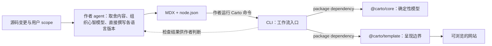

Carto 要维护的不是一份 API 清单，而是能随代码演进的心智地图。决定读者需要理解什么、页面边界画在哪里、哪些代码足以支撑结论，都需要阅读上下文并作出解释性取舍，因此由作者 agent 负责；文件哈希、结构检查和站点生成则适合交给确定性工具。`skills/carto/SKILL.md:8-18` `skills/carto/SKILL.md:34-38`

多语言文档也遵循这条分工：先为每个节点制定一份各语言共用、与语言无关的证据计划，再根据代码分别用对应语言直接撰写。各语言版本保持事实、源码锚点和 `carto:` 目标一致，但不必逐句逐段对应；这仍需要编写者作出判断，工具链不会先生成一种语言再翻译成其他语言。`skills/carto/SKILL.md:240-259`

## 三个包只接管可机械化的部分

**core 汇总文档集的底层模块。** 它的公共入口统一导出 schema、hash、固定 `.carto/docs/<id>` 布局的路径模块，以及 manifest、tree、resolver、graph、status 与 coverage；文章如何解释代码仍由作者决定。`packages/core/src/index.ts:1-10` `packages/core/src/paths.ts:1-16` `skills/carto/SKILL.md:8-18`

**CLI 是工作流入口。** 包依赖把 `@carto/core` 和 `@carto/template` 接到同一个命令行进程，并由 `citty` 组织命令。`packages/cli/package.json:23-27` 它公开 `init`、`status`、`sync`、`coverage`、`validate`、`preview` 与 `build`，把检查、固化和发布串成作者可反复执行的操作面。`packages/cli/src/main.ts:10-20`

**template 是呈现边界。** 它的公共入口导出版本号、站点配置与渲染能力；MDX 和节点元数据仍由作者产出，模板负责把这组输入变成网站。`packages/template/src/index.ts:1-3` `skills/carto/SKILL.md:15-18`

下面的图只表达职责流向：判断始终回到作者，工具返回可复现的状态，再把已确认的文档送入渲染端。

这是一张职责与依赖图，不表示每条边都是直接函数调用：skill 规定作者与工具的分工，CLI 包声明对 core 和 template 的依赖，而两个包的公共入口分别暴露存储路径、模型能力与渲染能力。`skills/carto/SKILL.md:15-18` `packages/cli/package.json:23-27` `packages/core/src/index.ts:1-10` `packages/core/src/paths.ts:1-16` `packages/template/src/index.ts:1-3`

## 维护闭环从源码变化开始

一次维护先根据用户给定的范围确定具体目标：`status` 提供过期节点候选，`coverage` 提供尚未被任何节点覆盖的源码候选，作者再用用户指定的范围筛选这两类候选。随后更新相应的 `node.json`，为每个节点制定一份与语言无关、供各语言版本共用的证据计划，并直接写齐配置中声明的语言版本。`skills/carto/SKILL.md:49-72`

内容确认后，定向 `sync <id>` 重算这些节点的源码哈希并记录当前 commit；`validate` 检查 schema、树、链接和同步状态；最后再用 `status` 确认本次触及的节点全部回到 `fresh`。以后被跟踪源码发生变化，相关节点会重新离开 `fresh` 状态，无需无差别重写整站。`skills/carto/SKILL.md:73-91`

这种闭环让“写什么、怎么讲”保留在人能审阅的文档中，让“哪里变了、结构是否成立、能否发布”成为重复执行也得到同一结果的机械步骤。想继续追踪各边界，可分别阅读 [core 的模型与状态](carto:core-model)、[CLI 的维护流程](carto:cli-workflow) 和 [站点渲染链路](carto:site-rendering)。
