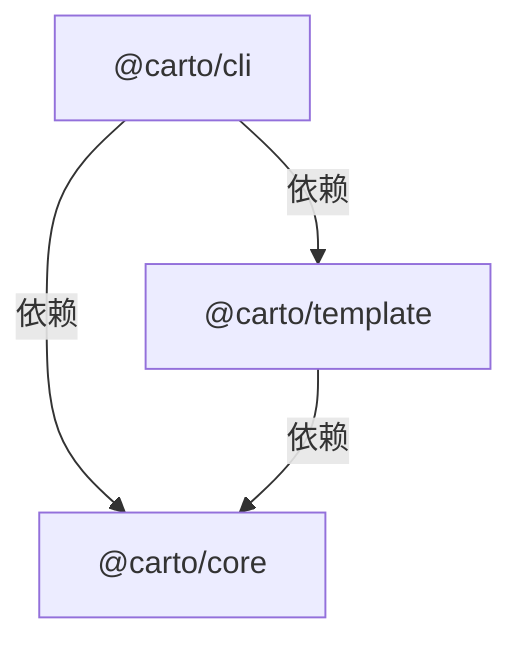

# Carto 架构总览

Carto 把**文档判断**、**仓库语义**、**命令编排**和**站点渲染**分开处理。作者或编码代理决定哪些内容值得成为页面，并写出带证据、按语言独立成文的源文件；各个包再把这些文档转成经过检查的模型，并在需要时发布为站点。理解这条边界很重要：Carto 自动化的是确定性的机械工作，而不是替作者理解代码库。`skills/carto/SKILL.md:9-20`

## 职责分别在哪里

仓库根目录是 monorepo 的控制面，并非额外的运行时层。它统一 Node 与 pnpm 基线，通过 workspace 递归执行 `build` 和 `typecheck`，同时承载共享的 Vitest 与流水线命令。`package.json:5-24`

运行时依赖始终朝同一个方向流动：

- **`@carto/core` 负责仓库语义。** 它的运行时依赖只有 `zod` 和 `ignore`，公共导出向上层提供磁盘模型、校验原语、树与链接解析、新鲜度及覆盖率能力。`packages/core/package.json:9-27` `packages/core/src/index.ts:1-10`
- **`@carto/cli` 是面向用户的控制面。** 它发布 `carto` 可执行文件。`packages/cli/package.json:9-26`
- **`@carto/template` 是展示边界。** 它导出渲染模块，并引入 Astro、Starlight 与 Mermaid 来完成站点物化和呈现。`packages/template/package.json:9-30`

这条单向依赖图让仓库语义同时位于命令编排和展示层之下，各专题页面可以分别承担行为改动面，而不必反转包职责。`packages/cli/package.json:23-26` `packages/template/package.json:25-30`

## 一次编写请求如何到达站点

1. **确定范围并编写。** 编写契约把人的需求转成边界明确的节点集合，其中包含可执行证据、view-spine coverage map 和分别写作的各语言页面；第一次同步前还要通过独立的正确性与展示审计。这一判断密集型循环见[编写工作流](carto:authoring-workflow)。`skills/carto/SKILL.md:39-110`
2. **解释文档集。** core 导出 schema、manifest、tree、graph 与 resolver 等能力，让节点包在内存中获得明确语义；具体契约见[文档模型](carto:document-model)和[导航与联邦](carto:navigation-federation)。`packages/core/src/index.ts:1-10`
3. **度量，并且只确认审阅过的范围。** 哈希、覆盖率、状态与定向同步的规则见[新鲜度与范围](carto:freshness-scope)。
4. **经过命令门禁。** 要从可执行入口追踪初始化、校验、同步、构建与预览，请读 [CLI 工作流](carto:cli-workflow)。
5. **先构建发布，再预览。** 执行构建时，template 把可信图和本地化 MDX 转成 Starlight 工作区，运行 Astro，并发布 `dist-site`。预览不会重新物化文档集，而是要求 `dist-site` 已经构建完成，并直接提供该产物。`packages/template/src/render.ts:19-39` `packages/template/src/render.ts:42-76` 完整生命周期与安全发布边界见[渲染流水线](carto:rendering-pipeline)。

这段顺序不是实现细节的重复清单，而是排查问题时可用的所有权地图：先看文档证据，再看 core 如何解释，然后看 CLI 的门禁，最后看 template 的输出。

## 接下来读哪一页

- 要安全地新建或刷新文档，从[编写工作流](carto:authoring-workflow)开始。
- 要从可执行入口一路追踪命令如何下交行为，阅读 [CLI 工作流](carto:cli-workflow)。
- 要理解 `carto.json`、节点身份、序列化与同步范围，阅读[文档模型](carto:document-model)。
- 要理解哈希、陈旧状态、覆盖率以及 sync 到底确认了什么，阅读[新鲜度与范围](carto:freshness-scope)。
- 要追踪父子树、逻辑链接、本地化路径和外部文档集，阅读[导航与联邦](carto:navigation-federation)。
- 要跟随 MDX 的物化、Astro 构建与原子发布，并了解如何预览已构建的站点，阅读[渲染流水线](carto:rendering-pipeline)。
- 要了解受支持的源码安装与更新事务，阅读[安装](carto:installation)。
- 要区分 CI 确定性证明的行为与模型评测衡量的行为，阅读[验证](carto:verification)。
