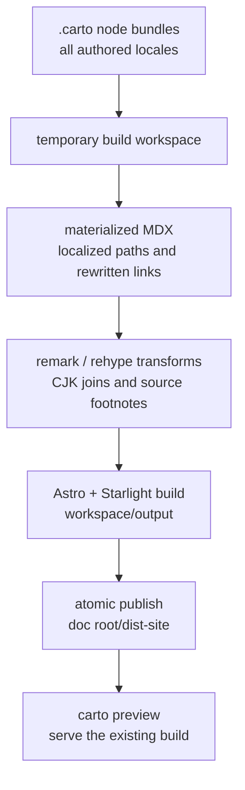

An authored Carto page is not handed directly to Astro. Carto projects the documentation graph into a disposable Starlight workspace, builds there, and replaces `dist-site` only after the build succeeds.



The CLI remains a thin handoff: `carto build` passes the current directory to the template package and turns a thrown error into a failing process. `packages/cli/src/commands/build.ts:1-14` The renderer owns workspace construction, materialization, Astro, publication, and cleanup. `packages/template/src/render.ts:19-39`

## Build in an isolated workspace

`buildSite` makes that ownership and control flow explicit:

```text
buildCommand.run()
└─ buildSite(process.cwd())
   ├─ resolve doc root; create real carto-render-* workspace
   ├─ create Astro cache; link dependencies
   ├─ write content and Astro configuration
   ├─ materialize(root, workspace/src/content/docs)
   ├─ runAstro(build, output = workspace/output)
   ├─ publish(workspace/output, root/dist-site)
   └─ finally: remove workspace
```

`packages/cli/src/commands/build.ts:4-13` `packages/template/src/render.ts:19-39`

The authored `.carto` bundles therefore remain the source of truth, and incomplete Astro output cannot become the public site. The generated workspace files merely re-export the template's compiled content collection and shared Astro configuration rather than forking those contracts per repository. `packages/template/src/render.ts:126-137`

### Dependency linking without reinstalling

Carto synthesizes the workspace's `node_modules` from template dependencies first and then dependencies installed at the documentation root; an existing destination wins. Most packages become directory symlinks, while Starlight is copied with symlinks dereferenced so package-local resolution stays coherent in the temporary tree. Scoped package directories are traversed recursively. `packages/template/src/render.ts:86-123`

The shared Astro configuration reads authored data through `CARTO_ROOT` and generated content through `CARTO_WORKSPACE`. It points source and cache paths into the workspace, loads the graph, user configuration, titles, and source-footnote page map, and installs CJK joining, source-footnote remark/rehype passes, Mermaid, and Starlight with Carto-owned locales and sidebar data. `packages/template/astro.config.mjs:10-34`

## Materialize the authored graph

Materialization is a page-by-page data flow, not an in-place edit:

```text
loadGraph(root)
├─ collectGraphTitles(graph)
├─ collectFreshness(graph)
└─ for each doc set × node × site locale
   ├─ choose requested locale or doc-set default; warn on fallback
   ├─ read authored locale page
   ├─ rewriteLinks(page, localized graph context)
   ├─ injectStalenessBanner(page, node status)
   ├─ targetPath(parent chain, locale prefix, federation prefix)
   └─ write generated MDX
```

`packages/template/src/materialize.ts:21-49` `packages/template/src/materialize.ts:85-123`

The output path preserves the node's parent chain. Non-default locales gain a locale prefix, and federated sets gain their graph prefix. Logical `carto:` Markdown targets become localized URLs here; empty labels fall back through the target locale title, default-locale title, and node id. An unresolvable target remains unchanged rather than being guessed. `packages/core/src/tree.ts:13-29` `packages/core/src/graph.ts:44-89` `packages/core/src/resolver.ts:52-84` See [navigation and federation](carto:navigation-federation) for identity and URL resolution.

### Rendering-only source and language transforms

Before Markdown transformation, Carto maps every generated page to its effective locale and exact `node.json` source set, including localized and federated targets. `packages/template/src/remark-source-footnotes.ts:46-60`

The remark pass converts eligible inline-code citations into deduplicated footnotes and appends their definitions. It accepts exact tracked paths and repository-relative `path:line` or ascending `path:start-end` addresses; code blocks, links, existing footnotes, definitions, and JSX stay untouched. The authored MDX keeps canonical machine-readable anchors while the site receives compact source notes. `packages/template/src/remark-source-footnotes.ts:63-91` `packages/template/src/remark-source-footnotes.ts:118-163`

The rehype pass unwraps the generated reference presentation and localizes the footnote heading, distinguishing source-only footnotes from a section that also contains author notes. `packages/template/src/remark-source-footnotes.ts:94-115` The CJK remark pass removes a soft line break only when both neighboring characters belong to its declared CJK class, including em dash and ellipsis; it walks text nodes rather than rewriting code or structure. `packages/template/src/remark-join-cjk.ts:7-40`

Freshness banners are another build-time presentation transform. `stale` and `missing` states add an escaped list of affected source paths unless the author already supplied a `banner`; fresh and unsynced pages pass through unchanged. `packages/template/src/staleness-banner.ts:3-26` The state calculation is covered in [freshness and scope](carto:freshness-scope).

## Localized navigation remains Carto-owned

Carto maps the manifest's default locale to Starlight's `root` locale and derives a recursive sidebar from graph parentage. Local and federated sets share that graph sidebar, federated sets form labeled groups, and each site locale receives a home redirect. `packages/template/src/site-config.ts:7-87`

Frontmatter titles are collected before materialization, so sidebar labels and empty-link labels share one authored source. `packages/template/src/site-config.ts:90-127` The site title defaults to the documentation root's exact basename, falls back to `Carto` only for an empty basename, and yields to an explicit `starlight.title`. A user `carto.config.mjs` or `carto.config.js` may add Starlight options, but the merged `locales` and `sidebar` remain Carto-owned. `packages/template/src/site-config.ts:142-181` `packages/template/astro.config.mjs:10-32`

## Publish atomically

Publication uses filesystem renames as its commit protocol:

```text
copy complete workspace/output → sibling staging
if dist-site exists: rename dist-site → backup
try rename staging → dist-site
catch:
  if previous site moved: rename backup → dist-site
  rethrow
if previous site moved: remove backup
finally:
  remove staging
  remove backup only when publication succeeded or restoration completed
```

`packages/template/src/render.ts:139-169`

Failures before publication leave the old `dist-site` untouched. A failed final swap attempts to restore it; if restoration also fails, the backup is deliberately preserved instead of being erased.

## Build hands the published result to preview

| Boundary | `carto build` | `carto preview` |
| --- | --- | --- |
| Required input | Authored local/federated graph | Existing `dist-site` directory |
| Disposable workspace | Generated content, config, cache, dependencies | Runtime config, cache, dependencies |
| Astro operation | `build` into `workspace/output` | `preview` pointed at `dist-site` |
| Effect on publication | Atomically replaces `dist-site` after success | Never materializes or republishes |
| Process lifecycle | Fails when Astro fails | Forwards termination signals; cleans up after exit |

`packages/cli/src/commands/build.ts:1-14` `packages/cli/src/commands/preview.ts:1-18` `packages/template/src/render.ts:19-83` `packages/template/src/render.ts:181-204`

Run `carto build` after authoring or freshness work, then `carto preview` to inspect exactly that published artifact. Host must be nonempty, port must be an integer from 1 through 65535, and a missing `dist-site` is rejected with an instruction to build first. CLI sequencing and error behavior are covered in [the CLI workflow](carto:cli-workflow).

## Where to change the pipeline

- Change authored-node placement, locale fallback, logical-link rewriting, or banner insertion in materialization—not in Astro configuration.
- Change Markdown/HAST presentation in the narrowly scoped remark or rehype plugin; keep canonical anchors and `carto:` links intact in authored MDX.
- Change locale labels, graph sidebar construction, title extraction, redirects, or the user/owned configuration boundary in the site-config layer.
- Change workspace lifecycle, dependency exposure, Astro process control, or atomic swap behavior in the renderer; keep `build` and `preview` CLI commands as thin handoffs.
