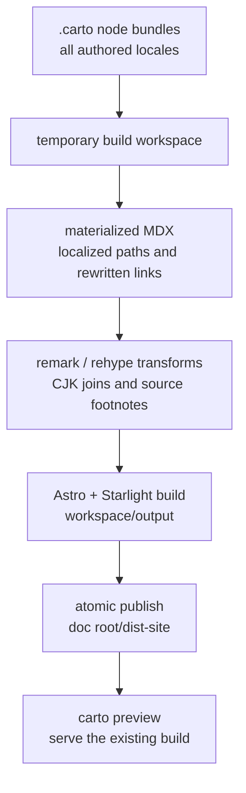

An authored Carto page is not handed directly to Astro. The renderer first constructs a disposable workspace, projects every local and federated node into Starlight's content tree, applies rendering-only transforms, builds elsewhere, and only then replaces the published `dist-site`. The CLI command is deliberately thin: `carto build` passes the current directory to the template package and converts any thrown error into a failing process. `packages/cli/src/commands/build.ts:1-14`

## Build in an isolated workspace

`buildSite` resolves the documentation root, creates a real temporary `carto-render-*` directory, and keeps generated source, Astro cache, and build output inside it. It links dependencies, writes generated content and Astro configuration, materializes the documentation graph, runs `astro build`, and publishes only after Astro succeeds. The `finally` block removes the workspace on both success and failure. `packages/template/src/render.ts:19-39`

This separation has two useful boundaries. Authored `.carto` bundles remain the source of truth rather than becoming an Astro content tree in place, and an incomplete Astro output never becomes the public site. The workspace configuration files are tiny re-exports of the template's compiled content collection and Astro configuration, so the build does not fork those contracts per repository. `packages/template/src/render.ts:126-137`

### Dependency linking without reinstalling

The workspace receives a synthesized `node_modules`. Carto traverses the template package's dependencies first, handles scoped packages recursively, and then considers dependencies installed at the documentation root. Existing destinations win. Most packages are directory symlinks to their real installation; Starlight itself is copied with symlinks dereferenced so its package-local resolution remains coherent inside the temporary tree. `packages/template/src/render.ts:86-123`

The shared Astro configuration reads `CARTO_ROOT` for authored data and `CARTO_WORKSPACE` for generated content. It loads the graph, user configuration, localized titles, and the source-footnote page map; then it points `srcDir` and the cache at the workspace while keeping the canonical site output at the documentation root. The configured pipeline installs CJK joining and source-footnote remark/rehype plugins, Mermaid, and Starlight with Carto-owned locale and sidebar data. `packages/template/astro.config.mjs:10-34`

## Materialize the authored graph

Materialization loads the complete local/federated graph and computes titles and freshness before writing pages. It iterates the root site's locale set across every doc set and node. If a federated doc set lacks a site locale, Carto warns and reads that set's default-locale page instead; the output still occupies the requested site locale. Each page then passes through logical-link rewriting and staleness-banner injection before being written to its generated target. `packages/template/src/materialize.ts:21-49`

The target path preserves the node's parent chain. Non-default locales gain a locale prefix, and federated sets gain their graph prefix, so one immutable node identity maps to the correct Starlight content path without changing the authored bundle. `packages/template/src/materialize.ts:85-90`

Authored Markdown links stay logical until this stage. For each ordinary Markdown target beginning with `carto:`, the resolver supplies the localized URL; an empty link label is filled from the target's locale title, then its default-locale title, then its id. Unresolvable targets are left untouched rather than being guessed during rendering. `packages/template/src/materialize.ts:92-123` See [navigation and federation](carto:navigation-federation) for how those identities resolve.

### Rendering-only source and language transforms

Before Markdown transformation, Carto maps each generated page path to its effective locale and the exact `node.json` source set. This lets the plugin recognize citations in the context of the page being rendered, including localized and federated target paths. `packages/template/src/remark-source-footnotes.ts:46-60`

The remark plugin turns eligible inline-code citations into deduplicated footnote references and appends their definitions. Exact tracked file names are accepted, as are repository-relative `path:line` and `path:start-end` addresses with valid ascending lines; code blocks, links, existing footnotes, definitions, and JSX are deliberately skipped. Thus authored MDX retains canonical machine-readable anchors while the human site gets compact source notes. `packages/template/src/remark-source-footnotes.ts:63-91` `packages/template/src/remark-source-footnotes.ts:118-163`

A rehype pass unwraps the generated reference presentation and localizes the footnote section heading, distinguishing a source-only section from one that also contains author-written notes. `packages/template/src/remark-source-footnotes.ts:94-115`

Chinese, Japanese, and related scripts often use source line wrapping without semantic spaces. The CJK remark plugin defines the supported character ranges (plus em dash and ellipsis) and removes only soft line breaks whose characters on both sides are in that class; it walks Markdown text nodes rather than rewriting code or structure. `packages/template/src/remark-join-cjk.ts:7-40`

Freshness is also a presentation concern at build time, not an authored-page mutation. For nodes classified `stale` or `missing`, Carto inserts a warning into YAML frontmatter, lists changed or absent source paths with HTML escaping, and preserves any explicit author-provided `banner`. Fresh and unsynced pages pass through unchanged. `packages/template/src/staleness-banner.ts:3-26` The state itself is explained in [freshness and scope](carto:freshness-scope).

## Localized navigation remains Carto-owned

Carto maps the manifest's default locale to Starlight's `root` locale and builds a recursive sidebar from parent relationships. Local and federated doc sets share the graph sidebar; labels use each node's extracted locale title, and federated sets form separately labeled groups. Home redirects are emitted once per site locale. `packages/template/src/site-config.ts:7-87`

Titles are read from each locale file's YAML frontmatter before materialization, giving sidebar labels and empty-link labels the same authored source. `packages/template/src/site-config.ts:90-127` The Starlight site title defaults to the documentation root's exact basename and falls back to `Carto` only when that basename is empty; an explicit `starlight.title` remains the final override. `packages/template/src/site-config.ts:174-180` `packages/template/astro.config.mjs:10-32` A repository may supply `carto.config.mjs` or `carto.config.js` with additional Starlight options, but Carto validates the default export and retains ownership of `locales` and `sidebar` when merging, preventing user configuration from breaking graph-derived navigation. `packages/template/src/site-config.ts:142-181`

## Publish atomically

Astro writes into the temporary workspace, not directly over the prior site. Publication copies that complete output to a uniquely named staging directory beside `dist-site`. If an old site exists, Carto renames it to a unique backup, renames staging into place, and removes the backup only after the new destination exists. If the staging rename fails after an old site was moved, Carto attempts to rename the backup back into place before rethrowing. Cleanup removes abandoned staging; if that restoration also fails, it deliberately preserves the backup instead of deleting it. `packages/template/src/render.ts:139-169`

That rename sequence is the commit point: failures during graph loading, materialization, plugins, or Astro leave the previous `dist-site` untouched, while a failure at the final swap attempts to restore the previous site from its backup. If restoration itself fails, the backup remains preserved.

## Preview serves; it does not build

`carto preview` is a separate handoff with host and port options. The command passes the current root and parsed port to the template package and reports template errors in the same CLI form as `build`. `packages/cli/src/commands/preview.ts:1-18`

The template refuses to preview unless `dist-site` already exists as a directory, validates a non-empty host and an integer port from 1 through 65535, and then creates another disposable workspace containing only the runtime configuration and linked dependencies needed by `astro preview`. It points Astro at the existing published output, forwards termination signals, and removes the preview workspace when the server exits. It never materializes authored pages and never republishes the site. `packages/template/src/render.ts:42-83`

In practice, run `carto build` after authoring or freshness work, then `carto preview` to inspect exactly that published artifact. The former is a transformation and atomic publication boundary; the latter is only a server for the boundary's existing result. CLI command sequencing and error behavior are covered in [the CLI workflow](carto:cli-workflow).

## Where to change the pipeline

- Change authored-node placement, locale fallback, logical-link rewriting, or banner insertion in materialization—not in Astro configuration.
- Change Markdown/HAST presentation in the narrowly scoped remark or rehype plugin; keep canonical anchors and `carto:` links intact in authored MDX.
- Change locale labels, graph sidebar construction, title extraction, redirects, or the user/owned configuration boundary in the site-config layer.
- Change workspace lifecycle, dependency exposure, Astro process control, or atomic swap behavior in the renderer; keep `build` and `preview` CLI commands as thin handoffs.
