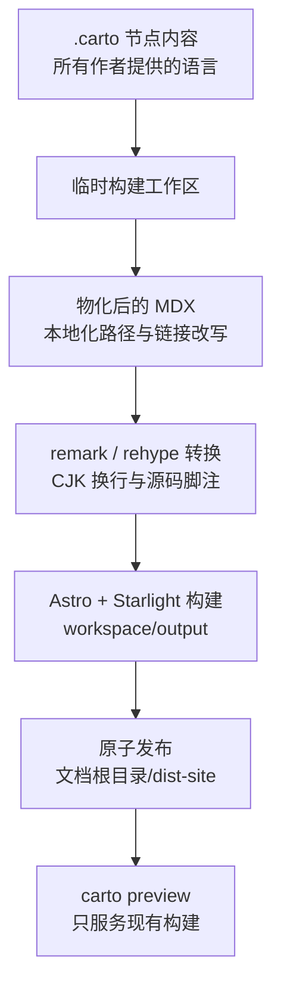

Carto 不会把作者页面原样交给 Astro。它先把文档图投影进一次性 Starlight 工作区，在那里完成构建，成功后才替换 `dist-site`。



CLI 只负责薄薄的一次交接：`carto build` 把当前目录传给模板包，并把抛出的错误转成失败退出。`packages/cli/src/commands/build.ts:1-14` 工作区、物化、Astro、发布与清理由渲染器统一掌控。`packages/template/src/render.ts:19-39`

## 在隔离工作区中构建

`buildSite` 的职责和控制流如下：

```text
buildCommand.run()
└─ buildSite(process.cwd())
   ├─ 解析文档根目录；创建真实路径的 carto-render-* 工作区
   ├─ 创建 Astro 缓存；链接依赖
   ├─ 写入内容与 Astro 配置
   ├─ materialize(root, workspace/src/content/docs)
   ├─ runAstro(build, output = workspace/output)
   ├─ publish(workspace/output, root/dist-site)
   └─ finally：删除工作区
```

`packages/cli/src/commands/build.ts:4-13` `packages/template/src/render.ts:19-39`

因此，`.carto` 中的作者内容始终是真源，未完成的 Astro 输出也不会成为对外站点。工作区文件只转发模板包已编译的内容集合与共享 Astro 配置，不会让每个仓库复制一套构建契约。`packages/template/src/render.ts:126-137`

### 复用依赖，而不是重新安装

Carto 先从模板依赖、再从文档根目录已安装的依赖合成工作区 `node_modules`，目标位置已有包时不覆盖。多数包使用目录符号链接；Starlight 则在解除符号链接后完整复制，以维持临时目录内的包内解析关系。scope 包目录会递归遍历。`packages/template/src/render.ts:86-123`

共享 Astro 配置通过 `CARTO_ROOT` 读取作者内容，通过 `CARTO_WORKSPACE` 定位生成内容。它把源码与缓存路径指向工作区，加载文档图、用户配置、标题和源码脚注页面映射，并装配 CJK 拼行、源码脚注 remark/rehype、Mermaid，以及使用 Carto 所有语言和侧边栏数据的 Starlight。`packages/template/astro.config.mjs:10-34`

## 将作者内容物化成站点内容树

物化是一条逐页数据流，不会原地改写作者文件：

```text
loadGraph(root)
├─ collectGraphTitles(graph)
├─ collectFreshness(graph)
└─ 遍历文档集 × 节点 × 站点语言
   ├─ 选择所需语言或文档集默认语言；发生回退时警告
   ├─ 读取作者语言页面
   ├─ rewriteLinks(page, 本地化文档图上下文)
   ├─ injectStalenessBanner(page, 节点状态)
   ├─ targetPath(父级链, 语言前缀, 联邦前缀)
   └─ 写入生成的 MDX
```

`packages/template/src/materialize.ts:21-49` `packages/template/src/materialize.ts:85-123`

输出路径保留节点父级链；非默认语言增加语言前缀，联邦文档集增加图前缀。Markdown 中的逻辑 `carto:` 地址也在此变成本地化 URL；空标签依次回退到目标语言标题、默认语言标题和节点 id。无法解析的目标保持不变，不会被猜测。`packages/core/src/tree.ts:13-29` `packages/core/src/graph.ts:44-89` `packages/core/src/resolver.ts:52-84` 身份与 URL 的规则见[导航与联邦文档](carto:navigation-federation)。

### 只影响展示的源码与语言转换

进入 Markdown 转换前，Carto 会把每个生成页面映射到实际语言和 `node.json` 的精确源码集合，本地化页面与联邦页面都包含在内。`packages/template/src/remark-source-footnotes.ts:46-60`

remark 处理会把合格的行内代码引用转成去重脚注并追加定义。它接受节点明确跟踪的路径，也接受仓库相对的 `path:line` 或正序 `path:start-end` 地址；代码块、链接、已有脚注、脚注定义与 JSX 保持不变。作者 MDX 因而保留机器可读的规范锚点，站点则得到紧凑的源码注释。`packages/template/src/remark-source-footnotes.ts:63-91` `packages/template/src/remark-source-footnotes.ts:118-163`

rehype 处理会整理生成引用的展示并本地化脚注区标题，同时区分“只有源码引用”与“还包含作者脚注”。`packages/template/src/remark-source-footnotes.ts:94-115` CJK remark 仅在换行两侧都属于声明的 CJK 字符类时删除软换行；该范围包含破折号与省略号，而且处理只遍历文本节点，不改写代码或结构。`packages/template/src/remark-join-cjk.ts:7-40`

新鲜度提示也是构建时的展示转换。`stale` 与 `missing` 状态会加入经过转义的受影响源码路径列表，但作者已有的 `banner` 优先；新鲜与尚未同步的页面保持不变。`packages/template/src/staleness-banner.ts:3-26` 状态计算见[新鲜度与工作范围](carto:freshness-scope)。

## 本地化导航由 Carto 掌控

Carto 把清单默认语言映射为 Starlight 的 `root` 语言，并根据图中的父子关系递归生成侧边栏。本地与联邦文档集共用这棵图侧边栏，联邦文档集形成带标题的分组，每种站点语言还会得到主页重定向。`packages/template/src/site-config.ts:7-87`

frontmatter 标题在物化前统一收集，因此侧边栏标签与空链接标签共享同一份作者来源。`packages/template/src/site-config.ts:90-127` 站点标题默认取文档根目录的原始 basename，仅在 basename 为空时回退到 `Carto`，显式 `starlight.title` 仍优先。用户可用 `carto.config.mjs` 或 `carto.config.js` 追加 Starlight 选项，但合并后的 `locales` 与 `sidebar` 继续由 Carto 掌控。`packages/template/src/site-config.ts:142-181` `packages/template/astro.config.mjs:10-32`

## 原子发布

发布以文件系统改名作为提交协议：

```text
复制完整 workspace/output → 同级 staging
若 dist-site 存在：改名 dist-site → backup
尝试改名 staging → dist-site
失败时：
  若旧站点已移走：改名 backup → dist-site
  重新抛错
若旧站点已移走：删除 backup
finally：
  删除 staging
  仅当发布成功或恢复完成时删除 backup
```

`packages/template/src/render.ts:139-169`

发布前失败不会触碰旧 `dist-site`。最终交换失败时会尝试恢复旧站点；若恢复本身也失败，backup 会被刻意保留，而不是遭到删除。

## Build 把已发布结果交给 Preview

| 边界 | `carto build` | `carto preview` |
| --- | --- | --- |
| 所需输入 | 作者提供的本地/联邦文档图 | 已存在的 `dist-site` 目录 |
| 一次性工作区 | 生成内容、配置、缓存与依赖 | 运行时配置、缓存与依赖 |
| Astro 操作 | `build` 到 `workspace/output` | 用 `preview` 指向 `dist-site` |
| 对发布的影响 | 成功后原子替换 `dist-site` | 从不物化，也不重新发布 |
| 进程生命周期 | Astro 失败时构建失败 | 转发终止信号；退出后清理 |

`packages/cli/src/commands/build.ts:1-14` `packages/cli/src/commands/preview.ts:1-18` `packages/template/src/render.ts:19-83` `packages/template/src/render.ts:181-204`

作者修改或新鲜度更新后先运行 `carto build`，再用 `carto preview` 查看这一份已发布产物。host 不能为空，port 必须是 1 到 65535 的整数；`dist-site` 不存在时，命令会拒绝预览并要求先构建。命令编排与错误规则见 [CLI 工作流](carto:cli-workflow)。

## 修改流水线时应落在哪一层

- 作者节点的落盘路径、语言回退、逻辑链接改写或过期提示注入，应修改物化层，而不是 Astro 配置。
- Markdown/HAST 的展示规则应留在职责单一的 remark 或 rehype 插件中；作者 MDX 里的规范锚点与 `carto:` 链接必须保持不变。
- 语言标签、文档图侧边栏、标题提取、重定向，以及用户配置与 Carto 所有配置的边界，应修改 site-config 层。
- 工作区生命周期、依赖暴露、Astro 子进程控制或原子交换属于 renderer；`build` 与 `preview` 的 CLI 命令应继续保持薄封装。
