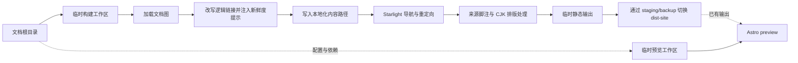

Carto 不直接让 Astro 读取文档根目录。`carto build` 先在系统临时目录组装一份可丢弃的 Astro 工程，把文档图投影为 Starlight 的内容树，构建成功后才替换根目录里的 `dist-site`。命令入口属于 [CLI 工作流](carto:cli-workflow)，节点关系、联邦前缀与 `carto:` 解析规则由 [核心语义](carto:core-model) 提供；本页只讨论这张图怎样变成可浏览站点。[Carto 总览](carto:overview) 给出了从编写到发布的完整边界。`packages/template/src/render.ts:19-39` `packages/template/src/materialize.ts:20-47`

## 构建工作区是隔离层，也是提交边界

构建工作区拥有独立的 `src/content/docs`、Astro 缓存和输出目录。Carto 写入桥接配置，链接模板依赖与文档根目录中的依赖，再运行 Astro；无论成功还是失败，临时目录都会被删除，因此模板包自带的内容目录和用户文档都不会充当构建暂存区。`packages/template/src/render.ts:19-39` `packages/template/src/render.ts:86-136`

工作区中的 Astro 配置从环境变量取得真实文档根目录和临时工作区，重新加载图与用户配置，并把生成内容注册成 Starlight docs collection。Astro 的输入、cache 与输出因此分别落在明确的位置。`packages/template/astro.config.mjs:11-34` `packages/template/src/content.config.ts:1-6`

构建产物先复制到 `dist-site` 同级的随机 staging 目录。已有站点会先改名为 backup，再以 `rename` 发布 staging；新目录改名失败时恢复 backup，成功后清理备份和残留 staging。Astro 构建完成后才会进入发布，因此构建失败不会碰现有站点。`packages/template/src/render.ts:19-39` `packages/template/src/render.ts:139-169`

## 文档图如何落到 Starlight 路由

物化器遍历图中的每个 doc-set、节点和站点 locale。若某个 doc-set 没有请求的 locale，它读取该 doc-set 的默认语言，但仍写入请求 locale 对应的站点路径，并发出 fallback 警告；因此站点的语言集合始终由根 manifest 控制。`packages/template/src/materialize.ts:20-47`

目标文件名由三段拼出：非默认语言的 locale 前缀、联邦 doc-set 前缀，以及从根节点到当前节点的 ID 链；默认语言不加 locale 目录。文件在内容树中的相对路径与 Starlight 最终生成的路由结构一致。`packages/template/src/materialize.ts:84-89`

Starlight 的 locale 映射同样以根 manifest 为准：默认语言占用 `root`，其他语言以 locale 名作为键。`packages/template/src/site-config.ts:7-13` 导航从节点父子关系递归生成；有子节点的条目同时保留自身页面和子页面，联邦 doc-set 则按前缀排序后作为分组追加。节点条目的标题取自各语言 MDX 的 frontmatter，非默认语言标题写入 Starlight 的 `translations`；联邦分组标签只采用该 doc-set 首页的默认语言标题，缺失时退回前缀。`packages/template/src/site-config.ts:23-40` `packages/template/src/site-config.ts:71-119`

根路径与各 locale 根路径重定向到 home；home 未显式指定时使用第一个顶层节点。`packages/template/src/site-config.ts:51-68` 用户可以在 `carto.config.mjs` 或 `carto.config.js` 补充 Starlight 选项，但 `locales` 和 `sidebar` 由 Carto 最后写入，不能被用户配置改掉。`packages/template/src/site-config.ts:142-177` `packages/template/src/site-config.ts:174-180` 这些派生项连同重定向、Mermaid 和 Markdown 插件一次性交给 Astro/Starlight。`packages/template/astro.config.mjs:21-33`

## 链接改写与来源脚注是两条不同流水线

物化阶段对整份 MDX 文本做正则替换，凡是链接目标以 `carto:` 开头的同形文本片段都会命中；它不区分正文链接、代码块或图片等 Markdown 上下文。解析成功后，目标会换成当前 locale、doc-set 前缀和联邦上下文对应的 URL；空链接文字优先采用目标页面的当前语言标题，再退回目标 doc-set 默认语言标题和节点 ID。无法解析的链接原样保留。`packages/template/src/materialize.ts:91-123`

源码地址不在这里改写。Astro 解析 Markdown 时，remark 插件根据每个物化页面的 locale 与节点 `sources` 建立页面上下文，把正文中以行内代码书写的完整仓库相对地址转成原生脚注引用；相同地址共用一个定义，定义正文仍保存原地址。`packages/template/src/remark-source-footnotes.ts:43-91` 只有可识别的裸 source 路径或带合法行号的仓库相对地址会被处理，代码块、链接、已有脚注等上下文会跳过，避免把示例与 Markdown 结构误判成引用。`packages/template/src/remark-source-footnotes.ts:117-163`

后续 rehype 阶段只调整包含 Carto 来源脚注的脚注区标题，并让标题可见；中文页面显示“来源”，若还混有作者脚注则显示“注释与来源”。`packages/template/src/remark-source-footnotes.ts:94-113` `packages/template/src/remark-source-footnotes.ts:249-252` 另一个 remark 插件只消除 CJK 字符之间因源码换行产生的软换行空白，不改动其他文本节点语义。`packages/template/src/remark-join-cjk.ts:20-40`

因此，`carto:` 链接在写入临时内容树前变成站内 URL；源码锚点则保留在物化后的 MDX 文本中，进入 Astro 的 remark 阶段后才转换为本地化脚注。`packages/template/src/materialize.ts:33-46` `packages/template/src/remark-source-footnotes.ts:58-82` `packages/template/src/remark-source-footnotes.ts:117-141`

## 新鲜度提示随构建生成，不回写文档

物化器通过统一路径模块读取 `.carto/docs/<id>/<locale>.mdx`，为每个 doc-set 计算 source 状态，把节点状态交给 banner 注入器，再将结果写入临时内容树；原始正文不会被改动。`packages/core/src/paths.ts:15-16` `packages/template/src/materialize.ts:39-55` 只有 `stale` 或 `missing` 会触发提示；若 frontmatter 已有 banner，Carto 尊重作者设置。自动提示列出变更或消失的 source 文件，并对文件名做 HTML 转义。`packages/template/src/staleness-banner.ts:3-27` 因此 banner 表达的是本次构建发现的 source 状态，而不是正文来源或作者意图。

## Preview 只服务已经发布的结果

`carto preview` 先确认 `dist-site` 已存在，并校验 host 与 port；它不会再次物化或构建页面。命令另建一个轻量临时工作区来承载 Astro 配置和依赖，把现有 `dist-site` 作为 `astro preview --outDir` 的输入。`packages/template/src/render.ts:42-78` 服务退出后，临时工作区也会删除。`packages/template/src/render.ts:42-83` 这使 preview 成为发布结果的旁路检查，而不是第二条可能产生不同内容的渲染路径。
