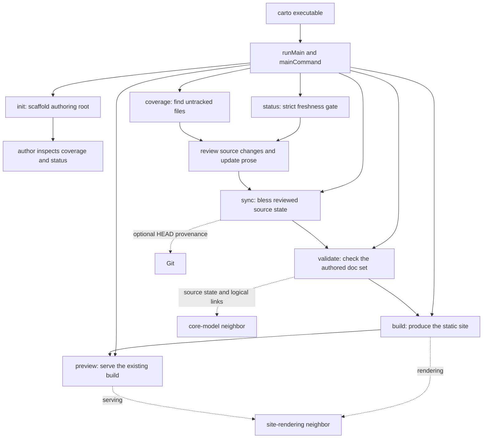

# How does an author move a doc set from initialization to preview?

The `carto` CLI is an authoring coordinator, not an automatic documentation generator. The package exposes `dist/index.js` as the `carto` executable; that entry calls `runMain(mainCommand)`, and the main command independently registers `init`, `status`, `sync`, `coverage`, `validate`, `preview`, and `build`. `packages/cli/package.json:9-16` `packages/cli/src/index.ts:1-5` `packages/cli/src/main.ts:10-20`

Those independent commands form a lifecycle controlled by the author: initialize the doc root, inspect assignment and freshness, review changes and update prose, explicitly bless reviewed sources, validate the authored set, then build and preview it. The CLI does not chain these steps for you. `packages/cli/src/main.ts:10-20` `packages/cli/src/commands/status.ts:15-33` `packages/cli/src/commands/sync.ts:10-26`

The dispatch branches are the command registry. The solid lifecycle edges are author actions rather than implicit CLI calls: stale output tells the author to review and update prose before targeted sync, while build and preview remain separately registered adapters. `packages/cli/src/main.ts:10-20` `packages/cli/src/commands/status.ts:25-33` `packages/cli/src/commands/build.ts:4-13` `packages/cli/src/commands/preview.ts:4-18`

## Initialize the authoring root

`carto init` operates in the current working directory. It accepts comma-separated locales, a default locale, and an optional relative code root; it refuses to overwrite an existing `carto.json` and schema-checks the configuration before writing anything. `packages/cli/src/commands/init.ts:6-33`

On success it creates `docs/`, writes `carto.json`, and creates `carto.config.mjs` only when that file is absent. Its final message hands control back to the authoring skill, so initialization establishes the workspace but does not create or revise documentation prose. `packages/cli/src/commands/init.ts:34-41`

## Inspect assignment and freshness

Use `carto coverage` to ask which documentable files are not named by any node source. It reports totals and uncovered paths; uncovered files produce a nonzero exit only when `--failOnUncovered` is set. Coverage is therefore an assignment inventory, not a freshness decision. `packages/cli/src/commands/coverage.ts:4-27`

Use `carto status` as the strict freshness gate. It classifies every node, prints each non-fresh source, and exits with status 1 whenever any node is not `fresh`; an empty doc set is reported explicitly. `packages/cli/src/commands/status.ts:15-33`

These checks answer different questions: coverage asks whether code files are represented by node sources, while status asks whether represented sources still match their recorded state. Neither command updates prose or source records. `packages/cli/src/commands/coverage.ts:18-27` `packages/cli/src/commands/status.ts:15-33`

## Review first, then sync deliberately

For a stale node, status gives the intended trust transition directly: review source changes, update the prose, and only then run `carto sync <id>`. This ordering makes synchronization an explicit acknowledgement that the named documentation has been reviewed against current code. `packages/cli/src/commands/status.ts:16-27`

`carto sync` collects positional ids as targeted nodes. With ids, it forwards those targets for rehashing; without ids, its declared default is only unsynced sources. It writes only nodes returned as changed, so choosing targets is the author's control point rather than a side effect of status or validate. `packages/cli/src/commands/sync.ts:5-26`

Git contributes optional provenance, not freshness. Sync tries `git rev-parse HEAD` and passes the result as a commit annotation; failure is converted to `undefined`. Status obtains its classification from `statusReport` and uses a stored commit only to append a `was …` note to a non-fresh source, so absence of Git does not prevent synchronization or become the freshness gate. `packages/cli/src/git.ts:3-8` `packages/cli/src/commands/sync.ts:13-20` `packages/cli/src/commands/status.ts:15-22`

## Validate the authored set

`carto validate` loads the root manifest and federation context, checks tree and home-node consistency, and obtains the same source-state report used for freshness inspection. Manifest or graph loading failures stop validation immediately. `packages/cli/src/commands/validate.ts:19-50`

Its severity policy is intentionally different from status. Unsynced and missing sources are errors, but a stale node is a warning with the same review-then-sync guidance. Validation can therefore print `validate: ok` while stale warnings remain; only `carto status` is the strict all-sources-fresh gate. `packages/cli/src/commands/validate.ts:50-60` `packages/cli/src/commands/validate.ts:77-83` `packages/cli/src/commands/status.ts:30-33`

Validation also requires one MDX file for every node and configured locale. In each existing page it extracts destinations written as Markdown links beginning with `carto:` and asks the neighboring core model to resolve them; missing pages or unresolved targets join the error set. `packages/cli/src/commands/validate.ts:62-73` `packages/cli/src/links.ts:1-9`

The details of node state and logical resolution belong to the [core model](carto:core-model), while this page covers when the CLI invokes and presents those mechanisms. Return to the [overview](carto:overview) for the system boundary.

## Build, then preview

`carto build` passes the current doc root to the template layer's static-site build and converts a thrown failure into CLI error output and exit status 1. `packages/cli/src/commands/build.ts:4-13`

`carto preview` is a separate command for serving an existing static site. It parses host and port options, passes them with the current doc root to the template layer, and likewise exits 1 on failure; it does not invoke build first. `packages/cli/src/commands/preview.ts:4-18` `packages/cli/src/main.ts:17-19`

Site materialization and serving internals are deliberately outside this workflow; follow [site rendering](carto:site-rendering) for that neighboring mechanism. Operationally, the author runs validate, build, and preview as explicit steps, preserving a visible boundary between documentation correctness and its rendered presentation. `packages/cli/src/main.ts:17-19` `packages/cli/src/commands/build.ts:6-12` `packages/cli/src/commands/preview.ts:10-17`
