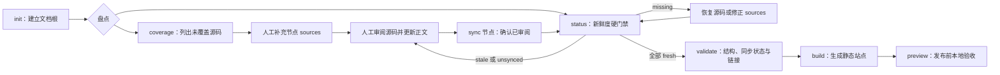

## 从空目录到发布前验收

`carto` 是一组可独立执行的子命令，不是替作者自动跑完流程的流水线。包清单把 `dist/index.js` 注册为 `carto`；进程入口将 `mainCommand` 交给 Citty 的 `runMain`，再由主命令分派 `init`、`status`、`sync`、`coverage`、`validate`、`preview` 和 `build`。 `packages/cli/package.json:9-16` `packages/cli/src/index.ts:1-5` `packages/cli/src/main.ts:10-20`

因此，闭环的控制权在作者手里：先盘点源码归属和文档新鲜度，阅读真实改动后修改正文，只同步已经审过的节点，最后依次做机械验证与站点验收。命令注册关系、`status` 的退出策略和 `sync` 的写回范围共同构成这条操作路径。 `packages/cli/src/commands/status.ts:15-33` `packages/cli/src/commands/sync.ts:10-26`

## 初始化只做一次

在计划作为文档根的目录运行 `carto init`。它支持 `--locales`、`--defaultLocale` 和 `--codeRoot`；命令先检查 `carto.json`，仅在其不存在时组装并校验配置。 `packages/cli/src/commands/init.ts:6-33`

初始化会创建 `docs/` 与 `carto.json`；只有 `carto.config.mjs` 不存在时才写入默认配置。它搭好容器后便停止，不会替作者创建节点或正文。 `packages/cli/src/commands/init.ts:34-41` 系统各包的职责边界可先看 [Carto 总览](carto:overview)。

## 先找无人负责的源码，再看哪些正文过期

`carto coverage` 打印覆盖文件数、文件总数和未覆盖路径，但不会修改节点或 `sources`；启用 `--failOnUncovered` 后，只要未覆盖列表非空就以非零状态退出，适合放进自动检查。 `packages/cli/src/commands/coverage.ts:4-27` `packages/cli/src/commands/coverage.ts:18-27`

`carto status` 打印每个节点的当前状态，并展开所有非 fresh 源文件；遇到 stale 时还明确要求先审阅源文件变更、更新正文，再执行对应节点的 `carto sync`。 `packages/cli/src/commands/status.ts:16-27` `packages/cli/src/commands/status.ts:25-33`

把 `status` 当作严格的新鲜度门禁：报告中任一节点不是 `fresh`，进程就返回 1；没有节点时只打印提示，不会误报失败。 `packages/cli/src/commands/status.ts:15-33` `packages/cli/src/commands/status.ts:30-33` 节点如何从源文件状态得到整体状态属于相邻的 [节点与源码模型](carto:core-model)，这里关心的是 CLI 对结果采取的门禁策略。

## 评审正文后，定向同步

工具能指出发生变化的源文件，但“代码变化是否改变了文档含义”仍要由作者判断。先阅读 diff，修订相关 locale 的正文与引用，再运行 `carto sync <节点 ID…>`。给出 ID 时，命令只把这些目标传给同步逻辑；不带 ID 时则传入未指定的目标。两种路径都只写回真正发生变化的 `node.json`。 `packages/cli/src/commands/sync.ts:5-26` 未指定目标时如何补齐初始快照，见 [节点与源码模型](carto:core-model)。

同步是对本轮人工评审的确认，不是正文生成器。CLI 同时尝试读取代码根目录的 `HEAD`：Git 命令失败时返回 `undefined`，同步仍可继续。 `packages/cli/src/git.ts:3-8` `packages/cli/src/commands/sync.ts:13-20` 这份 commit 只是可选的来源信息；`status` 仅在非 fresh 源文件旁把它显示为 `was …`，门禁判断仍看节点的 `state`。 `packages/cli/src/commands/status.ts:15-22`

同步后再跑一次 `carto status`。只有全体节点都变成 `fresh`，才进入发布前验证；这样不会把 `validate` 对 stale 的宽松处理误当成新鲜度保证。 `packages/cli/src/commands/status.ts:30-33` `packages/cli/src/commands/validate.ts:50-60`

## 区分新鲜度门禁与完整性验证

`carto validate` 先读取 manifest 和联邦图，再检查树结构、主页节点及源码状态。读取或建图失败会立即报错；树问题则按自身严重级别进入 error 或 warning。 `packages/cli/src/commands/validate.ts:19-50`

对源码状态，它有意采用不同于 `status` 的策略：`unsynced` 和 `missing` 记为 error，`stale` 只记为 warning，并提示审阅正文后同步。换言之，仅有 stale 时 `validate` 仍可能成功，所以它不能取代前一步严格的 `status`。 `packages/cli/src/commands/validate.ts:50-60`

验证还逐节点、逐 locale 检查 MDX 是否存在，并解析正文中的 `carto:` Markdown 链接；链接提取器直接对原始 MDX 运行正则：只要右方括号后紧跟左圆括号，且目标以 `carto:` 开头、不含空白或右圆括号，就会命中，代码块、行内代码和图片也不会被排除，随后再交给 core 解析。 `packages/cli/src/commands/validate.ts:62-73` `packages/cli/src/links.ts:1-9` warning 会输出但不改变退出码；只要 errors 非空就返回 1，否则最终打印 `validate: ok`。 `packages/cli/src/commands/validate.ts:77-83`

这些检查覆盖结构、同步状态和可解析链接，不评判技术表述是否准确。人工正文评审必须发生在同步之前，而不是等 `validate` 替代评审。 `packages/cli/src/commands/validate.ts:19-83`

## 构建后再预览

通过 `status` 与 `validate` 后运行 `carto build`。命令把当前工作目录交给模板包的 `buildSite`，构建异常会打印错误并以 1 退出。 `packages/cli/src/commands/build.ts:4-13` `packages/cli/src/commands/build.ts:6-12`

随后运行 `carto preview` 验收已有静态站点；它不会隐式构建，而是把当前目录以及 host、port 传给 `previewSite`，默认监听 `127.0.0.1:4321`，服务失败同样返回 1。 `packages/cli/src/commands/preview.ts:4-18` `packages/cli/src/commands/preview.ts:10-17` 主命令也把 `validate`、`preview`、`build` 注册为三个独立动作，因此发布前应保持“验证 → 构建 → 预览”的显式顺序。 `packages/cli/src/main.ts:17-19`

静态站点如何物化、如何提供服务是模板包的职责，不在 CLI 工作流内展开；需要追踪渲染边界时参见 [站点渲染](carto:site-rendering)。
