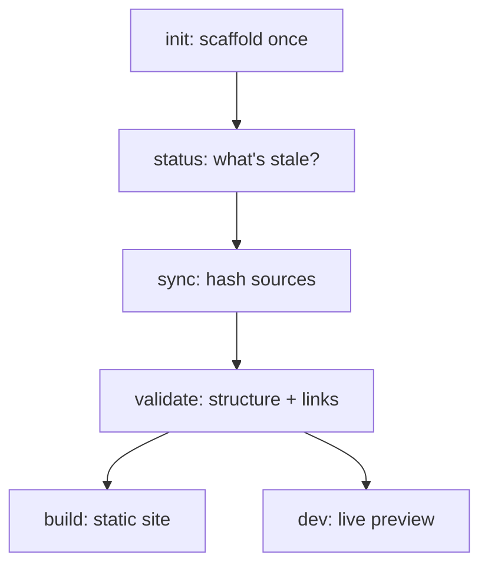

This is a user-facing reference for the six `carto` commands: what each one
does *for you*, when to run it, and its real output. For the concepts each
command reports on (staleness states, links), see [](carto:concepts).

## Mental model

`packages/cli/src/index.ts:12` wires exactly six subcommands onto the `carto`
entry point — there are no others, and no fine-grained mutation commands
(`skill/SKILL.md:57`):

- **`carto init`** — run once per doc root, only if `carto.json` is absent;
  refuses otherwise (`packages/cli/src/commands/init.ts:15`). Scaffolds
  `carto.json` and `docs/`.
- **`carto status`** — run first, every invocation. Read-only: prints one
  `state id` line per node and exits `1` the moment any node is not `fresh`
  (`packages/cli/src/commands/status.ts:20`), so it doubles as a CI gate.
- **`carto sync`** — run after you edit `carto.json` or a source file changes.
  The only command that writes deterministically: it recomputes every source's
  hash and refreshes `updated_at`, then prints `synced N node(s)`
  (`packages/cli/src/commands/sync.ts:14`).
- **`carto validate`** — run after `sync`, before you trust the docs. Read-only:
  checks node/slug/parent structure, rejects any non-fresh source, opens every
  `docs/<id>/<locale>.mdx` and resolves every `carto:` link
  (`packages/cli/src/commands/validate.ts:30`); prints `validate: ok` only when
  there are zero errors (`packages/cli/src/commands/validate.ts:62`).
- **`carto dev`** — optional. Spawns `@carto/template`'s Astro dev server for a
  live preview (`packages/cli/src/commands/dev.ts:22`).
- **`carto build`** — optional. Spawns `@carto/template`'s static build
  (`packages/cli/src/commands/build.ts:7`), producing `dist-site/`.



## Worked example

Run from the repo root (the directory containing `carto.json`) — this is the
real output from syncing this repo's own six-node self-docs tree:

```
$ carto sync
synced 6 node(s)

$ carto status
fresh     overview
fresh     getting-started
fresh     skill
fresh     cli
fresh     concepts
fresh     internals

$ carto validate
validate: ok

$ carto build
```

`sync` reports exactly `synced 6 node(s)` — one line, `synced ${count} node(s)`
templated at `packages/cli/src/commands/sync.ts:14` from the manifest's node
count. `status` prints each node's state left-aligned in a 9-character field
followed by its id (`packages/cli/src/commands/status.ts:18`); once every source is
freshly hashed, every line reads `fresh`. `validate` prints nothing but
`validate: ok` on success (`packages/cli/src/commands/validate.ts:62`) — any
error instead prints one `error: ...` line per problem and exits 1
(`packages/cli/src/commands/validate.ts:59`). `build` delegates to
`@carto/template`'s build script and produces `dist-site/`.

## Contract

- Every command reads `carto.json` from `process.cwd()` — always run `carto`
  from the doc root.
- Exit codes are meaningful: `status` and `validate` exit non-zero on any
  problem, so both are safe to wire into CI.
- `init` is the only command that writes when nothing exists yet; `sync` is the
  only command that writes to an existing manifest. `status`, `validate`, and
  `dev` never modify `carto.json` or `docs/`.

## Gotchas

- `carto dev` and `carto build` need `@carto/template` built first — if it
  isn't resolvable, both fail with `@carto/template is not available; run pnpm
  build first` (`packages/cli/src/commands/dev.ts:18`).
- A `carto:` link to an id that does not exist is a `validate` error, not a
  warning (`packages/cli/src/commands/validate.ts:93`) — only a dangling
  `parent` in the manifest is a warning.

See [](carto:getting-started) for the full first-run walkthrough, and
[](carto:concepts) for what `fresh`/`stale`/`unsynced`/`missing` mean.
