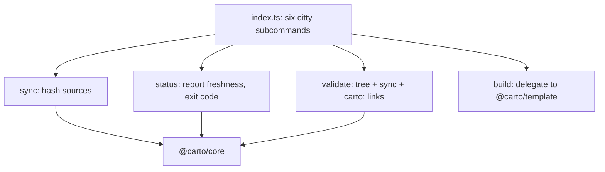

`@carto/cli` is the `carto` binary a human or agent actually runs. It is a
thin citty wrapper: every command reads `carto.json` from `process.cwd()`,
calls into [core internals](carto:core) to do the real work, and translates
the result into stdout and an exit code. It never invents structure on its
own — `sync` only hashes, `validate` only checks.

## Mental model

`packages/cli/src/index.ts:12` wires exactly six subcommands onto the `carto`
entry point: `init`, `status`, `sync`, `validate`, `dev`, `build`.

- **`sync`** (`packages/cli/src/commands/sync.ts:11`) reads the manifest, calls
  `@carto/core`'s `syncManifest` to recompute every source hash, writes the
  manifest back, and prints `synced N node(s)`.
- **`status`** (`packages/cli/src/commands/status.ts:16`) reads the manifest,
  calls `@carto/core`'s `statusReport`, prints one `state id` line per node,
  and exits with code `1` the moment any node's state is not `fresh`
  (`packages/cli/src/commands/status.ts:20`) — this exit code is what makes
  `status` usable as a CI gate.
- **`validate`** (`packages/cli/src/commands/validate.ts:30`) runs three checks
  in sequence: `checkTree` for id/slug/parent structural errors, `statusReport`
  to reject unsynced/stale/missing sources
  (`packages/cli/src/commands/validate.ts:35`), then for every node and locale
  it opens `docs/<id>/<locale>.mdx`, extracts every `carto:` target, and
  resolves each with `@carto/core`'s `resolveCartoLink`
  (`packages/cli/src/commands/validate.ts:51`) — a link to an unknown id fails
  validation. It prints `validate: ok`
  (`packages/cli/src/commands/validate.ts:62`) only when there are zero errors.
- **`build`** (`packages/cli/src/commands/build.ts:7`) does not touch
  `@carto/core` directly; it shells out to `@carto/template`'s build script,
  which reads `docs/` and `carto.json` and renders the static site.

Because `status` and `validate` both delegate their real checks to
`@carto/core`, the CLI package itself stays small: its job is argument
parsing, exit codes, and stdout formatting, not policy.
