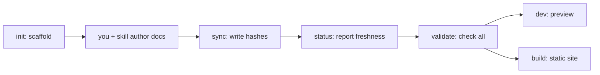

The `carto` binary is six subcommands (`packages/cli/src/index.ts:12`). Each is
a thin, deterministic wrapper over `@carto/core` — it hashes, checks, or launches
the renderer; it never writes prose. All commands read `carto.json` from the
current directory, so **run them from the doc root**. In this repo that's the
repo root, invoked as `pnpm exec carto <cmd>`.

## Overview



Two commands **write** (`init`, `sync`); three are **read-only checks or
previews** (`status`, `validate`, `dev`); one **produces the static site**
(`build`). `status` and `validate` signal failure by exit code, so they drop
straight into CI.

| Command | Does for you | Exit |
|---|---|---|
| `init` | Scaffold `carto.json` + `docs/` | 1 if `carto.json` exists |
| `status` | Report each node's freshness | non-zero if any node not fresh |
| `sync` | Write every source hash | 1 if a source file is missing |
| `validate` | Full check: schema, tree, sync, links | 1 on any error |
| `dev` | Preview site at localhost:4321 | passthrough from Astro |
| `build` | Render static site to `dist-site/` | passthrough from Astro |

## `carto --help`

```
$ carto --help
Generate and maintain carto documentation (carto)

USAGE carto init|status|sync|validate|dev|build

COMMANDS

      init    Scaffold carto.json and docs/ in the current directory
    status    Report each node's freshness
      sync    Recompute and write every source hash
  validate    Validate schema, tree, sync state, and links
       dev    Preview the site for the current doc root
     build    Build the static site for the current doc root
```

## init

Scaffolds an empty `carto.json` and a `docs/` directory. Refuses to overwrite an
existing manifest — the guard is an `access` check that exits 1
(`packages/cli/src/commands/init.ts:15`). `--locales en,zh` declares the locale
list; `--defaultLocale` picks the default (`packages/cli/src/commands/init.ts:19`).

```
$ carto init
initialized carto.json (locales: en) and docs/

$ carto init
carto.json already exists; refusing to overwrite
```

## status

Prints one `state id` line per node — the state is the **worst** of its sources
(`fresh` < `unsynced` < `stale` < `missing`) — and exits non-zero if any node is
not fresh (`packages/cli/src/commands/status.ts:20`). This is your CI freshness
gate and the way you pick `refresh` targets.

```
$ carto status
fresh     overview
fresh     getting-started
fresh     skill
fresh     cli
fresh     concepts
fresh     internals
```

## sync

The one deterministic write: recomputes and writes every source hash and
refreshes `updated_at` (`packages/cli/src/commands/sync.ts:12`). Run it after any
`carto.json` edit and after code changes. It aborts if a registered source file
doesn't exist (`packages/core/src/manifest.ts:84`).

```
$ carto sync
synced 6 node(s)
```

## validate

The full gate: schema, id/slug uniqueness, parent cycles, sync state, one `.mdx`
per locale, that `home` (if set) names a real node, and that every `carto:` link
resolves (`packages/cli/src/commands/validate.ts:17`). Missing docs, unsynced or
stale nodes, and an unknown `home` are errors; a dangling parent is only a
warning. Exits 1 with an `error:` line per problem; prints `validate: ok` when
clean (`packages/cli/src/commands/validate.ts:66`).

```
$ carto validate
validate: ok
```

Before the pages existed, the same command listed the gaps it found:

```
$ carto validate
error: missing doc: docs/overview/en.mdx
error: missing doc: docs/overview/zh.mdx
...
```

## dev

Launches the bundled Astro + Starlight template in dev mode, passing
`CARTO_ROOT=$PWD` so it materializes and serves *your* doc root
(`packages/cli/src/commands/dev.ts:25`). Entry page is
`http://localhost:4321/overview/` — the default locale (`en`) is unprefixed; `zh`
lives under `/zh/overview/`. Stop it with Ctrl-C.

## build

Same template, production mode: renders the static site into `dist-site/`
(gitignored) under the doc root (`packages/cli/src/commands/build.ts:7`, which
calls `runTemplateScript('build')` at `packages/cli/src/commands/dev.ts:15`).

## See also

- [](carto:getting-started) — these commands in a full run.
- [](carto:concepts) — what the freshness states and links mean.
- [](carto:internals) — how `dev`/`build` reach the template.
