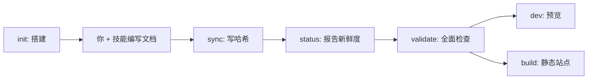

`carto` 二进制是六个子命令（`packages/cli/src/index.ts:12`）。每个都是 `@carto/core`
之上一层薄薄的、确定性的封装——它做哈希、做校验、或启动渲染器；它从不写正文。所有命令都从
当前目录读取 `carto.json`，因此**在文档根里运行它们**。在本仓库里那就是仓库根，用
`pnpm exec carto <cmd>` 调用。

## 概览



两个命令**写入**（`init`、`sync`）；三个是**只读检查或预览**（`status`、`validate`、
`dev`）；一个**产出静态站点**（`build`）。`status` 和 `validate` 用退出码表示失败，因此可以
直接接进 CI。

| 命令 | 为你做什么 | 退出码 |
|---|---|---|
| `init` | 搭建 `carto.json` + `docs/` | 若 `carto.json` 已存在则为 1 |
| `status` | 报告每个节点的新鲜度 | 有任一节点非 fresh 则非零 |
| `sync` | 写入每个源文件哈希 | 有源文件缺失则为 1 |
| `validate` | 全面检查：schema、树、同步、链接 | 有任何错误则为 1 |
| `dev` | 在 localhost:4321 预览站点 | 透传自 Astro |
| `build` | 把静态站点渲染到 `dist-site/` | 透传自 Astro |

## `carto --help`

```
$ carto --help
Generate and maintain carto documentation (carto)

USAGE carto init|status|sync|validate|dev|build

COMMANDS

      init    Scaffold carto.json and docs/ in the current directory
    status    Report each node's freshness
      sync    Recompute and write every source hash
  validate    Validate schema, tree, sync state, and links
       dev    Preview the site for the current doc root
     build    Build the static site for the current doc root
```

## init

搭建一个空的 `carto.json` 和一个 `docs/` 目录。拒绝覆盖已存在的清单——护栏是一个 `access`
检查，命中则退出 1（`packages/cli/src/commands/init.ts:15`）。`--locales en,zh` 声明语言列表；
`--defaultLocale` 选定默认语言（`packages/cli/src/commands/init.ts:19`）。

```
$ carto init
initialized carto.json (locales: en) and docs/

$ carto init
carto.json already exists; refusing to overwrite
```

## status

每个节点打印一行 `state id`——该状态取其各源文件中**最差**的一个
（`fresh` < `unsynced` < `stale` < `missing`）——只要有节点非 fresh 就以非零退出
（`packages/cli/src/commands/status.ts:20`）。这是你的 CI 新鲜度闸门，也是你挑选 `refresh`
目标的方式。

```
$ carto status
fresh     overview
fresh     getting-started
fresh     skill
fresh     cli
fresh     concepts
fresh     internals
```

## sync

唯一的确定性写操作：重新计算并写入每个源文件哈希，并刷新 `updated_at`
（`packages/cli/src/commands/sync.ts:12`）。在任何 `carto.json` 编辑之后、以及代码变化之后
运行它。若某个已注册的源文件不存在，它会中止（`packages/core/src/manifest.ts:84`）。

```
$ carto sync
synced 6 node(s)
```

## validate

完整的闸门：schema、id/slug 唯一性、parent 环、同步状态、每种语言一个 `.mdx`，以及每个
`carto:` 链接是否可解析（`packages/cli/src/commands/validate.ts:17`）。缺失的文档以及
unsynced/stale 的节点是错误；悬空的 parent 只是警告。有问题时以退出码 1 结束，并为每个问题
打印一行 `error:`；干净时打印 `validate: ok`（`packages/cli/src/commands/validate.ts:62`）。

```
$ carto validate
validate: ok
```

在页面尚不存在时，同一个命令会列出它发现的缺口：

```
$ carto validate
error: missing doc: docs/overview/en.mdx
error: missing doc: docs/overview/zh.mdx
...
```

## dev

以 dev 模式启动内置的 Astro + Starlight 模板，传入 `CARTO_ROOT=$PWD`，使它物料化并服务
*你的*文档根（`packages/cli/src/commands/dev.ts:25`）。入口页是
`http://localhost:4321/overview/`——默认语言（`en`）无前缀；`zh` 位于 `/zh/overview/`。
用 Ctrl-C 停止它。

## build

同一个模板，生产模式：把静态站点渲染到文档根下的 `dist-site/`（已被 gitignore）
（`packages/cli/src/commands/build.ts:7`，它在 `packages/cli/src/commands/dev.ts:15`
调用 `runTemplateScript('build')`）。

## 另见

- [](carto:getting-started) —— 在一次完整运行中看这些命令。
- [](carto:concepts) —— 新鲜度状态与链接的含义。
- [](carto:internals) —— `dev`/`build` 如何触达模板。
