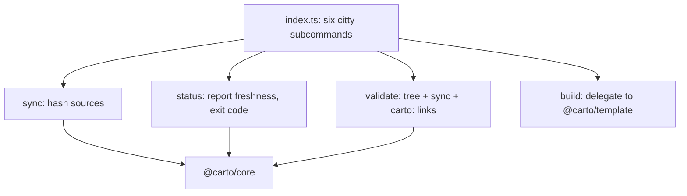

`@carto/cli` 就是人类或智能体真正运行的 `carto` 可执行文件。它是一层薄薄的 citty
封装：每个命令都从 `process.cwd()` 读取 `carto.json`，调用 [core internals](carto:core)
完成真正的工作，再把结果转换成标准输出与退出码。它自己从不发明结构——`sync` 只做
哈希，`validate` 只做检查。

## 心智模型

`packages/cli/src/index.ts:12` 把六个子命令精确地挂到 `carto` 入口上：`init`、
`status`、`sync`、`validate`、`dev`、`build`。

- **`sync`**（`packages/cli/src/commands/sync.ts:11`）读取清单，调用 `@carto/core`
  的 `syncManifest` 重新计算每个 source 的哈希，把清单写回磁盘，并打印
  `synced N node(s)`。
- **`status`**（`packages/cli/src/commands/status.ts:16`）读取清单，调用
  `@carto/core` 的 `statusReport`，为每个节点打印一行 `state id`，只要有任意节点的
  状态不是 `fresh` 就以退出码 `1` 结束
  （`packages/cli/src/commands/status.ts:20`）——正是这个退出码让 `status` 可以
  用作 CI 的门禁。
- **`validate`**（`packages/cli/src/commands/validate.ts:30`）依次运行三类检查：
  `checkTree` 检查 id/slug/parent 结构性错误；`statusReport` 拒绝未同步/过期/缺失
  的 source（`packages/cli/src/commands/validate.ts:35`）；然后对每个节点和每个
  locale，打开 `docs/<id>/<locale>.mdx`，提取其中每一个 `carto:` 目标，并用
  `@carto/core` 的 `resolveCartoLink` 逐一解析
  （`packages/cli/src/commands/validate.ts:51`）——指向未知 id 的链接会导致校验失败。
  只有当错误数为零时才会打印 `validate: ok`
  （`packages/cli/src/commands/validate.ts:62`）。
- **`build`**（`packages/cli/src/commands/build.ts:7`）不直接调用 `@carto/core`，
  而是调用 `@carto/template` 的构建脚本，由它读取 `docs/` 与 `carto.json` 并渲染出
  静态站点。

因为 `status` 与 `validate` 都把真正的检查工作委托给 `@carto/core`，CLI 包本身
保持精简：它的职责是参数解析、退出码与标准输出格式化，而不是策略判断。
