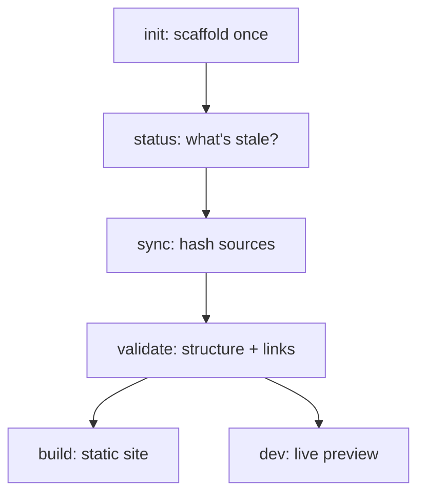

本页是面向用户的六个 `carto` 命令参考：每个命令**为你**做了什么、你什么时候运行它，
以及它真实的输出。关于每个命令所报告的概念（新鲜度状态、链接），见 [](carto:concepts)。

## 心智模型

`packages/cli/src/index.ts:12` 把恰好六个子命令精确地挂到 `carto` 入口上——没有其他
命令，也没有细粒度的变更命令（`skill/SKILL.md:57`）：

- **`carto init`**——每个文档根目录只运行一次，只有在 `carto.json` 不存在时才可以；
  否则拒绝运行（`packages/cli/src/commands/init.ts:15`）。搭建 `carto.json` 和
  `docs/`。
- **`carto status`**——每次调用时最先运行。只读：先为每个节点打印一行
  `state id`，然后只要有任意节点不是 `fresh` 就以退出码 `1` 结束
  （`packages/cli/src/commands/status.ts:21`），所以它也能当作 CI 门禁使用。
- **`carto sync`**——在你编辑 `carto.json` 或某个源文件发生变化之后运行。它是唯一会
  确定性地写入的命令：重新计算每个 source 的哈希并刷新 `updated_at`，然后打印
  `synced N node(s)`（`packages/cli/src/commands/sync.ts:14`）。
- **`carto validate`**——在 `sync` 之后、在你信任这些文档之前运行。只读：检查
  node/slug/parent 结构，拒绝任何非 fresh 的 source，打开每一份
  `docs/<id>/<locale>.mdx` 并解析其中每一个 `carto:` 链接
  （`packages/cli/src/commands/validate.ts:30`）；只有当错误数为零时才打印
  `validate: ok`（`packages/cli/src/commands/validate.ts:62`）。
- **`carto dev`**——可选。为实时预览启动 `@carto/template` 的 Astro 开发服务器
  （`packages/cli/src/commands/dev.ts:22`）。
- **`carto build`**——可选。启动 `@carto/template` 的静态构建
  （`packages/cli/src/commands/build.ts:7`），产出 `dist-site/`。



## 实操示例

从仓库根目录（也就是 `carto.json` 所在目录）运行——下面是同步本仓库自身六节点
自述文档树时的真实输出：

```
$ carto sync
synced 6 node(s)

$ carto status
fresh     overview
fresh     getting-started
fresh     skill
fresh     cli
fresh     concepts
fresh     internals

$ carto validate
validate: ok

$ carto build
```

`sync` 精确地报告 `synced 6 node(s)`——这一行是在
`packages/cli/src/commands/sync.ts:14` 处根据清单的节点数模板化出的
`synced ${count} node(s)`。`status` 把每个节点的状态左对齐打印在一个 9 字符宽的
字段里，后面跟着它的 id（`packages/cli/src/commands/status.ts:18`）；一旦每个
source 都被重新哈希过，每一行都会读到 `fresh`。`validate` 成功时只打印
`validate: ok`（`packages/cli/src/commands/validate.ts:62`）——一旦出错，则会为
每个问题打印一行 `error: ...` 并以退出码 1 结束
（`packages/cli/src/commands/validate.ts:59`）。`build` 委托给 `@carto/template`
的构建脚本，产出 `dist-site/`。

## 约定

- 每个命令都从 `process.cwd()` 读取 `carto.json`——务必始终在文档根目录下运行
  `carto`。
- 退出码是有意义的：`status` 和 `validate` 在出现任何问题时都会以非零退出码结束，
  两者都可以安全地接入 CI。
- `init` 是唯一在什么都不存在时才写入的命令；`sync` 是唯一会写入一份已存在清单的
  命令。`status`、`validate` 和 `dev` 从不修改 `carto.json` 或 `docs/`。

## 注意事项

- `carto dev` 和 `carto build` 都需要先构建好 `@carto/template`——如果它无法被
  解析，两者都会失败并提示 `@carto/template is not available; run pnpm build first`
  （`packages/cli/src/commands/dev.ts:18`）。
- 一个指向不存在 id 的 `carto:` 链接是 `validate` 的错误，不是警告
  （`packages/cli/src/commands/validate.ts:93`）——只有清单里悬空的 `parent` 才是
  警告。

关于完整的第一次运行走查，见 [](carto:getting-started)；关于
`fresh`/`stale`/`unsynced`/`missing` 是什么意思，见 [](carto:concepts)。
