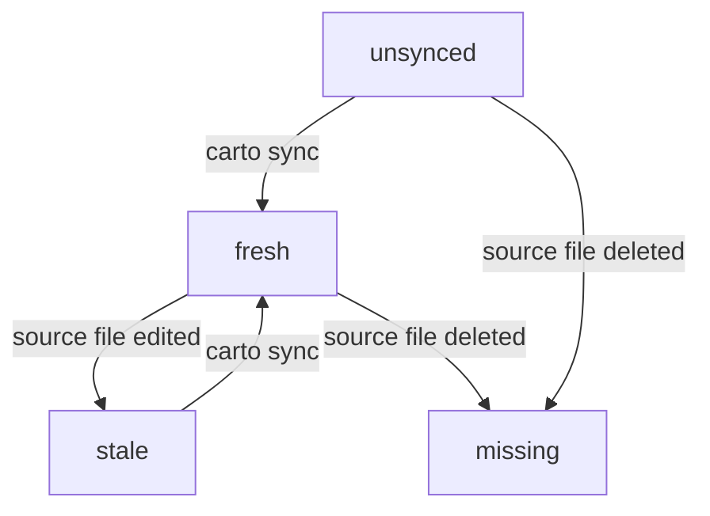

To read or write a carto doc set you need four pieces of vocabulary: the
manifest, the four staleness classes, `carto:` links, and `path:line` code
anchors. This page defines them precisely, against the code that enforces
them.

## Mental model

- **The manifest (`carto.json`)**: one per doc root, one site. Each entry in
  `nodes` has an `id` (required, globally unique, the link target — pattern
  `^[a-z0-9][a-z0-9-]*$`, `packages/core/src/schema.ts:3`), an optional `slug`
  (the URL segment, defaults to `id`), an optional `parent` (another node's
  `id`; omit the key for a root node), and `sources` (files whose behavior the
  page describes, `packages/core/src/schema.ts:17`). A `source` is `{ file }`
  with an *optional* `hash` — the schema treats a missing hash as legal, not an
  error (`packages/core/src/schema.ts:12`).
- **Four staleness states**, decided by comparing a source's stored hash against
  a freshly computed sha256-truncated-to-16-hex digest of its current bytes
  (`packages/core/src/hash.ts:5`, compared against the stored value in
  `packages/core/src/status.ts:35`): `unsynced` (no hash stored yet — the
  normal state right after you add a source), `fresh` (stored hash matches the
  current file), `stale` (they differ — the file changed since the last
  `sync`), and `missing` (the file no longer exists on disk). A node's overall
  state is the worst state among its sources (`packages/core/src/status.ts:31`).
- **`carto:` links** point at a node by its immutable `id`, never a file path
  or slug: `[label](carto:getting-started)`, optionally `#anchor` for a heading within that
  node; an empty label auto-fills the target's title
  (`packages/core/src/resolver.ts:9`). The `carto:<alias>/<id>` federation form
  is parsed but always rejected as unsupported in this version
  (`packages/core/src/resolver.ts:44`); a malformed id or an id that resolves to
  no node is also an error (`packages/core/src/resolver.ts:47`).
- **`path:line` code anchors** are plain text, e.g. `packages/core/src/hash.ts:5`
  — a pointer for the reader's eye, not a machine-checked link. They are a
  separate concept from `sources[].file`, which is what `carto sync` actually
  hashes; in practice both should point at the same load-bearing code.

## Contract

- `id` is immutable — link targets break if you rename it. `slug` is cheap to
  change; it only has to be unique among siblings (nodes sharing a `parent`),
  enforced by `checkTree` (`packages/core/src/tree.ts:56`).
- A node's site path is its ancestor chain of slugs joined with `/`, prefixed
  with `/<locale>` for every locale except `defaultLocale`
  (`packages/core/src/tree.ts:30`).
- A parent cycle (including a node that is its own parent) is an error
  (`packages/core/src/tree.ts:66`); a dangling `parent` (an id that does not yet
  exist) is only a warning (`packages/core/src/tree.ts:61`).

See  for how `status`, `sync`, and `validate` surface these states,
and  for how the site path becomes an actual route.
