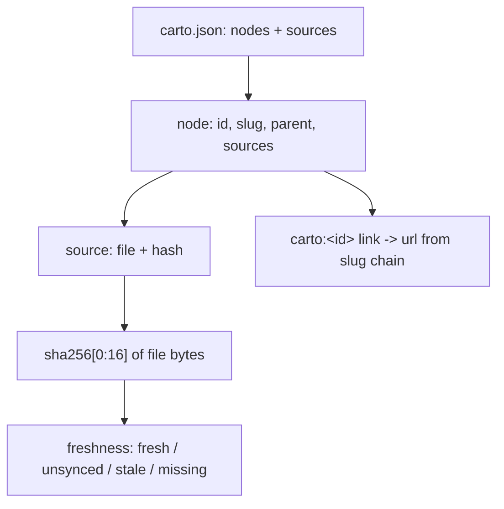

This page is the vocabulary carto assumes: the **manifest** that holds all
structure, the **freshness** model that makes staleness detectable, and the
**`carto:` link** system that survives refactors. Everything here is enforced by
`@carto/core` — the same code the [](carto:cli) runs.

## Mental model



Four ideas: a **node** is one page with an immutable identity; a **source** ties
a node to a file via a content hash; **freshness** is that hash compared to
reality; a **`carto:` link** points at a node's `id`, never its location.

## The manifest

One `carto.json` per doc root = one site. It carries structure and source
tracking only — **no prose**. The schema (`packages/core/src/schema.ts:24`)
requires `version: 1`, a non-empty unique `locales` list with `defaultLocale` a
member of it, and a `nodes` array. Cross-field rules are checked in a
`superRefine`: duplicate locales, a `defaultLocale` outside `locales`, and
duplicate node ids all fail (`packages/core/src/schema.ts:32`).

A node has four fields (`packages/core/src/schema.ts:17`):

- **`id`** — required, globally unique, immutable. Pattern
  `^[a-z0-9][a-z0-9-]*$` (`packages/core/src/schema.ts:3`) — lowercase, digits,
  hyphens; no `.`, no `/`. This is the link target. Never rename it.
- **`slug`** — optional display/URL segment; defaults to the id
  (`packages/core/src/tree.ts:9`); must be unique among siblings. Cheap to
  change — links target the id, not the slug.
- **`parent`** — optional id of the parent node. **Omit the key** for a root; do
  not write `parent: null` (the schema types it as an optional string). A
  non-existent parent is a warning, not an error — you can generate from the
  middle of the tree.
- **`sources`** — the files whose behavior this page describes. Write **`file`
  only**, a path relative to `carto.json`'s directory, with no `..` segments
  (`packages/core/src/schema.ts:5`); `carto sync` fills `hash`. The array may be
  empty for a pure-orientation page.

`sources` is the **staleness crosshair**: too broad triggers false "stale"
churn; too narrow lets real changes slip by. Register only the load-bearing
files a node actually explains.

## Freshness = hash vs. reality

Each source stores a 16-char sha256 of the file's bytes
(`packages/core/src/hash.ts:5`). `carto sync` recomputes and writes it; `carto
status` recomputes and compares. Comparison yields one of four states
(`packages/core/src/status.ts:5`):

- **fresh** — stored hash == actual hash.
- **unsynced** — the source has no stored hash yet (you added a `file` but
  haven't run `sync`) (`packages/core/src/status.ts:44`).
- **stale** — stored hash != actual hash: the file changed since the last sync.
- **missing** — the file no longer exists on disk
  (`packages/core/src/status.ts:41`).

A node's state is the **worst** of its sources, ordered
`fresh < unsynced < stale < missing` (`packages/core/src/status.ts:20`, reduced
at `packages/core/src/status.ts:31`). Because it's hash-based, not git-based, it
catches any edit regardless of VCS — but a newly *added* file inside a subsystem
is invisible until you register it and re-sync.

### Worked example — a real staleness transition

`carto status` reports every node `fresh` right after a sync. Append a byte to a
tracked source and the owning node flips to `stale` — this is exactly what the
repo's `pnpm e2e` smoke test does to `packages/core/src/hash.ts` (a source of the
`concepts` node), then restores it:

```
$ carto status
fresh     concepts

$ printf '\n' >> packages/core/src/hash.ts
$ carto status          # exits non-zero
stale     concepts

$ carto sync && carto status
synced 6 node(s)
fresh     concepts
```

## `carto:` links

Link between pages by **logical id**, never by file path or slug. In `.mdx`,
write a Markdown link whose target is `carto:<id>`:

- `carto:<id>` — a node by id.
- `carto:<id>#<anchor>` — a heading anchor within that node.
- an **empty label** with target `carto:<id>` — the build fills in the target's
  title in the current locale.

The resolver parses the target, rejects the reserved federation `/` form as
unsupported, and looks the id up in the manifest
(`packages/core/src/resolver.ts:41`); an unknown id is an error at
`carto validate` time. The URL itself is the slug chain from root to node,
prefixed by locale for non-default locales (`packages/core/src/tree.ts:30`) —
which is why moving a node never breaks a link.

**Code anchors are different.** A `path:line` mention in prose (like
`packages/core/src/hash.ts:5`) points a reader at source. It renders as plain
text in the MVP — no permalink — and is **separate** from `sources`, which is the
machine-tracked staleness set. In practice both point at the same load-bearing
code.

## See also

- [](carto:cli) — the commands that read and enforce this model.
- [](carto:internals) — where each concept lives in `@carto/core`.
