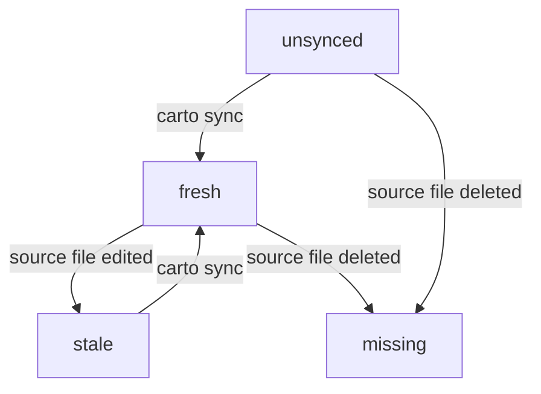

要读懂或撰写一份 carto 文档集，你需要四件词汇：清单、四种新鲜度状态、`carto:` 链接、
以及 `path:line` 代码锚点。本页对照实际执行这些规则的代码，精确定义它们。

## 心智模型

- **清单（`carto.json`）**：每个文档根目录一份，对应一个站点。`nodes` 中的每一项都有
  一个 `id`（必需，全局唯一，即链接目标——模式为 `^[a-z0-9][a-z0-9-]*$`，
  `packages/core/src/schema.ts:3`）、一个可选的 `slug`（URL 片段，默认等于 `id`）、
  一个可选的 `parent`（另一个节点的 `id`；省略该 key 表示根节点），以及 `sources`
  （该页面所描述行为对应的文件，`packages/core/src/schema.ts:17`）。一个 `source` 是
  `{ file }` 加一个*可选*的 `hash`——schema 把缺失 `hash` 视为合法状态，而不是错误
  （`packages/core/src/schema.ts:12`）。
- **四种新鲜度状态**，通过比较一个 source 存储的哈希与其当前字节内容重新计算出的
  sha256 截断 16 位十六进制摘要来判定（`packages/core/src/hash.ts:5`，与存储值的
  比较发生在 `packages/core/src/status.ts:45`）：
  `unsynced`（尚未存储哈希——刚添加一个 source 之后的正常状态）、`fresh`（存储的哈希
  与当前文件一致）、`stale`（两者不一致——文件在上一次 sync 之后变化过）、`missing`
  （文件在磁盘上已不存在）。一个节点的整体状态等于其所有 source 中最差的那个
  （`packages/core/src/status.ts:31`）。
- **`carto:` 链接**通过节点不可变的 `id` 指向该节点，绝不通过文件路径或 slug：
  `[label](carto:getting-started)`，可选地加 `#anchor` 指向该节点内的一个标题；空标签
  会自动填充目标的标题（`packages/core/src/resolver.ts:9`）。`carto:<alias>/<id>` 这种
  联邦形式虽然会被解析，但在这个版本里始终会被拒绝为不支持
  （`packages/core/src/resolver.ts:44`）；一个格式错误的 id，或一个解析不到任何节点
  的 id，同样是错误（`packages/core/src/resolver.ts:47`）。
- **`path:line` 代码锚点**是纯文本，例如 `packages/core/src/hash.ts:5`——供读者用眼睛
  跳转，而不是一个被机器校验的链接。它与 `sources[].file`（`carto sync` 真正哈希的
  对象）是不同的概念；在实践中，二者应当指向同一段承载论断的代码。

## 约定

- `id` 是不可变的——重命名它会破坏所有指向它的链接。`slug` 则很廉价，可以随意更改；
  它只需要在兄弟节点（共享同一个 `parent` 的节点）之间保持唯一，由 `checkTree` 强制
  （`packages/core/src/tree.ts:56`）。
- 一个节点的站点路径，是它的祖先链上各节点 slug 用 `/` 连接的结果，除
  `defaultLocale` 之外的每种 locale 都会加上 `/<locale>` 前缀
  （`packages/core/src/tree.ts:30`）。
- 一个 parent 环（包括一个节点把自己设为 parent）是错误
  （`packages/core/src/tree.ts:66`）；一个悬空的 `parent`（尚不存在的 id）只是警告
  （`packages/core/src/tree.ts:61`）。

关于 `status`、`sync`、`validate` 如何呈现这些状态，见 ；关于站点路径
如何变成真正的路由，见 。
