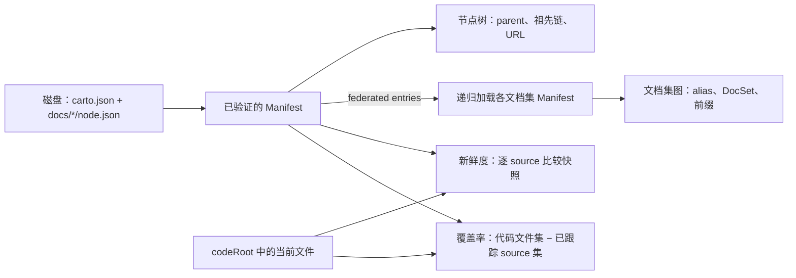

## Manifest 是推理起点，不是另一份配置文件

Carto 先把磁盘上的 `carto.json` 与各节点的 `node.json` 收拢成一个内存模型。类型关系很直接：`Config` 保存文档集级配置，`Node` 在节点文件字段之外补上目录名产生的 `id`，`Manifest` 则把节点数组并入配置。 `packages/core/src/schema.ts:80-87`

配置 schema 要求版本为 `1`、至少一个 locale，且 `defaultLocale` 必须属于 locale 列表；`codeRoot`、主页节点和联邦入口也在这里校验。联邦 alias 不能重复，`self` 被保留。 `packages/core/src/schema.ts:43-77` `nodeFileSchema` 产出的元数据只保留可选 `parent` 与默认为空数组的 `sources`；`id` 来自目录名，序列化 `node.json` 时也不会写入。 `packages/core/src/schema.ts:43-46` `packages/core/src/manifest.ts:27-43`

装配过程分三步：读取并解析 `carto.json`，用 schema 把无效内容转成 `ManifestError`； `packages/core/src/manifest.ts:21-35` `packages/core/src/manifest.ts:68-80` 随后扫描 `docs/` 的一级目录，拒绝非法目录名并按 id 排序；最后逐个读取存在的 `node.json`，解析后与配置合并。 `packages/core/src/manifest.ts:82-131` 父节点是否存在、父链是否成环由 `checkTree` 在装配后另行检查，而不是 schema 装配的一部分。 `packages/core/src/tree.ts:32-68`

下面只画以根 manifest 为入口建立的几种结构。节点树与联邦图不是同一条层级关系：前者来自单个 manifest，后者会递归加载每个联邦文档集自己的 manifest。新鲜度与覆盖率也不是同一个指标。 `packages/core/src/graph.ts:44-88`

## 两种层级：节点树与文档集图

单个 manifest 内，`parent` 形成节点树。`nodesById` 建索引，`childrenOf` 查直接子节点；`rootChain` 从当前节点沿 `parent` 向上回溯，返回包含当前节点的根到节点链，URL 再由链中各节点的 id 拼出，并按站点默认 locale 决定是否加 locale 前缀。 `packages/core/src/tree.ts:3-29` `packages/core/src/tree.ts:9-29` 这套树检查会把悬空父引用记为 warning，把父链环记为 error；它不会把联邦入口混进节点父子关系。 `packages/core/src/tree.ts:32-68`

联邦位于更外层，描述的是多个 manifest 组成的 `DocSet` 图。每个文档集持有自己的 manifest、文档根目录、URL 前缀以及本地 alias 到文档集 hash 的映射；整个 `Graph` 再以 hash 索引这些集合。 `packages/core/src/graph.ts:7-19` 文件型入口相对当前文档根解析，身份 hash 来自相对联邦根的规范化真实路径；git 型入口目前会明确报未实现。 `packages/core/src/graph.ts:28-42`

加载器递归读取每个文档集的 manifest，并用 hash 去重。根集合在启用联邦时取 `/self` 前缀；其他集合若由多个 alias 指向，则选字典序最小的 alias，再拼上 hash 形成稳定前缀。 `packages/core/src/graph.ts:44-88` 因此，节点树回答“一个页面在本集合中的祖先与导航路径是什么”，联邦图回答“跨文档集引用落到哪个独立 manifest 与 URL 命名空间”。

## Source 是相对 codeRoot 的内容快照

`source.file` 只能使用正斜杠的相对路径，不能包含 `..`；`commit` 只有在 `hash` 存在时才合法。 `packages/core/src/schema.ts:5-25` manifest 的 `codeRoot` 从文档根解析，未配置时使用文档根本身。 `packages/core/src/manifest.ts:6-8` 对应文件的快照是文件字节的 SHA-256 十六进制摘要前 16 位；commit 只是与该摘要一起记录的来源信息，不参与内容哈希。 `packages/core/src/hash.ts:4-10`

`sync` 会区分“不指定目标”和“定向指定节点”：

- 不传 `targets` 时，所有节点都在范围内，但只给尚无 hash 的 source 建立初始快照；已有快照原样保留。 `packages/core/src/manifest.ts:187-205` `packages/core/src/manifest.ts:208-232`
- 传入 `targets` 时，先拒绝未知节点，只处理选中的节点，并重新计算这些节点的每个 source；hash 或 commit 任一变化都会把节点列入 `changed`。 `packages/core/src/manifest.ts:169-185` `packages/core/src/manifest.ts:208-236`

两条路径都在传入的代码根下解析 `source.file`；文件缺失时先记录其路径并保留该 source 的现有元数据，遍历结束后统一抛错，因此不会返回部分同步结果。 `packages/core/src/manifest.ts:169-236` `packages/core/src/manifest.ts:233-236` 这种差异让不指定目标的 `sync` 适合补齐新节点的基线，而定向 `sync` 明确表示“接受这些节点当前的代码状态”。

## 新鲜度取最差 source，覆盖率另算

新鲜度共有 `fresh`、`unsynced`、`stale`、`missing` 四态，优先级依次升高。节点报告保留每个 source 的结果，再以最差状态作为节点状态。 `packages/core/src/status.ts:5-21` `packages/core/src/status.ts:27-33` 分类时从代码根读取当前文件：文件不存在为 `missing`，没有存储 hash 为 `unsynced`，摘要相同为 `fresh`，否则为 `stale`。 `packages/core/src/status.ts:27-46` `packages/core/src/status.ts:27-53` 全量状态报告只是依 manifest 节点顺序逐一执行这项分类。 `packages/core/src/status.ts:49-53` `packages/core/src/status.ts:27-52`

覆盖率不读取存储 hash，也不会把 `fresh` 当成“已覆盖”。它先合并忽略规则：读取 `.gitignore` 和 `.cartoignore`，并内置排除 `.git`、`node_modules/`、`/carto.json`、`/docs/`、`/dist-site/` 以及两个忽略文件本身。 `packages/core/src/coverage.ts:10-14` 遍历代码根时统一为 POSIX 路径，并可额外排除嵌套在代码根内的文档目录。 `packages/core/src/coverage.ts:20-57` 最终把所有节点声明的 `source.file` 合成“已跟踪集合”，与遍历得到的代码文件集合做差；差集是 `uncovered`，`covered` 则是总数减去差集大小。 `packages/core/src/coverage.ts:60-68`

换句话说，新鲜度检查“声明过的快照是否仍对应当前内容”，覆盖率检查“当前代码文件是否被任何节点声明”。一个 source 可以已覆盖但 stale；一个节点也可以全部 fresh，而代码根仍有大量未覆盖文件。

## 邻接边界

[架构总览](carto:overview)说明 core 在整套 Carto 中的位置；[命令行工作流](carto:cli-workflow)负责选择何时读取、同步和报告这些派生结果；[站点渲染](carto:site-rendering)消费已建立的节点路径与文档集前缀。core-model 的边界止于确定性的装配、派生与比较，不负责命令编排，也不负责页面呈现。
