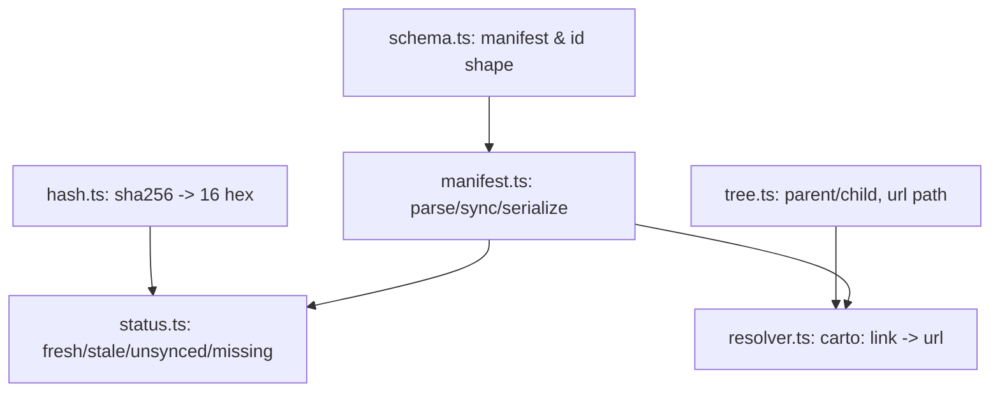

`@carto/core` is the shared brain behind carto: a dependency-free library that
`@carto/cli` and `@carto/template` both import. It owns the manifest's shape,
how a file's staleness is decided, how the node tree resolves parent/child
relationships into URLs, and how `carto:` links turn into paths. See
[the overview](carto:overview) for how the three packages fit together.

## Mental model

Five small modules, each with one job:

- **Schema** (`packages/core/src/schema.ts:3`) defines `ID_PATTERN`
  (`^[a-z0-9][a-z0-9-]*$`), the pattern every node `id` and `slug` must match.
  `sourceSchema` (`packages/core/src/schema.ts:12`) models a source as `file`
  plus an *optional* `hash` — the absence of `hash` is the "unsynced" state, not
  an error. `nodeSchema` (`packages/core/src/schema.ts:17`) adds `id`, `slug`,
  `parent`, and `sources` on top.
- **Hashing** (`packages/core/src/hash.ts:5`) computes a sha256 digest of a
  file's raw bytes and truncates it to the first 16 hex characters — this
  16-char hash is exactly what `carto sync` writes into `sources[].hash`.
- **Tree** (`packages/core/src/tree.ts:41`) walks the flat `nodes[]` array to
  detect three tree-shaped problems: duplicate slugs among siblings (an error,
  `packages/core/src/tree.ts:56`), a parent id that does not exist (a warning
  only, `packages/core/src/tree.ts:61`), and parent cycles (an error,
  `packages/core/src/tree.ts:66`). `urlPath` (`packages/core/src/tree.ts:30`)
  turns a node's ancestor chain of slugs into the site path a locale renders at.
- **Status** (`packages/core/src/status.ts:35`) classifies each source into one
  of four states by comparing the stored hash against a freshly computed one:
  `fresh` (hashes match), `stale` (they differ), `unsynced` (no stored hash
  yet), or `missing` (the file is gone).
- **Resolver** (`packages/core/src/resolver.ts:9`) parses a `carto:<id>` or
  `carto:<id>#<anchor>` link target; the reserved `carto:<alias>/<id>`
  federation form is recognized but always rejected as unsupported
  (`packages/core/src/resolver.ts:44`) until a future version.

`packages/core/src/manifest.ts:68` (`syncManifest`) is the one function that
recomputes every source's hash; it refuses to update `updated_at` if any
registered file is missing (`packages/core/src/manifest.ts:84`), which is why
a source path that does not exist on disk makes `carto sync` fail loudly
instead of silently writing a stale manifest.
