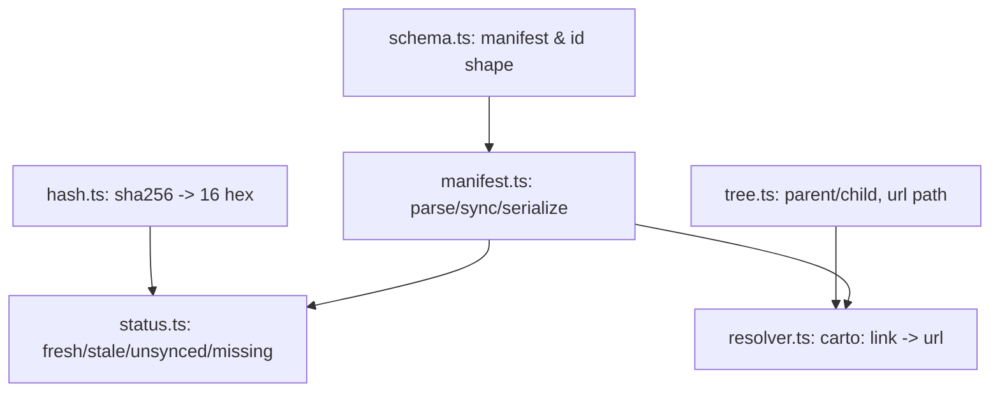

`@carto/core` 是 carto 背后共享的大脑：一个不依赖其他包、被 `@carto/cli` 与
`@carto/template` 同时引入的库。它定义了清单的形状、如何判定一个文件是否过期、节点树
如何把父子关系解析成 URL，以及 `carto:` 链接如何转换成路径。想了解三个包如何组合在一起，
参见 [the overview](carto:overview)。

## 心智模型

五个各司其职的小模块：

- **Schema**（`packages/core/src/schema.ts:3`）定义了 `ID_PATTERN`
  （`^[a-z0-9][a-z0-9-]*$`），每个节点的 `id` 与 `slug` 都必须匹配这个模式。
  `sourceSchema`（`packages/core/src/schema.ts:12`）把一个 source 建模为 `file`
  加上一个*可选*的 `hash`——`hash` 缺失就是"未同步"状态，而不是错误。`nodeSchema`
  （`packages/core/src/schema.ts:17`）在此基础上加上了 `id`、`slug`、`parent`
  与 `sources`。
- **Hashing**（`packages/core/src/hash.ts:5`）对一个文件的原始字节计算 sha256 摘要，
  并截取前 16 个十六进制字符——这个 16 字符哈希正是 `carto sync` 写入
  `sources[].hash` 的内容。
- **Tree**（`packages/core/src/tree.ts:41`）遍历扁平的 `nodes[]` 数组，检测三类树形
  问题：同级节点间重复的 slug（错误，`packages/core/src/tree.ts:56`）、指向不存在节点
  的 parent id（仅为警告，`packages/core/src/tree.ts:61`），以及父级循环引用（错误，
  `packages/core/src/tree.ts:66`）。`urlPath`（`packages/core/src/tree.ts:30`）把一个
  节点的祖先 slug 链转换成该 locale 下渲染的站点路径。
- **Status**（`packages/core/src/status.ts:35`）通过比较存储的哈希与实时计算的哈希，
  把每个 source 分类为四种状态之一：`fresh`（哈希一致）、`stale`（哈希不一致）、
  `unsynced`（尚无存储的哈希）或 `missing`（文件已不存在）。
- **Resolver**（`packages/core/src/resolver.ts:9`）解析 `carto:<id>` 或
  `carto:<id>#<anchor>` 形式的链接目标；保留的 `carto:<alias>/<id>` 联邦形式虽能被
  识别，但目前始终会被判定为不支持（`packages/core/src/resolver.ts:44`），留待未来
  版本支持。

`packages/core/src/manifest.ts:68`（`syncManifest`）是唯一重新计算每个 source 哈希的
函数；如果任何登记的文件缺失，它会拒绝更新 `updated_at`
（`packages/core/src/manifest.ts:84`）——这就是为什么一个在磁盘上不存在的 source 路径
会让 `carto sync` 直接报错失败，而不是悄悄写入一个过期的清单。
