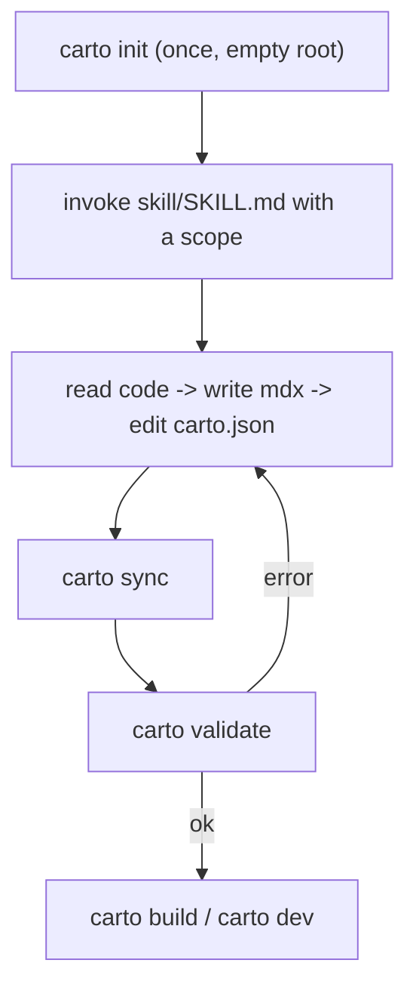

This walks a first-time user from zero to a rendered doc site: install the
CLI, scaffold a doc root, invoke the skill, and sync + validate + build the
result. Every command below was actually run in this repository's own worktree
— the output is real, not idealized.

## Mental model

- **Prerequisites**: an LLM or coding agent you already use (BYO-LLM — carto has
  no bundled model), and the `carto` CLI on your `PATH` (built from this repo
  via `pnpm build`, which compiles `@carto/core`, `@carto/cli`, and
  `@carto/template`).
- **`carto init`** scaffolds an empty doc root: it refuses to run if
  `carto.json` already exists (`packages/cli/src/commands/init.ts:15`),
  otherwise it writes a minimal `carto.json` (`version: 1`, your locales, an
  empty `nodes` array) and creates `docs/`
  (`packages/cli/src/commands/init.ts:33`).
- **Invoke the skill with a scope** — hand your agent `skill/SKILL.md` plus
  either `document <dir|files>` (new coverage) or `refresh [<id>]` (existing
  nodes whose sources changed) (`skill/SKILL.md:31`).
- **What the skill does at each step** — the generation loop: read the code and
  run `carto status`, plan a node tree, write `docs/<id>/<locale>.mdx` for every
  node and locale, edit `carto.json` (each source lists `file` only), then
  `carto sync` followed by `carto validate`; on a validate error, fix what it
  names and repeat (`skill/SKILL.md:42`).



## Worked example

**1. Scaffold an empty doc root.** Run in a fresh directory (not this repo,
which already has a `carto.json`):

```
$ carto init
initialized carto.json (locales: en) and docs/
```

This is the real, unedited stdout of `carto init` run against an empty
directory — it prints exactly the `${locales.join(', ')}` template at
`packages/cli/src/commands/init.ts:35`.

**2. Invoke the skill.** With `carto.json` and `docs/` in place, hand your agent
`skill/SKILL.md` and a scope, e.g. `document packages/payments`. The agent reads
the code, writes `docs/payments/en.mdx` (and any other locales), and adds a
`payments` node to `carto.json` with
`sources: [{ "file": "packages/payments/src/..." }]` — no `hash` yet.

**3. Sync and validate.** This repository's own self-docs (the six nodes
`overview`, `getting-started`, `skill`, `cli`, `concepts`, `internals`) are the
worked example: after writing all twelve `.mdx` pages and the manifest above,
running the loop from this worktree produced:

```
$ carto sync
synced 6 node(s)

$ carto status
fresh     overview
fresh     getting-started
fresh     skill
fresh     cli
fresh     concepts
fresh     internals
```

Every node reports `fresh` — the hashes `sync` just wrote match the sources on
disk (`packages/core/src/status.ts:45`). See [](carto:cli) for what `validate`
and `build` print next, and [](carto:concepts) for what `fresh`/`stale` mean.

## Gotchas

- `carto init` refuses to overwrite an existing `carto.json`
  (`packages/cli/src/commands/init.ts:16`) — you only ever run it once per doc
  root.
- A freshly-added source is `unsynced`, not an error; `carto validate` is what
  rejects unsynced sources, forcing you to run `sync` first
  (`skill/SKILL.md:219`).

Next: [](carto:skill) for exactly what the skill asks your agent to do, or
[](carto:cli) for the full command reference.
