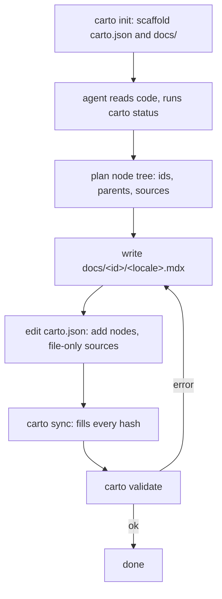

Goal: go from an undocumented directory to a **validated carto doc set** that
renders as a site. By the end you'll have scaffolded a doc root, driven your
agent through the generation loop, and seen `carto validate` exit 0. The
walkthrough below is the real run that produced *this* site, with real output.

## Prerequisites

- **An LLM/agent** that can read files and write files — carto is BYO-LLM. The
  agent reads code and writes the `.mdx` pages and the manifest
  ([](carto:skill)); carto never invents prose.
- **The `carto` CLI on PATH.** In this repo it's a workspace binary: after
  `pnpm install && pnpm build && pnpm install` (the second install links the
  bin — see the repo `README.md`), invoke it as `pnpm exec carto`.
- **Node ≥ 20.**

## The loop you're about to run



Three concepts to hold: a **node** is one page with an immutable `id`; a
**source** is a file whose behavior a node describes (the staleness crosshair);
a **locale** is one language — every node needs one `.mdx` per declared locale or
`validate` fails (`packages/cli/src/commands/validate.ts:45`).

## Steps

### 1. Scaffold the doc root

`carto init` writes an empty `carto.json` and a `docs/` directory into the
current directory. It refuses to clobber an existing manifest
(`packages/cli/src/commands/init.ts:15`):

```
$ carto init
initialized carto.json (locales: en) and docs/

$ carto init
carto.json already exists; refusing to overwrite
```

Pass `--locales en,zh` to declare more than one language up front
(`packages/cli/src/commands/init.ts:19`).

### 2. Let the agent plan and write

Invoke [](carto:skill) with a scope (a directory or set of files). The agent
reads the code, chooses a node subtree (ids, parents, sources), and writes
`docs/<id>/<locale>.mdx` for each node. It then edits `carto.json` to register
each node with its sources — **`file` only, no `hash`** (`carto sync` fills
those). See [](carto:concepts) for the manifest shape.

### 3. Sync, then validate

`carto sync` computes and writes every source hash and refreshes `updated_at`
(`packages/cli/src/commands/sync.ts:12`). `carto validate` then checks schema,
tree, sync state, and that every `carto:` link resolves
(`packages/cli/src/commands/validate.ts:17`).

## Worked example — documenting this repo

This is the actual run that produced the six-node self-doc set, from the repo
root (the doc root):

```
$ pnpm exec carto sync
synced 6 node(s)

$ pnpm exec carto status
fresh     overview
fresh     getting-started
fresh     skill
fresh     cli
fresh     concepts
fresh     internals

$ pnpm exec carto validate
validate: ok
```

`sync` filled 6 nodes' hashes; `status` reports every node `fresh` (stored hash
== actual hash) and exits 0; `validate` prints `validate: ok`. Preview it with
`carto dev` at `http://localhost:4321/overview/`, or render the static site with
`carto build` — both are covered in [](carto:cli).

## What "done" looks like

`carto validate` exits 0 and `carto status` shows every node `fresh`. If a
source later changes, that node turns `stale` — re-invoke the skill on it
(`refresh` mode) and re-`sync`. That staleness signal is the whole point; how it
works is [](carto:concepts).

## Next

- [](carto:skill) — the authoring interface and its two modes.
- [](carto:cli) — every command with real output.
- [](carto:concepts) — manifest, staleness, and links in depth.
