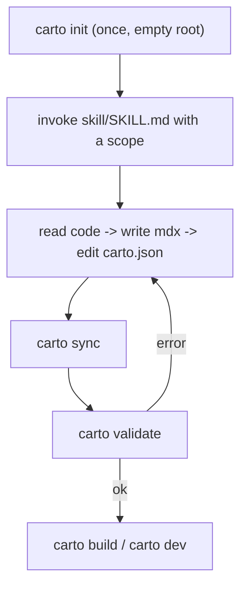

本页带你从零走到一个已渲染的文档站点：安装 CLI、搭建一个文档根目录、调用技能、
再依次 sync + validate + build。下面的每一条命令都真的在这个仓库自己的 worktree
里运行过——输出是真实的，不是想象出来的。

## 心智模型

- **前置条件**：一个你已经在用的 LLM 或编码智能体（BYO-LLM——carto 不附带模型），以及
  `PATH` 上可用的 `carto` CLI（从本仓库通过 `pnpm build` 构建，它会编译 `@carto/core`、
  `@carto/cli` 和 `@carto/template`）。
- **`carto init`** 搭建一个空的文档根目录：如果 `carto.json` 已经存在就拒绝运行
  （`packages/cli/src/commands/init.ts:15`），否则它会构建一份最小的 `carto.json`
  （`version: 1`、你的 locales、一个空的 `nodes` 数组）于 `packages/cli/src/commands/init.ts:20`，
  创建 `docs/`（`packages/cli/src/commands/init.ts:33`），并写入清单
  （`packages/cli/src/commands/init.ts:34`）。
- **带着一个范围调用技能**——把 `skill/SKILL.md` 交给你的智能体，再加上
  `document <dir|files>`（覆盖新范围）或 `refresh [<id>]`（源文件变化过的已有节点）
  （`skill/SKILL.md:31`）。
- **技能在每一步做什么**——这个生成循环：读代码并运行 `carto status`，规划节点树，
  为每个节点每种 locale 撰写 `docs/<id>/<locale>.mdx`，编辑 `carto.json`（每个 source
  只写 `file`），然后运行 `carto sync`，再运行 `carto validate`；如果 validate 报错，
  就修复它指出的问题并重复（`skill/SKILL.md:42`）。



## 实操示例

**1. 搭建一个空的文档根目录。** 在一个全新的目录里运行（不是本仓库，因为本仓库已经有
一份 `carto.json`）：

```
$ carto init
initialized carto.json (locales: en) and docs/
```

这是 `carto init` 针对一个空目录运行时真实、未经修改的标准输出——它打印的正是
`packages/cli/src/commands/init.ts:35` 处的 `${locales.join(', ')}` 模板。

**2. 调用技能。** 有了 `carto.json` 和 `docs/` 之后，把 `skill/SKILL.md` 和一个范围
交给你的智能体，例如 `document packages/payments`。智能体会读代码，写出
`docs/payments/en.mdx`（以及其他 locale），并往 `carto.json` 里加一个 `payments`
节点，`sources: [{ "file": "packages/payments/src/..." }]`——此时还没有 `hash`。

**3. Sync 与 validate。** 本仓库自己的自述文档（`overview`、`getting-started`、
`skill`、`cli`、`concepts`、`internals` 这六个节点）就是这个实操示例：在写完全部十二份
`.mdx` 页面和上面的清单之后，在这个 worktree 里跑这个循环产生了：

```
$ carto sync
synced 6 node(s)

$ carto status
fresh     overview
fresh     getting-started
fresh     skill
fresh     cli
fresh     concepts
fresh     internals
```

每个节点都报告 `fresh`——`sync` 刚写入的哈希与磁盘上的源文件一致
（`packages/core/src/status.ts:45`）。关于 `validate` 和 `build` 接下来会打印什么，
见 [](carto:cli)；关于 `fresh`/`stale` 是什么意思，见 [](carto:concepts)。

## 注意事项

- `carto init` 拒绝覆盖已存在的 `carto.json`
  （`packages/cli/src/commands/init.ts:16`）——每个文档根目录只运行它一次。
- 一个刚添加的 source 是 `unsynced`，不是错误；`carto validate` 才会拒绝未同步的
  source，从而迫使你先运行 `sync`（`packages/cli/src/commands/validate.ts:37`）。

下一步：关于技能到底要求你的智能体做什么，见 [](carto:skill)；完整的命令参考，
见 [](carto:cli)。
