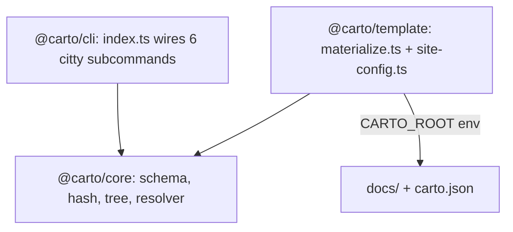

This node is for people hacking on carto itself — contributors extending the
CLI, core library, or template, not end users driving the skill. If you only
want to *use* carto, see  instead.

## Mental model

Three packages, each with one job, wired together as a pnpm workspace:

- **`@carto/core`** (`packages/core/src/index.ts:1`) is the shared library both
  other packages import: the zod manifest schema, sha256 hashing,
  the node tree, the freshness classifier, and the `carto:` link resolver. It
  never touches `process.cwd()` or stdout — see  for what it
  computes.
- **`@carto/cli`** (`packages/cli/src/index.ts:12`) is the `carto` binary. It
  wires exactly six citty subcommands (`init`, `status`, `sync`, `validate`,
  `dev`, `build`) onto core's functions and is the only package that owns
  `process.cwd()`, stdout formatting, and exit codes — see  for
  the user-facing view of the same six commands.
- **`@carto/template`** materializes a doc root into an Astro/Starlight site.
  `packages/template/src/materialize.ts:11` reads `carto.json`, wipes and
  recreates its Starlight content collection
  (`packages/template/src/materialize.ts:12`), and for every node × locale
  copies `docs/<id>/<locale>.mdx` into a path keyed by the node's ancestor slug
  chain (`packages/template/src/materialize.ts:27`), rewriting every
  `[label](carto:concepts)` link in the copy into a real site URL — and filling an
  empty label with the target's title — via `resolveCartoLink`
  (`packages/template/src/materialize.ts:33`).
  `packages/template/src/site-config.ts:18` builds the sidebar by walking the
  same root-to-leaf tree (`childrenOf`, `packages/template/src/site-config.ts:1`)
  that `urlPath` uses to compute routes.

## Contract

- `@carto/template` is invoked out-of-process: `carto dev`/`carto build`
  `spawn` a `pnpm` script inside the template package with `CARTO_ROOT` set to
  the CLI's `process.cwd()` (`packages/cli/src/commands/dev.ts:22`), so the
  template never assumes it lives inside the doc root it renders.
  `packages/template/src/materialize.ts:10` reads that env var, falling back to
  its own `process.cwd()` only when unset.
- `materialize.ts` link-rewriting only rewrites links it can resolve — an
  unresolved `carto:` target is left untouched in the copy
  (`packages/template/src/materialize.ts:36`), which is why `carto validate`
  must run and pass **before** `carto build`: an invalid link silently survives
  into the rendered mdx otherwise, it just fails to become a working `<a href>`.

## Gotchas

- `@carto/core` exports its public surface from a single barrel
  (`packages/core/src/index.ts:2`-`:7`) re-exporting `schema`, `hash`,
  `manifest`, `tree`, `resolver`, and `status` — adding a new core module means
  adding its export line here or consumers cannot import it.
- The template's title-fill (``) requires a first pass over every
  node's frontmatter to collect titles (`packages/template/src/materialize.ts:42`)
  before the link-rewrite pass runs — get the ordering wrong and titles resolve
  to the raw id instead.

See  for the manifest/staleness/link vocabulary these modules
implement, and  for the commands that call into `@carto/core`.
