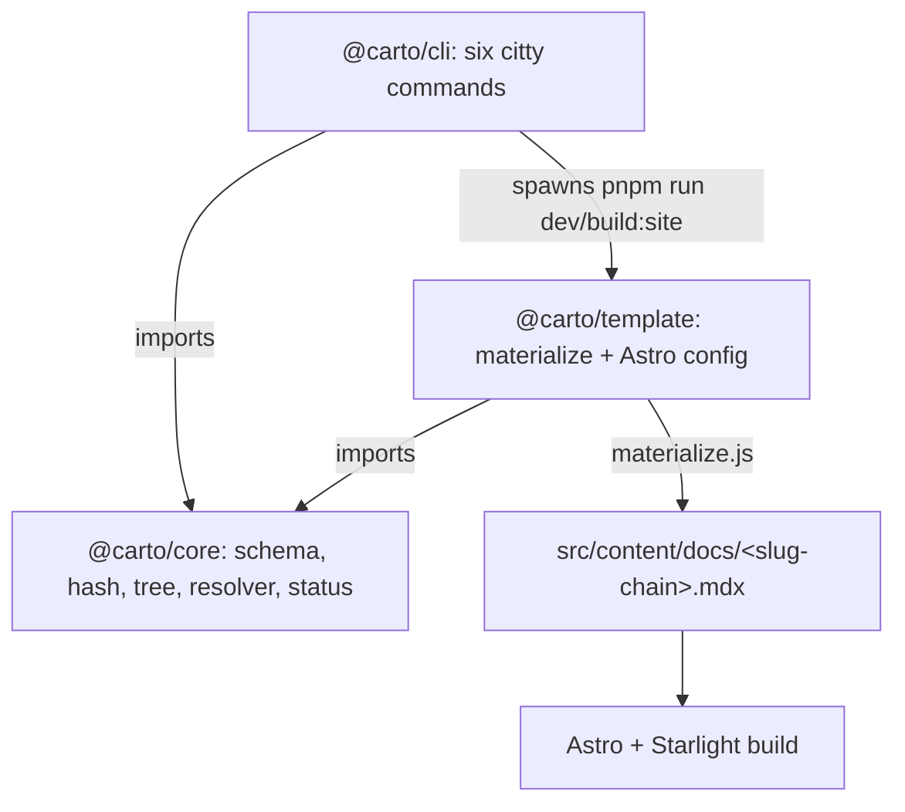

This node is for people **hacking on carto itself**, not for users documenting
their code — if you just want to drive carto, read .
Here is how the three packages fit: `@carto/core` is the library of record,
`@carto/cli` is thin citty wiring over it, and `@carto/template` materializes
id-based docs into the layout Astro + Starlight route natively.

## Mental model

Three packages, one dependency direction: everything points at `core`. `cli` and
`template` reimplement none of core's schema/hash/URL/resolver logic — they call
it. The only cross-package runtime call is `cli` spawning `template`'s package
scripts.

## `@carto/core` — the library

A flat barrel (`packages/core/src/index.ts:2`) re-exporting five modules: the zod
`schema`, `hash` (sha256/16), `manifest` (read/write/`syncManifest`), `tree`
(`slugOf`, `childrenOf`, `rootChain`, `urlPath`, `checkTree`), `resolver`
(`parseCartoLink`/`resolveCartoLink`), and `status` (the four-state
classifier). This is the single definition of every rule the other packages
depend on; the model it encodes is .

## `@carto/cli` — citty wiring

`packages/cli/src/index.ts:10` builds one `defineCommand` with six subcommands
and hands it to `runMain` (`packages/cli/src/index.ts:22`). Each command file
under `packages/cli/src/commands/` is thin: it reads `carto.json` from
`process.cwd()`, calls a core function, prints a line, and sets an exit code.
`validate` adds the only CLI-local logic — `extractCartoTargets`
(`packages/cli/src/links.ts:1`) scans each `.mdx` for `carto:` targets and feeds
them to core's resolver. The user-facing behavior of all six is .

## `@carto/template` — materialize then route

Starlight hardcodes `src/content/docs` and derives locale + URL from directory
structure. Rather than fight it, the template **materializes**: `materialize.ts`
reads the doc root's `carto.json` (via `CARTO_ROOT`), wipes and rebuilds
`src/content/docs` (`packages/template/src/materialize.ts:12`), and writes each
node's `.mdx` to a **slug-chain path** — `rootChain(...).map(slugOf).join('/')`,
locale-prefixed for non-default locales
(`packages/template/src/materialize.ts:27`). As it copies, `rewriteLinks`
replaces every `carto:<id>` with the resolved URL and fills empty labels with the
target's title (`packages/template/src/materialize.ts:33`); titles are collected
from each page's frontmatter first (`packages/template/src/materialize.ts:42`).

The Astro config reads the same manifest and builds Starlight's `locales` and
`sidebar` from it via `buildLocales` / `buildSidebar`
(`packages/template/src/site-config.ts:3`, `packages/template/src/site-config.ts:18`);
`entryFor` recurses the node tree into nested sidebar entries
(`packages/template/src/site-config.ts:22`). The result reproduces exactly the
URLs `urlPath` computes, so `carto:` links resolve to real routes.

## How `carto dev`/`build` reach here

The CLI's `dev`/`build` resolve `@carto/template/package.json` at runtime and
`spawn pnpm run` (`dev` or `build:site`) with `CARTO_ROOT` = the doc root
(`packages/cli/src/commands/dev.ts:15`). That env var is what points
`materialize.js` and the Astro config at your `carto.json` instead of the
template's own directory.

## Build order gotcha

The `carto` bin target (`packages/cli/dist/index.js`) doesn't exist on a fresh
clone, so pnpm's first `install` can't link it. The sequence is `pnpm install`
→ `pnpm build` → `pnpm install` again (the second install links the now-built
bin). The repo `README.md` documents this trap; `pnpm e2e` is the standing guard
that the whole pipeline still runs.

## See also

-  — the model `@carto/core` encodes.
-  — the user-facing side of these commands.
