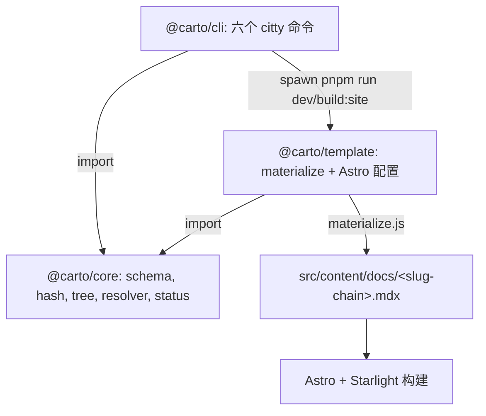

本节点面向**改动 carto 本身**的人，而非为自己代码写文档的用户——如果你只想驱动 carto，
去读 。这里讲三个包如何组合：`@carto/core` 是权威库，
`@carto/cli` 是它之上一层薄薄的 citty 接线，而 `@carto/template` 把基于 id 的文档物料化为
Astro + Starlight 能原生路由的布局。

## 心智模型

三个包，一个依赖方向：一切都指向 `core`。`cli` 和 `template` 不重新实现 core 的任何
schema/hash/URL/resolver 逻辑——它们调用它。唯一的跨包运行时调用是 `cli` spawn `template`
的 package 脚本。

## `@carto/core` —— 库

一个扁平的桶文件（`packages/core/src/index.ts:2`）重导出五个模块：zod `schema`、`hash`
（sha256/16）、`manifest`（read/write/`syncManifest`）、`tree`（`slugOf`、`childrenOf`、
`rootChain`、`urlPath`、`checkTree`）、`resolver`（`parseCartoLink`/`resolveCartoLink`）、
以及 `status`（四态分类器）。这是其他包所依赖的每条规则的唯一定义；它编码的模型是
。

## `@carto/cli` —— citty 接线

`packages/cli/src/index.ts:10` 构建一个带六个子命令的 `defineCommand` 并交给 `runMain`
（`packages/cli/src/index.ts:22`）。`packages/cli/src/commands/` 下的每个命令文件都很薄：
它从 `process.cwd()` 读 `carto.json`、调用一个 core 函数、打印一行、设置退出码。`validate`
加入了唯一的 CLI 本地逻辑——`extractCartoTargets`（`packages/cli/src/links.ts:1`）扫描每个
`.mdx` 中的 `carto:` 目标，并把它们喂给 core 的解析器。这六个命令的用户面向行为是
。

## `@carto/template` —— 先物料化再路由

Starlight 硬编码 `src/content/docs`，并从目录结构推导 locale 与 URL。与其对抗，模板选择
**物料化（materialize）**：`materialize.ts` 读取文档根的 `carto.json`（通过 `CARTO_ROOT`），
清空并重建 `src/content/docs`（`packages/template/src/materialize.ts:12`）。当清单没有根节点时，
它写一张空态 `index.mdx`——以文档根的文件夹名作标题——然后返回
（`packages/template/src/materialize.ts:14`、`packages/template/src/materialize.ts:31`）；
否则把每个节点的 `.mdx` 写到一个 **slug 链路径**——`rootChain(...).map(slugOf).join('/')`，
非默认语言带语言前缀（`packages/template/src/materialize.ts:52`）。复制的同时，`rewriteLinks`
把每个 `carto:<id>` 替换为解析后的 URL 并用目标标题填充空标签
（`packages/template/src/materialize.ts:58`）；标题先从每个页面的 frontmatter 收集
（`packages/template/src/materialize.ts:67`）。

Astro 配置读取同一份清单，并通过 `buildLocales` / `buildSidebar` 从中构建 Starlight 的
`locales` 与 `sidebar`（`packages/template/src/site-config.ts:3`、
`packages/template/src/site-config.ts:18`）；`entryFor` 把节点树递归成嵌套的侧边栏条目
（`packages/template/src/site-config.ts:38`）。`buildRedirects` 把站点根 `/`（以及每个语言根）
送往 `home` 节点，未设 `home` 时送往第一个根节点（`packages/template/src/site-config.ts:22`）。
其结果精确重现 `urlPath` 所计算的 URL，因此 `carto:` 链接解析到真实路由。

## `carto dev`/`build` 如何触达这里

CLI 的 `dev`/`build` 在运行时解析 `@carto/template/package.json`，并以 `CARTO_ROOT` = 文档根
`spawn pnpm run`（`dev` 或 `build:site`）（`packages/cli/src/commands/dev.ts:15`）。正是那个
环境变量把 `materialize.js` 和 Astro 配置指向你的 `carto.json`，而非模板自身的目录。

## 构建顺序的坑

`carto` bin 目标（`packages/cli/dist/index.js`）在全新克隆上并不存在，所以 pnpm 的第一次
`install` 无法链接它。顺序是 `pnpm install` → `pnpm build` → 再次 `pnpm install`（第二次
install 链接现已构建好的 bin）。仓库 `README.md` 记录了这个坑；`pnpm e2e` 是整条流水线仍能
运行的常驻守卫。

## 另见

-  —— `@carto/core` 所编码的模型。
-  —— 这些命令的用户面向一侧。
