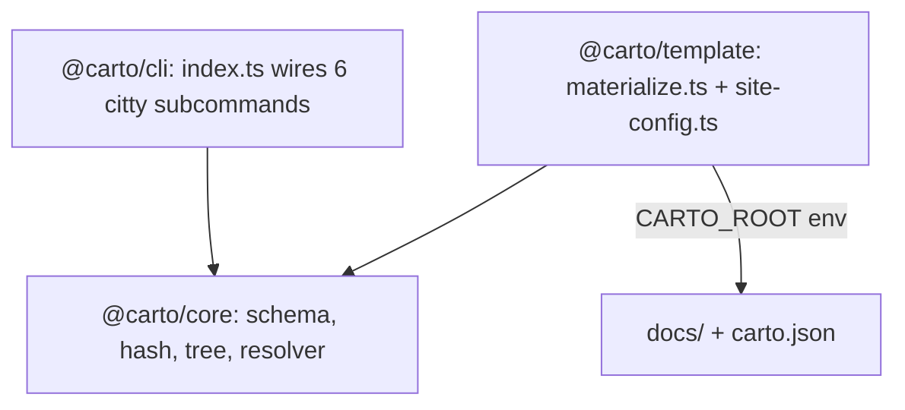

本节面向亲自动手改造 carto 本身的人——是给扩展 CLI、核心库或模板的贡献者看的，
不是给驱动这份技能的最终用户看的。如果你只是想*使用* carto，请见 。

## 心智模型

三个包，各司其职，通过一个 pnpm workspace 连接在一起：

- **`@carto/core`**（`packages/core/src/index.ts:1`）是另外两个包都会导入的共享库：
  zod 清单 schema、sha256 哈希、节点树、新鲜度分类器，以及 `carto:` 链接解析器。它从不
  接触 `process.cwd()` 或标准输出——关于它计算的内容，见 。
- **`@carto/cli`**（`packages/cli/src/index.ts:12`）就是 `carto` 可执行文件。它把
  恰好六个基于 citty 的子命令（`init`、`status`、`sync`、`validate`、`dev`、`build`）
  接到 core 的函数上，也是唯一拥有 `process.cwd()`、标准输出格式化与退出码的包——
  关于这六个命令面向用户的视角，见 。
- **`@carto/template`** 把一个文档根目录物化成一个 Astro/Starlight 站点。
  `packages/template/src/materialize.ts:11` 读取 `carto.json`，清空并重建它的
  Starlight 内容集合（`packages/template/src/materialize.ts:12`），然后为每个
  节点 × 每种 locale，把 `docs/<id>/<locale>.mdx` 复制到一个由该节点祖先 slug
  链决定的路径（`packages/template/src/materialize.ts:27`），并在复制过程中通过
  `resolveCartoLink` 把每一个 `[label](carto:concepts)` 链接重写成真正的站点 URL——
  空标签会被填充为目标的标题（`packages/template/src/materialize.ts:33`）。
  `packages/template/src/site-config.ts:18` 通过遍历同一棵从根到叶的树
  （`childrenOf`，`packages/template/src/site-config.ts:1`）构建侧边栏，
  这棵树也正是 `urlPath` 用来计算路由的那棵。

## 约定

- `@carto/template` 是被跨进程调用的：`carto dev`/`carto build` 会在模板包内部
  `spawn` 一个 `pnpm` 脚本，并把 `CARTO_ROOT` 设为 CLI 的 `process.cwd()`
  （`packages/cli/src/commands/dev.ts:22`），因此模板从不假定自己就运行在它所渲染的
  那个文档根目录里。`packages/template/src/materialize.ts:10` 读取这个环境变量，
  只有在它未设置时才回退到自己的 `process.cwd()`。
- `materialize.ts` 的链接重写只重写它能解析的链接——一个无法解析的 `carto:` 目标会
  原样留在复制出的文件里（`packages/template/src/materialize.ts:36`），这正是为什么
  `carto validate` 必须在 `carto build` **之前**运行并通过：否则一个无效链接会悄悄
  留在渲染出的 mdx 里，只是无法变成一个可用的 `<a href>`。

## 注意事项

- `@carto/core` 从单一的 barrel 文件导出它的公共接口
  （`packages/core/src/index.ts:2`-`:7`），重新导出 `schema`、`hash`、`manifest`、
  `tree`、`resolver`、`status`——新增一个 core 模块，就意味着要在这里加上它的导出行，
  否则外部消费者无法导入它。
- 模板的标题填充（``）需要先对每个节点的 frontmatter 做一趟
  收集标题的遍历（`packages/template/src/materialize.ts:42`），然后才运行链接重写；
  把顺序搞反，标题就会解析成原始 id。

关于这些模块实现的清单/新鲜度/链接词汇，见 ；关于调用
`@carto/core` 的那些命令，见 。
