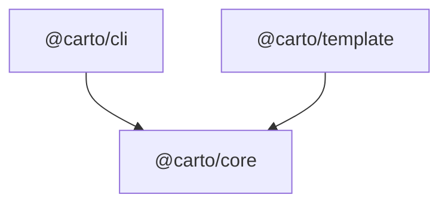

Carto generates sustainably-evolving documentation for a codebase. Instead of
transcribing code line by line, an agent writes a small set of `.mdx` pages
that capture a guided mental model, and every page anchors its load-bearing
claims back to the source files it describes. A lightweight CLI hashes those
sources so tooling can tell exactly which pages went stale when the code
changed, and regenerate only those — this repo documents itself as the
working example.

## Mental model

Three packages cooperate, wired together by the pnpm workspace declared in
`pnpm-workspace.yaml:1` and the root `package.json:7` build script that
compiles all of them:

- `@carto/core` is the shared brain: the zod manifest schema, content hashing,
  the node tree, the freshness classifier, and the `carto:` link resolver.
  Nothing in it talks to the filesystem CLI-style — it is a pure library. See
  [core internals](carto:core).
- `@carto/cli` is the `carto` binary. It wraps `@carto/core`'s functions as six
  citty subcommands (`init`, `status`, `sync`, `validate`, `dev`, `build`) and
  is the only package that touches `process.cwd()` and stdout/exit codes. See
  [the command line](carto:cli).
- `@carto/template` is the bundled Astro and Starlight site. `carto build` and
  `carto dev` shell out to it to render the `docs/` tree plus `carto.json`
  into a static site.

The manifest that ties everything together is `carto.json` at the repo root —
one manifest, one doc site. Each node in it lists `sources`: real files whose
behavior the corresponding page describes. `carto sync` hashes those files;
`carto status` reports whether a page's sources have drifted since the last
sync; `carto validate` checks the manifest's structure and every `carto:` link
before `carto build` renders anything.
