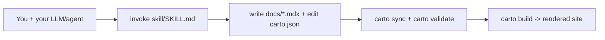

Carto helps you keep a codebase's documentation from going stale. The problem
it solves: hand-written docs drift out of sync with the code they describe,
and nobody notices until a new joiner is misled. Carto's answer is a doc set
where every page carries a machine-checkable anchor back to the source it
describes, so a CLI can tell you exactly which pages fell behind.

Carto is for you if you already have an LLM or coding agent (**BYO-LLM** — carto
ships no model of its own) and want that agent to produce, and keep honest, a
top-down mental-model map of a codebase — not an API reference, and not a
line-by-line transcription (`skill/SKILL.md:8`).

## Mental model

Three things you interact with, and the loop that connects them:

- **The skill** (`skill/SKILL.md`) is what you invoke your agent with. It is the
  instructions, not a program: it tells your agent how to read code, choose a
  node tree, and write pages (`skill/SKILL.md:15`).
- **The pages you write**: `docs/<id>/<locale>.mdx` files, one per node per
  locale, plus one `carto.json` manifest that lists each node's `id`, `parent`,
  and `sources` (`skill/SKILL.md:16`).
- **The `carto` CLI** does only what an agent can't do reliably: hash source
  files, and validate the manifest's structure and links
  (`skill/SKILL.md:16`). It never invents prose or structure.
- **The rendered site**: `carto build` (or `carto dev` for a live preview) turns
  `docs/` + `carto.json` into a static Astro/Starlight site.

The loop repeats every time code changes: `carto status` shows which nodes
drifted, you (via your agent) refresh only those pages, then `sync` and
`validate` again (`skill/SKILL.md:33`).

Where to go next:

- New to carto? Start at  for the zero-to-result walkthrough.
- Want to know what to actually invoke? See  for the authoring skill itself.
- Need a command reference? See  for what each of the six commands does for you.
- Need the vocabulary (manifest, staleness, links)? See .
