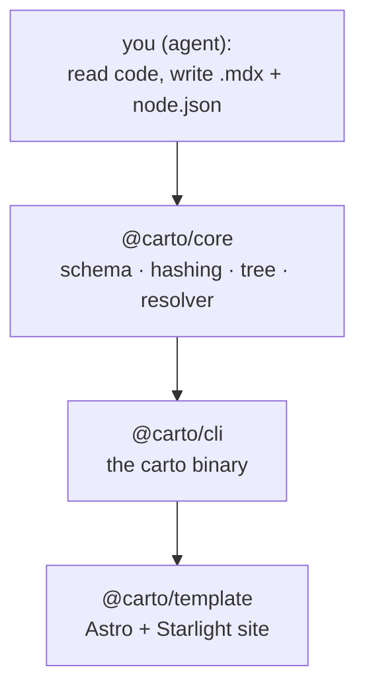

Carto generates **sustainably-evolving** documentation: a top-down mental-model
map of a codebase — not an API reference — whose every page carries a
machine-checkable fingerprint back to the source it describes. When code
changes, tooling can tell exactly which pages went stale and regenerate only
those, instead of letting the map drift out of sync with the territory.

## The problem it solves

Hand-written architecture docs rot. Someone edits `payment.ts`, the page that
explained payments is now subtly wrong, and nothing flags it. Six months later
the doc is worse than none, because it is confidently misleading.

Carto's answer is the **staleness crosshair**: each page declares the source
files whose behavior it describes, and stores a content hash of each. Change a
tracked file and its page is *provably* stale — surfaced by `carto status`,
banner-flagged in the built site, and left for a human to refresh. The map
evolves with the code because drift is detectable, not because anyone remembers
to look.

## How the pieces fit

Carto is a TypeScript pnpm monorepo of three packages, plus the authoring
skill that tells an agent how to drive them.

- **[@carto/core](carto:manifest)** is the pure logic layer: the on-disk format
  and its [Zod schema](carto:manifest), source [hashing and freshness](carto:freshness),
  the node parent-tree, [`carto:` link resolution and federation](carto:links),
  and [source coverage](carto:coverage). It is filesystem-aware but
  rendering-agnostic — every symbol is re-exported flat from
  `packages/core/src/index.ts:1`.
- **[@carto/cli](carto:cli)** is the `carto` binary: a thin command layer that
  reads the manifest, delegates the real work to core, prints a human report,
  and exits with a status code. `packages/cli/src/index.ts:11` wires the seven
  subcommands.
- **[@carto/template](carto:rendering)** turns a resolved doc-set into a static
  Starlight-on-Astro site, rewriting `carto:` links to real URLs and injecting
  staleness banners.
- The **[testing strategy](carto:testing)** and its [skill evals](carto:evals)
  defend all of the above.

## What you write on disk

Two kinds of file. The CLI never invents structure — it only hashes and checks.

- **`carto.json`** — one thin config per doc root: locales, `defaultLocale`, an
  optional `home` node, an optional `codeRoot`, and an optional `federated`
  array. It carries **no node list** — nodes live in their own directories.
- **`docs/<id>/node.json`** — one per page. The directory name *is* the node
  id and the immutable link target. Holds an optional `parent` and a `sources`
  list — the files whose behavior the page describes. See
  [the manifest model](carto:manifest) for the exact shape.
- **`docs/<id>/<locale>.mdx`** — the prose, one per node per locale, each with
  YAML frontmatter carrying a `title`.

## The generation loop

Documenting or refreshing always runs the same loop, scoped to what you set out
to write:

1. **`carto status`** / **`carto coverage`** — turn the scope into targets:
   which nodes are stale, which source files no node covers.
2. Write the `node.json` files and the `.mdx` pages for the in-scope nodes.
3. **`carto sync <id> …`** — bless exactly those nodes: recompute their source
   hashes and stamp the current commit. Naming ids is what keeps every other
   page's freshness untouched.
4. **`carto validate`** — check schema, tree, links, and that in-scope pages are
   synced. Fix what it names, then sync + validate again.
5. **`carto status`** — confirm every id you meant to write is now `fresh`.

The [CLI page](carto:cli) walks each command; [freshness](carto:freshness)
explains why naming ids on `sync` is the core of scoped updates.

:::note
This site documents carto **with carto** — it is dogfooded. The pages you are
reading are the doc-set in this repo's `docs/`, and their staleness is tracked
against the very source files described here.
:::
