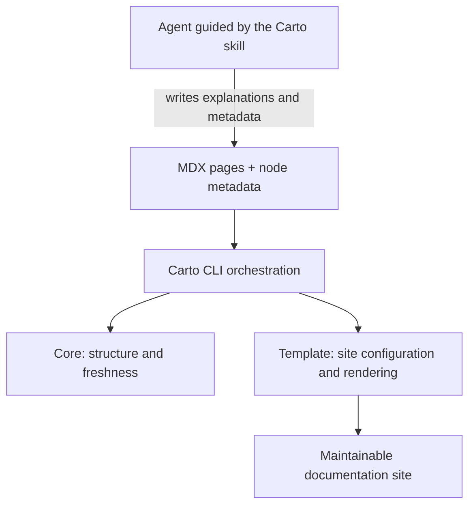

## Judgement belongs to the authoring agent

Carto separates documentation judgement from deterministic mechanics. The Carto skill asks an agent to build a sustainable mental map rather than an API reference or line-by-line transcription. The agent reads the code, chooses what the page should explain, and writes the MDX and node metadata; the CLI hashes files and validates structure and links, while the template renders the result. `skills/carto/SKILL.md:8-18`

That split keeps meaning in authored files, where it can be reviewed alongside the source. Carto's tools do not invent a page boundary or explanation: the skill explicitly treats those choices as documenting judgement and delegates only structural, freshness, and rendering work to deterministic components. `skills/carto/SKILL.md:34-38`

## One authored model, three package boundaries

The CLI is the orchestration boundary. Its package depends directly on both `@carto/core` and `@carto/template`, so dependency direction runs from the CLI toward the reusable model operations and the site renderer, not from authored pages toward package internals. `packages/cli/package.json:23-27`

At the core boundary, the public surface gathers schema, hashing, manifest, tree, resolution, graph, status, and coverage capabilities. These are the deterministic operations that let the CLI reason about a documentation set without taking over the author's explanatory choices. `packages/core/src/index.ts:1-9`

At the template boundary, the public surface exposes site configuration and rendering. It owns the conversion from the documentation set into the site presentation, while the MDX and node metadata remain the authored source of truth. `packages/template/src/index.ts:1-3`

The complete orientation is:

```mermaid
flowchart TD
    A["Agent guided by the Carto skill"] -->|"writes explanations and metadata"| F["MDX pages + node metadata"]
    F --> C["Carto CLI orchestration"]
    C --> K["Core: structure and freshness"]
    C --> T["Template: site configuration and rendering"]
    T --> S["Maintainable documentation site"]
```

This is a responsibility map, not a claim that authoring is automated: the skill places page writing with the agent, the CLI declares both package dependencies, core exposes the model operations, and template exposes rendering. `skills/carto/SKILL.md:15-18` `packages/cli/package.json:23-27` `packages/core/src/index.ts:1-9` `packages/template/src/index.ts:1-3`

## The lifecycle at orientation depth

A documentation run begins with a human-given scope. The agent narrows that scope using status and coverage information, applies the safety checkpoint for structural changes, then writes only the in-scope `node.json` files and locale pages. `skills/carto/SKILL.md:49-72`

After authoring, targeted sync records freshness for exactly the written nodes; validation checks schema, tree, links, and synchronization; status confirms that each touched node is fresh. This ordering is what makes maintenance scoped: deterministic checks preserve the connection to changing source files without rewriting unaffected explanations. `skills/carto/SKILL.md:73-91`

The CLI presents that lifecycle as a single command surface—`init`, `status`, `sync`, `coverage`, `validate`, `preview`, and `build`. At this level, the important point is that one orchestrator carries authored files through model checks and onward to preview or build; command-specific behavior belongs in the workflow documentation. `packages/cli/src/main.ts:10-20`

## Continue into the boundaries

Read the [core model](carto:core-model) for the documentation graph and freshness concepts, the [CLI workflow](carto:cli-workflow) for command sequencing and operational checkpoints, and [site rendering](carto:site-rendering) for how the template turns the documentation set into the delivered site.
