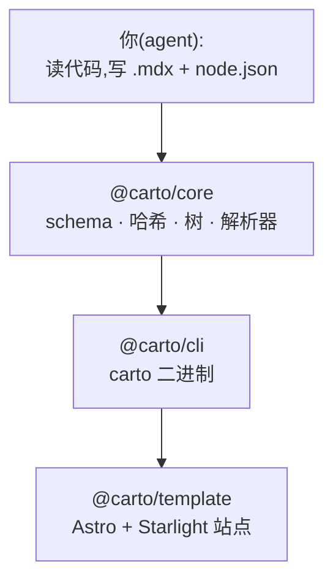

Carto 生成**可持续演进**的文档:一张自顶向下的代码库心智模型地图——不是 API
参考——它的每一页都携带一个可机器校验的指纹,指回其所描述的源码。当代码变化时,
工具能准确判断哪些页面已经陈旧并只重新生成那些页面,而不是任由地图与真实代码
逐渐脱节。

## 它解决的问题

手写的架构文档会腐烂。有人改了 `payment.ts`,那页解释支付的文档如今就微妙地
错了,却没有任何东西发出警告。六个月后,这份文档比没有还糟,因为它在信誓旦旦
地误导人。

Carto 的答案是**陈旧准星**:每一页声明它所描述行为的源文件,并存下每个文件的
内容哈希。改动一个被跟踪的文件,它的页面就*可证明地*陈旧——由 `carto status`
暴露、在构建出的站点里以横幅标记、并留给人来刷新。地图随代码演进,是因为漂移
可被检测,而不是因为有谁记得去看。

## 各部分如何拼合

Carto 是一个 TypeScript pnpm monorepo,含三个包,外加一份告诉 agent 如何驱动
它们的创作技能。

- **[@carto/core](carto:manifest)** 是纯逻辑层:磁盘格式及其
  [Zod schema](carto:manifest)、源码[哈希与新鲜度](carto:freshness)、
  node 父子树、[`carto:` 链接解析与联邦](carto:links),以及
  [源码覆盖率](carto:coverage)。它感知文件系统,但与渲染无关——每个符号都从
  `packages/core/src/index.ts:1` 扁平重导出。
- **[@carto/cli](carto:cli)** 是 `carto` 二进制:一层薄命令层,读取 manifest、
  把真正的工作委托给 core、打印人类可读报告,并以状态码退出。
  `packages/cli/src/index.ts:11` 装配了七个子命令。
- **[@carto/template](carto:rendering)** 把解析后的 doc-set 变成一个静态的
  Starlight-on-Astro 站点,将 `carto:` 链接改写为真实 URL 并注入陈旧横幅。
- **[测试策略](carto:testing)** 及其[技能评估](carto:evals)守护以上一切。

## 你在磁盘上写什么

两类文件。CLI 从不发明结构——它只做哈希与校验。

- **`carto.json`** —— 每个 doc root 一份的精简配置:locales、`defaultLocale`、
  可选的 `home` node、可选的 `codeRoot`,以及可选的 `federated` 数组。它**不含
  node 列表**——node 各自住在自己的目录里。
- **`docs/<id>/node.json`** —— 每页一份。目录名*即是* node id,也是不可变的
  链接目标。它保存一个可选的 `parent` 和一个 `sources` 列表——即该页所描述行为
  的源文件。确切结构见[manifest 模型](carto:manifest)。
- **`docs/<id>/<locale>.mdx`** —— 正文,每 node 每 locale 一份,各带一段
  YAML frontmatter,携带 `title`。

## 生成循环

创作或刷新始终跑同一个循环,范围锁定在你打算写的内容上:

1. **`carto status`** / **`carto coverage`** —— 把范围转成具体目标:哪些 node
   陈旧、哪些源文件还没被任何 node 覆盖。
2. 为范围内的 node 写 `node.json` 与 `.mdx` 页面。
3. **`carto sync <id> …`** —— 为恰好这些 node 加持:重算它们的源码哈希并盖上
   当前 commit。点名 id 正是让其他所有页面的新鲜度保持不动的关键。
4. **`carto validate`** —— 校验 schema、树、链接,以及范围内页面是否已 sync。
   修复它指出的问题,然后再 sync + validate。
5. **`carto status`** —— 确认你打算写的每个 id 现在都是 `fresh`。

[CLI 页面](carto:cli)逐一走过每个命令;[新鲜度](carto:freshness)解释了为何在
`sync` 上点名 id 是范围化更新的核心。

:::note
本站是**用 carto 记录 carto**——它是自举(dogfood)的。你正在读的这些页面就是
本仓库 `docs/` 里的 doc-set,它们的陈旧状态正是针对这里所描述的那些源文件来
跟踪的。
:::
