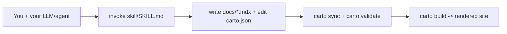

Carto 帮助你避免一个代码库的文档变得过时。它要解决的问题是：手写的文档会与它所描述的
代码逐渐失步，而在新成员被误导之前往往没有人注意到。Carto 的解法是：文档集中的每个
页面都携带一个可机器校验的锚点，指回它所描述的源文件，因此 CLI 可以准确告诉你哪些页面
落后了。

如果你已经拥有一个 LLM 或编码智能体（**BYO-LLM**——carto 自身不附带任何模型），并且
希望这个智能体产出并持续维护一份自顶向下的心智模型地图——而不是 API 参考文档，也不是
逐行转录（`skill/SKILL.md:8`）——那么 carto 就是为你准备的。

## 心智模型

你会接触到三样东西，以及把它们连接起来的循环：

- **技能**（`skill/SKILL.md`）是你用来调用智能体的东西。它是一份说明书，而不是一个
  程序：它告诉你的智能体如何读代码、选择节点树、撰写页面（`skill/SKILL.md:15`）。
- **你撰写的页面**：`docs/<id>/<locale>.mdx` 文件，每个节点每种 locale 一份，加上一份
  `carto.json` 清单，列出每个节点的 `id`、`parent` 和 `sources`
  （`skill/SKILL.md:16`）。
- **`carto` CLI** 只做智能体无法可靠完成的事：为源文件计算哈希，校验清单的结构和链接
  （`skill/SKILL.md:16`）。它从不发明文字或结构。
- **渲染出的站点**：`carto build`（或用于实时预览的 `carto dev`）把 `docs/` 与
  `carto.json` 转换成一个静态的 Astro/Starlight 站点。

每当代码变化，这个循环就会重复：`carto status` 会显示哪些节点已经漂移，你（通过智能体）
只刷新那些页面，然后再次运行 `sync` 和 `validate`（`skill/SKILL.md:33`）。

接下来去哪里：

- 第一次接触 carto？从  开始，那里是从零到结果的完整走查。
- 想知道到底要调用什么？看 ，那里是撰写技能本身。
- 需要命令参考？看 ，那里说明六个命令各自为你做了什么。
- 需要词汇表（清单、新鲜度、链接）？看 。
