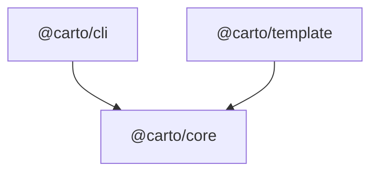

Carto 为一个代码库生成可持续演进的文档。它不会逐行转录代码，而是由智能体撰写一小组
`.mdx` 页面，捕捉一个引导式的心智模型；每个页面都会把关键论断锚定回它所描述的源文件。
一个轻量级的 CLI 会对这些源文件计算哈希，因此工具可以准确判断哪些页面在代码变化后已经
过时，并且只重新生成那些页面——这个仓库正是用来记录它自身的活例子。

## 心智模型

三个包协同工作，由 `pnpm-workspace.yaml:1` 声明的 pnpm workspace 以及编译所有包的根
`package.json:7` build 脚本连接在一起：

- `@carto/core` 是共享的核心大脑：zod 清单模式、内容哈希、节点树、新鲜度分类器，以及
  `carto:` 链接解析器。它内部完全不涉及 CLI 式的文件系统交互——是一个纯库。参见
  [core internals](carto:core)。
- `@carto/cli` 是 `carto` 可执行文件。它把 `@carto/core` 的函数包装成六个基于 citty 的
  子命令（`init`、`status`、`sync`、`validate`、`dev`、`build`），也是唯一接触
  `process.cwd()` 与标准输出/退出码的包。参见 [the command line](carto:cli)。
- `@carto/template` 是内置的 Astro 与 Starlight 站点。`carto build` 与 `carto dev` 会
  调用它，把 `docs/` 目录树与 `carto.json` 渲染成静态站点。

把一切串联起来的清单是仓库根目录下的 `carto.json`——一个清单对应一个文档站点。清单中的
每个节点都列出了 `sources`：即该页面所描述行为对应的真实文件。`carto sync` 会对这些文件
计算哈希；`carto status` 会报告某个页面的源文件自上次同步以来是否发生了漂移；`carto
validate` 会在 `carto build` 渲染任何内容之前检查清单结构和每一个 `carto:` 链接。
