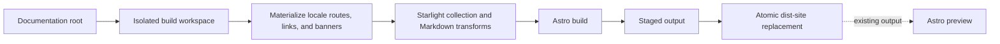

# Site rendering

Site rendering is the adapter between Carto's documentation model and the site a reader opens. The [overview](carto:overview) explains the product boundary, the [core model](carto:core-model) defines the graph consumed here, and the [CLI workflow](carto:cli-workflow) explains how a build or preview reaches this adapter. This page follows one question end to end: how does a documentation root become a configured, localized site without making generated state part of the authored docs?

## One projection pipeline

A build creates a fresh temporary workspace, links its dependencies, writes the Astro and content configuration, materializes the graph, and runs Astro there. Only after Astro succeeds does Carto publish the generated output under the documentation root; the temporary workspace is removed whether the build succeeds or fails. `packages/template/src/render.ts:19-39`

The whole path is one projection. Materialization supplies locale-specific routes and rendering-only metadata; Starlight and the Markdown transforms interpret that temporary content; Astro emits a complete output directory; publication replaces `dist-site` through a staged rename. Preview is deliberately a side branch from an already published site rather than another pass through materialization. `packages/template/src/materialize.ts:20-47` `packages/template/astro.config.mjs:11-34` `packages/template/src/render.ts:42-78` `packages/template/src/render.ts:139-169`

The workspace reuses both template and documentation-root packages through links, but copies Starlight itself so package-relative assets still work from the isolated project. Its generated files merely re-export Carto's Astro integration and built content collection, keeping the workspace disposable rather than turning it into another source tree. `packages/template/src/render.ts:86-136`

Publication first copies Astro's output to a staging directory beside `dist-site`. If an older site exists, Carto renames it to a backup, renames staging into place, restores the backup if that second rename fails, and removes temporary staging or backup paths afterward. Readers therefore see a fully built directory, while a failed replacement preserves the previous one. `packages/template/src/render.ts:139-169`

## The graph becomes routes

Materialization loads the graph once and treats the root doc-set's locales as the site's locale set. It walks every doc-set, node, and site locale; when a federated doc-set lacks that locale, it reads the doc-set's default-locale page but still writes the requested site-locale route and warns about the fallback. `packages/template/src/materialize.ts:20-47`

A destination path is assembled from three graph facts: a non-default locale prefix, a federated doc-set prefix when present, and the node's complete root-to-node ancestry. The resulting MDX path is therefore both a Starlight content address and a faithful projection of Carto parentage rather than a copy of the authored `docs/<id>` layout. `packages/template/src/materialize.ts:84-89`

The root locale maps to Starlight's special `root` locale key, while every other locale keeps its own key, label, and language value. Root redirects choose the configured home node when it is valid and otherwise the first root node, producing a redirect for each site locale. `packages/template/src/site-config.ts:7-13` `packages/template/src/site-config.ts:51-68`

Navigation is graph-derived as well. Root nodes remain in manifest order; federated doc-sets are appended as prefix-sorted groups. Each parent entry contains a link to itself before recursively nested children, and labels use default-locale titles plus translated labels collected from each page's frontmatter. `packages/template/src/site-config.ts:23-40` `packages/template/src/site-config.ts:71-119`

A user configuration may supply other Starlight options, but Carto overwrites `locales` and `sidebar` with these graph-derived values. That boundary lets themes and presentation settings vary without allowing site configuration to contradict the routes and hierarchy being materialized. `packages/template/src/site-config.ts:142-177` `packages/template/src/site-config.ts:174-180`

## Authored MDX is resolved in two different phases

Logical links and source citations may look similar in authored prose because both are compact, repository-aware notation, but they are not the same transform. During materialization, Markdown links whose destinations begin with `carto:` are resolved in the current locale and federation context. Resolved destinations become site URLs; unresolved destinations remain untouched; and an empty link label is filled from the requested-locale title, then the target doc-set's default-locale title, then the node ID. `packages/template/src/materialize.ts:91-123`

Source addresses remain literal inline code through materialization. During the later remark pass, the transform associates each temporary page path with its site locale and declared source files, recognizes valid repository-relative `path:line` or `path:start-end` addresses, and appends deduplicated native footnote definitions. It avoids code blocks, existing definitions, links, link references, and MDX JSX subtrees, so source notation is interpreted only where prose can safely become a citation. `packages/template/src/remark-source-footnotes.ts:43-91` `packages/template/src/remark-source-footnotes.ts:117-163`

The rendered footnote heading is localized from the route locale and distinguishes a source-only section from one that also contains authored notes. The same Markdown pipeline first removes soft line breaks only when they fall between covered CJK characters; Mermaid remains an Astro integration rather than another authored-content rewrite. `packages/template/src/remark-source-footnotes.ts:94-113` `packages/template/src/remark-source-footnotes.ts:249-252` `packages/template/src/remark-join-cjk.ts:20-40` `packages/template/astro.config.mjs:21-33`

Starlight reads this projected content through its docs loader and schema. The Astro integration owns the temporary source and cache directories, redirects, transforms, Mermaid integration, locales, and sidebar, so every renderer sees the same graph-derived configuration. `packages/template/src/content.config.ts:1-6` `packages/template/astro.config.mjs:11-34`

## Freshness is visible but ephemeral

Before each temporary MDX file is written, materialization computes freshness per doc-set and node, rewrites its logical links, and then injects any freshness warning. This ordering makes the banner part of the rendered projection, not a mutation of `docs/<id>/<locale>.mdx`. `packages/template/src/materialize.ts:39-55`

A banner is added only for a stale or missing node that has frontmatter and does not already define `banner:`. Its message lists only changed or absent source files, escapes their paths for HTML and YAML, and preserves the page's line-ending style. Authored banners therefore win, and fresh or unsynced pages pass through unchanged. `packages/template/src/staleness-banner.ts:3-27`

Preview closes the loop without rebuilding it. It refuses to start unless `dist-site` already exists, creates a small serving workspace, points `astro preview` at that existing output, and never calls materialization. Changes to the graph, pages, locales, or freshness state become visible only after another build publishes a new `dist-site`. `packages/template/src/render.ts:42-78`
