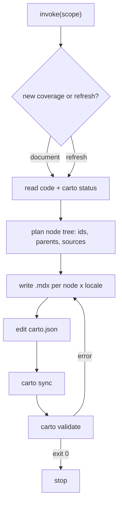

The skill (`skill/SKILL.md`) is carto's **primary interface** — the thing you
actually invoke. It's not code you run; it's the instruction set your LLM/agent
follows to read a codebase, write `.mdx` pages, and edit the one `carto.json`
manifest. Carto's split of labor is deliberate: **the agent does the judgement**
(what to document, how to split it, what's true), and **the CLI does only what
must be deterministic** (hash files, validate structure and links). This page is
the map of that skill; the CLI it drives is .

## The BYO-LLM model

You bring the agent. Carto supplies three parts around it: this skill (the
authoring guide), the `carto` CLI (the guardrails), and the Astro/Starlight
template (the renderer). The agent writes prose and the manifest by hand; the
CLI never invents structure — it only hashes (`carto sync`) and checks
(`carto validate`). That boundary is why a page can never silently disagree with
the code it points at: the hash catches it.

## Mental model

- **Two modes.** `document <dir|files>` is new coverage: read the code, invent a
  node subtree, write the pages, register the sources. `refresh [<id>]`
  regenerates existing pages after code changed — `carto status` shows which
  nodes are non-fresh; `refresh` with no id covers all of them, `refresh <id>`
  targets one node and its subtree.
- **A node is one mental model**, readable in one sitting — a subsystem, a flow,
  a core concept. Never one file per node. Split when the `sources` list balloons
  or more than ~5 independent concepts pile up.
- **Audience layering.** If the code has users, the tree MUST open with a
  user-facing layer ("what is this, how do I invoke it, what's the main loop");
  internal architecture belongs in deeper contributor nodes. That is exactly the
  shape of this site:  →  up top,
   at the bottom.
- **Node type fixes section order.** Explanation (concept → context → mechanism →
  tradeoffs → example), Tutorial (goal → prerequisites → steps → verification →
  next), or Reference (overview → signature → parameters → returns → examples →
  edge cases). Most nodes are Explanation.
- **The hard floor.** Every node carries Intent + a mental-model view (3–5
  concepts, their relations, one mermaid diagram) + a `path:line` anchor on every
  load-bearing claim. Every **user-facing** node additionally needs one real,
  reproducible worked example — real commands with real output.

## What each page must contain

Four principles hold across all node types: **value first** (open with what the
reader gains), **overview before detail**, **concrete over vague** (every claim
observable — a real command, a real input/output, not "handles caching
appropriately"), and **sufficient background** (define an unfamiliar concept at
first use). Prose and links go in the `.mdx`; structure and source tracking go in
`carto.json` () — the two never mix.

## Verification disciplines (non-negotiable)

The skill's spine is that documentation must be **provable from code behavior**:

- **Comments, docstrings, and names are assumptions, not evidence.** Use them as
  hints; verify every claim against actual behavior; never copy them verbatim.
- **Every claim carries a `path:line` anchor.** If you can't confirm it from the
  code, don't write it — mark a TODO instead of inventing a fact.
- **Run-throughs trace a real code path** with inputs and outputs the code can
  actually produce — no idealized examples.
- **Generate all locales together.** Write `defaultLocale` first, then each
  translation; translations preserve every `carto:` link and every `path:line`
  anchor **verbatim** — translate the prose, never the identifiers.

## When you invoke it

You invoke the skill; it produces `.mdx` + a `carto.json` edit; then you run the
CLI. The loop ends only when 's `carto validate` exits 0 — that's
the contract the skill closes against. To see it end to end on real source, read
.
