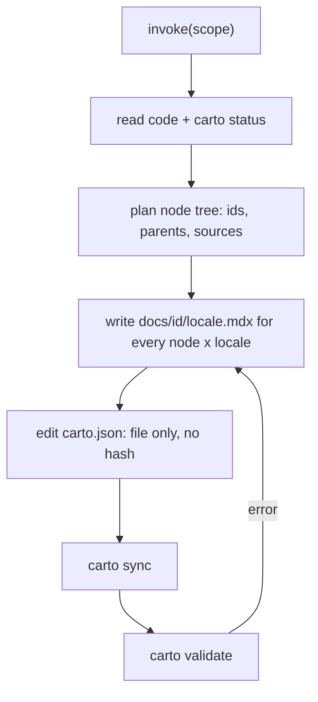

The carto **skill** (`skill/SKILL.md`) is carto's primary interface — not the
CLI. You (or your agent) invoke it with a scope, and it tells your agent how to
turn source code into a doc tree. Carto itself never reads or writes prose; the
skill is what makes an agent do that judgement, and the CLI only hashes and
checks the result (`skill/SKILL.md:15`).

## Mental model

- **BYO-LLM.** Carto assumes you bring your own agent. The skill is a markdown
  instruction file an agent reads before acting — there is no bundled model
  (`skill/SKILL.md:15`).
- **Two modes.** `document <dir|files>` covers new ground: read the code, invent
  a node subtree, write pages, register sources. `refresh [<id>]` regenerates
  existing pages after code changed — with no id it covers every non-fresh node,
  with an id it targets one node and its subtree (`skill/SKILL.md:31`).
- **The generation loop** the skill drives on every invocation: read code and run
  `carto status`, plan the node tree, write an `.mdx` per node per locale, edit
  `carto.json` (sources list `file` only, no `hash`), run `carto sync`, then
  `carto validate` — on any validate error, fix the mdx or manifest it names and
  re-run sync + validate (`skill/SKILL.md:42`). An invocation must not stop until
  `validate` exits 0 (`skill/SKILL.md:53`).
- **How the agent decides node structure.** A node is one mental model readable
  in one sitting — never one file per node. The tree is shaped top-down: an
  orientation layer first, subsystems and flows deeper. **Audience layering is
  mandatory**: if the documented thing has users, the tree must open with a
  user-facing layer (what it is, how you invoke it, the main loop you drive)
  before any internal-architecture node, and a dedicated `getting-started` node
  is required whenever the thing has users (`skill/SKILL.md:162`,
  `skill/SKILL.md:170`).
- **Verification disciplines are non-negotiable**: comments and names are hints,
  not evidence — every claim must be checked against real code behavior and
  carry a `path:line` anchor; run-throughs trace a real path with real
  inputs/outputs; all locales are generated together and translations preserve
  every `carto:` link and `path:line` anchor verbatim (`skill/SKILL.md:202`).

## Contract

- Input: a scope (`document <dir|files>` or `refresh [<id>]`).
- Output: one or more `docs/<id>/<locale>.mdx` files and an updated `carto.json`,
  such that `carto validate` exits 0.
- Invariant: every node has an `.mdx` for every declared locale, or `validate`
  fails (`skill/SKILL.md:212`).
- The skill never runs `carto init` unless `carto.json` is entirely absent —
  `init` itself refuses to run otherwise (`skill/SKILL.md:23`).

## Gotchas

- The CLI has no fine-grained mutation commands — no `add-node`, no
  `set-parent`. You edit `carto.json` by hand; `sync` and `validate` are only
  guardrails, never generators (`skill/SKILL.md:57`).
- A `parent` id that does not exist yet is a warning, not an error — you may
  generate a subtree before its parent exists (`skill/SKILL.md:108` inlined into
  the skill from the manifest rules).

See  for a first run of this loop end to end, and
 for what each of the six commands prints when you run it.
