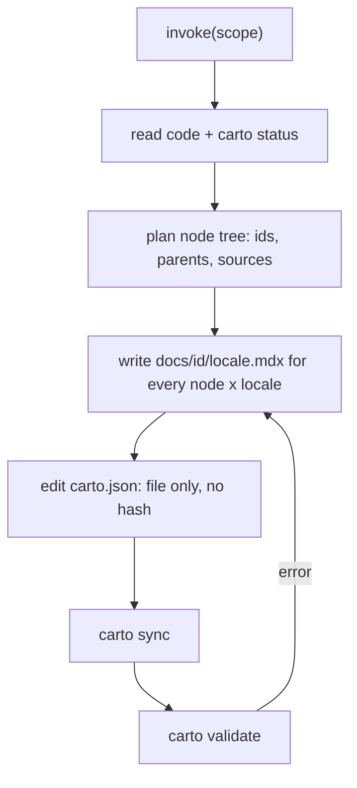

carto 的**技能**（`skill/SKILL.md`）是 carto 的主要交互界面——而不是 CLI。你（或你的
智能体）用一个范围来调用它，它会告诉你的智能体如何把源代码变成一棵文档树。carto 自身
从不读写文字；正是这份技能让智能体去做这些判断，而 CLI 只负责哈希和检查结果
（`skill/SKILL.md:15`）。

## 心智模型

- **BYO-LLM。** carto 假定你自带智能体。这份技能是一份智能体在行动前会读取的 markdown
  说明文件——没有内置模型（`skill/SKILL.md:15`）。
- **两种模式。** `document <dir|files>` 覆盖新的范围：读代码、构思一棵节点子树、撰写
  页面、注册源文件。`refresh [<id>]` 在代码变化后重新生成已有页面——不带 id 时覆盖每一个
  非 fresh 的节点，带 id 时只针对一个节点及其子树（`skill/SKILL.md:31`）。
- **技能在每次调用中驱动的生成循环**：读代码并运行 `carto status`，规划节点树，为每个
  节点每种 locale 撰写一份 `.mdx`，编辑 `carto.json`（sources 只写 `file`，不写
  `hash`），运行 `carto sync`，然后运行 `carto validate`——如果 validate 报错，就修复它
  指出的 mdx 或清单，再次运行 sync + validate（`skill/SKILL.md:42`）。一次调用在
  `validate` 退出码为 0 之前不能停止（`skill/SKILL.md:53`）。
- **智能体如何决定节点结构。** 一个节点就是一个可以一口气读完的心智模型——绝不是一个
  文件对应一个节点。整棵树自顶向下塑形：最上层是定位性内容，子系统与流程在更深处。
  **分层面向受众是强制的**：如果所记录的东西有用户，这棵树就必须先开一层面向用户的内容
  （它是什么、你如何调用它、你驱动的主循环），排在任何内部架构节点之前；只要这个东西有
  用户，就必须有一个专门的 `getting-started` 节点（`skill/SKILL.md:162`，
  `skill/SKILL.md:170`）。
- **验证纪律是不可协商的**：注释和名字只是提示，不是证据——每一个论断都必须对照真实
  代码行为核实，并携带一个 `path:line` 锚点；走查要沿着真实路径追踪真实的输入/输出；
  所有 locale 要一起生成，翻译要逐字保留每一个 `carto:` 链接和 `path:line` 锚点
  （`skill/SKILL.md:202`）。

## 约定

- 输入：一个范围（`document <dir|files>` 或 `refresh [<id>]`）。
- 输出：一个或多个 `docs/<id>/<locale>.mdx` 文件，以及一份更新过的 `carto.json`，使得
  `carto validate` 退出码为 0。
- 不变量：每个节点必须为每个声明的 locale 都有一份 `.mdx`，否则 `validate` 会失败
  （`skill/SKILL.md:212`）。
- 技能只在 `carto.json` 完全不存在时才运行 `carto init`——否则 `init` 自己会拒绝运行
  （`skill/SKILL.md:23`）。

## 注意事项

- CLI 没有细粒度的变更命令——没有 `add-node`，没有 `set-parent`。你需要手动编辑
  `carto.json`；`sync` 和 `validate` 只是守卫，从不生成内容（`skill/SKILL.md:57`）。
- 一个尚不存在的 `parent` id 只是警告，不是错误——你可以在其父节点存在之前先生成一棵
  子树（`skill/SKILL.md:108`，源自清单规则并内联进这份技能）。

关于把这个循环完整跑一遍，见 ；关于运行每个命令时会打印
什么，见 。
