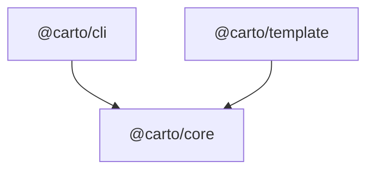

# Plan 006: End-to-end smoke test — carto documents its own repo

> **Executor instructions**: Follow this plan step by step. Run every
> verification command and confirm the expected result before moving to the
> next step. If anything in the "STOP conditions" section occurs, stop and
> report — do not improvise. When done, update the status row for this plan
> in `plans/README.md` — unless a reviewer dispatched you and told you they
> maintain the index.
>
> **Drift check (run first)**: this plan depends on plans 003, 004, and 005.
> Before starting, confirm those landed and still match what is inlined below:
> ```
> git diff --stat 442f9de..HEAD -- packages/core packages/cli packages/template skill package.json pnpm-workspace.yaml
> pnpm build
> pnpm exec carto --help
> test -f skill/SKILL.md && echo skill-present
> ```
> If `pnpm build` fails, if `carto --help` does not print the six commands
> (`init`, `status`, `sync`, `validate`, `dev`, `build`), if `skill/SKILL.md`
> is missing, or if the `carto.json` schema / CLI behavior differs from the
> excerpts in "Current state" below, treat it as a STOP condition — do not
> author docs against a moving target.

## Status

- **Priority**: P2
- **Effort**: M
- **Risk**: MED
- **Depends on**: plans/003-carto-cli.md, plans/004-carto-template.md, plans/005-carto-skill.md
- **Category**: tests
- **Planned at**: commit `442f9de`, 2026-07-08

## Why this matters

Plans 002–005 each verify their own package in isolation, but nothing exercises
the *whole* pipeline the way a real user does: skill writes docs → `carto sync`
hashes → `carto validate` checks → `carto build` renders. This plan wires that
full loop over carto's **own** repo as the subject codebase. It delivers two
things at once: (1) a regression that fails loudly whenever a schema, CLI, or
template change breaks the end-to-end flow — the project's canary — and (2)
carto's living self-documentation, a small real doc set a new joiner can browse
to understand the three packages. Because the docs anchor back to real files in
`packages/`, they also demonstrate the staleness mechanism working on genuine
source, not a fixture.

## Current state

This is a greenfield monorepo. At commit `442f9de` the repo root holds only
`AGENTS.md`, `.gitignore`, `.agents/skills/`, and `skills-lock.json` — there is
no source code. **By the time this plan (006) runs, plans 001–005 have created**
the packages, the `carto` CLI, the Astro/Starlight template, and the skill. This
plan is the only one that creates `docs/` and `carto.json` at the repo root.

What does **not** yet exist and this plan creates:
- `carto.json` at the repo root (the manifest for carto's own self-docs).
- `docs/<id>/<locale>.mdx` pages under the repo root.
- `scripts/e2e.sh` and a root `package.json` `e2e` script.

### Authoritative facts you depend on (inlined — the executor has zero prior context)

**Monorepo layout** created by earlier plans (fixed paths/names):
```
carto/                          (repo root = pnpm workspace root = the doc root)
├── package.json                (private root; scripts below)
├── pnpm-workspace.yaml         (packages: "packages/*")
├── tsconfig.base.json
├── scripts/lint-comments.sh    (comment gate)
├── packages/
│   ├── core/src/{schema,manifest,hash,tree,resolver,status,index}.ts   (@carto/core)
│   ├── cli/src/{index.ts, commands/{init,status,sync,validate,dev,build}.ts}  (@carto/cli, bin: carto)
│   └── template/  (@carto/template — bundled Astro 5 + Starlight site)
├── skill/SKILL.md              (the carto skill — the doc-authoring guide)
└── docs/                       (THIS plan creates it: carto's own self-docs)
```

**Canonical root `package.json` scripts** (created by plan 001 — do not change
them; this plan only *adds* an `e2e` script beside them):

| Script | Runs | Expected |
|---|---|---|
| `pnpm install` | install workspace | exit 0 |
| `pnpm build` | `pnpm -r build` (compiles core, cli, template) | exit 0 |
| `pnpm typecheck` | `pnpm -r typecheck` (`tsc --noEmit` per package) | exit 0 |
| `pnpm test` | `vitest run` (unit tests) | all pass |
| `pnpm lint` | `bash scripts/lint-comments.sh` (comment gate) | exit 0 |

**`carto.json` schema** (defined once with zod in `@carto/core`; excerpt of the
shape you must produce). `file` paths are **relative to the directory containing
`carto.json`** — here that is the repo root:
```jsonc
{
  "version": 1,                          // literal 1
  "locales": ["en", "zh"],               // non-empty, unique
  "defaultLocale": "en",                 // must be a member of locales
  "updated_at": "2026-07-08T00:00:00Z",  // ISO 8601; carto sync refreshes it
  "nodes": [
    {
      "id": "core",                       // REQUIRED, globally unique, immutable
                                          //   pattern ^[a-z0-9][a-z0-9-]*$ (no '.', no '/')
                                          //   this is the carto: link target
      "slug": "core",                     // OPTIONAL; defaults to id; same pattern;
                                          //   unique among siblings (same parent)
      "parent": "overview",               // OPTIONAL; id of parent node; absent = root
      "sources": [                        // files whose behavior this page describes
        { "file": "packages/core/src/hash.ts", "hash": "e3b0c44298fc1c14" }
      ]
    }
  ]
}
```
Field rules enforced by `carto validate`: `id` unique + pattern; `slug` optional
same pattern + unique among siblings; `parent` absent = root, a parent id that
does not exist is a **warning** (not error), a cycle/self-parent is an **error**;
`sources[].file` relative to the manifest dir; `sources[].hash` filled by
`carto sync` — before sync the entries carry `file` only (no `hash`), which is an
**unsynced** state that `status` flags and `validate` rejects.

**`carto` CLI surface** (binary `carto`, built with citty). Invoke from the doc
root (the repo root) via `pnpm exec carto <command>`:

| Command | Kind | Behavior | Exit |
|---|---|---|---|
| `carto sync` | write (deterministic) | recompute + write every source hash; refresh `updated_at` | 0 on success |
| `carto status` | read-only | print each node's freshness (unsynced/stale/missing/fresh) | **non-zero if any node is not fresh**, 0 if all fresh |
| `carto validate` | read-only | zod schema + id uniqueness + sibling-slug uniqueness + parent cycles (error) / dangling parents (warning) + every node has an mdx per locale + all `carto:` links resolve + federation `/` form → error | non-zero on any error |
| `carto build` | build | render the static site from `docs/` + `carto.json` via the bundled template (`@carto/template`) into `dist-site/` (gitignored) | 0 on success |
| `carto init` | scaffold | create starter `carto.json` + `docs/`; **do NOT use it here** (you write `carto.json` by hand) | — |
| `carto dev` | dev server | not used in this plan | — |

**Staleness classes** (`@carto/core`, used by `status`): **fresh** (all sources
present, hashes match) · **unsynced** (a source has no hash) · **stale** (a
source's current hash ≠ stored hash) · **missing** (a source `file` gone). Hash =
sha256 of the file's raw bytes, hex, first 16 chars.

**`carto:` link model** (written inside `.mdx` as a normal Markdown link target,
resolved at build + by `validate` using the shared `@carto/core` resolver):
```
[label](carto:<id>)          internal ref by node id  (<id> pattern ^[a-z0-9][a-z0-9-]*$)
[](carto:<id>)               empty label → build fills the target node's title
[label](carto:<id>#anchor)   ref to a heading anchor within that node
```
A `carto:` target with no matching `id` → build **fails** and `validate` reports
it. The `carto:<alias>/<id>` federation form (with `/`) is a `validate` **error**
in MVP — do not write it.

**Code anchors** are a *separate* concept from `carto:` links and from
`sources[]`: inline `path:line` mentions in prose (e.g. `packages/core/src/hash.ts:12`)
that let a reader jump to source. MVP renders them as **plain text** — no
permalink tooling, and `validate` does not check them. Keep them accurate at
authoring time anyway.

**mdx file layout is `docs/<id>/<locale>.mdx`** (id-based paths, stable across
refactors). Each node needs one `.mdx` **per declared locale**. Every mdx needs a
`title` in its frontmatter (the node's title lives there, not in the manifest).

**Skill content checklist** (documented in `skill/SKILL.md` — the floor
you must meet on every page): **Intent** (what problem it solves, its role) +
**Mental model** (3–5 core concepts + relations + one mermaid diagram) + **Code
anchors** (`path:line` on load-bearing claims) are the **hard floor**; Run-through
/ Contract / Gotchas are added only when the page warrants. Four verification
disciplines: (1) comments/names are hints, not evidence — verify every claim
against code behavior, never copy comments verbatim; (2) every claim carries a
`path:line` anchor; (3) run-throughs trace a real code path; (4) locales generated
together — translations preserve `carto:` links and `path:line` anchors
**verbatim**.

## Commands you will need

| Purpose | Command | Expected on success |
|---|---|---|
| Install | `pnpm install` | exit 0 |
| Build all packages | `pnpm build` | exit 0 (core, cli, template compiled) |
| Typecheck | `pnpm typecheck` | exit 0 |
| Unit tests | `pnpm test` | all pass |
| Comment lint | `pnpm lint` | exit 0 |
| CLI: fill hashes | `pnpm exec carto sync` | exit 0 |
| CLI: freshness | `pnpm exec carto status` | exit 0 when all fresh; non-zero otherwise |
| CLI: validate | `pnpm exec carto validate` | exit 0 |
| CLI: build site | `pnpm exec carto build` | exit 0; static site under `dist-site/` |
| E2E regression | `pnpm e2e` | exit 0 |

(All `carto` commands are run from the repo root, which is the doc root — the
directory containing `carto.json`.)

## Suggested executor toolkit

- Read `skill/SKILL.md` before authoring the mdx — it is the authoritative
  doc-writing checklist. The floor is inlined above in case you cannot read it,
  but the skill has the fuller node-splitting heuristic and verification rules.
- Read the actual source you are documenting (`packages/core/src/*.ts`,
  `packages/cli/src/commands/*.ts`) so your Intent/mental-model/anchors describe
  real behavior with real line numbers — not the excerpts in this plan.

## Scope

**In scope** (the only files you create/modify):
- `carto.json` (create, at repo root)
- `docs/overview/en.mdx`, `docs/overview/zh.mdx` (create)
- `docs/core/en.mdx`, `docs/core/zh.mdx` (create)
- `docs/cli/en.mdx`, `docs/cli/zh.mdx` (create)
- `scripts/e2e.sh` (create)
- `package.json` (root — add exactly one `e2e` script; change nothing else)

**Out of scope** (do NOT touch, even though they look related):
- `packages/**` — the packages are delivered by plans 002–005. If a package is
  wrong, that is a STOP condition, not something you patch here.
- `scripts/lint-comments.sh`, `pnpm-workspace.yaml`, `tsconfig.base.json`, the
  five existing root scripts — owned by plan 001.
- `plans/README.md` index beyond your own status row (the dispatcher maintains it).
- The template's HTML/routing — if `carto build` fails, report it (STOP); never
  hand-author HTML or hack `@carto/template` to force a green build.

## Git workflow

- Branch: `advisor/006-e2e-smoke`
- Commit per logical unit (docs, then script wiring); Conventional Commits,
  imperative, lowercase, no trailing period — e.g.
  `test(e2e): document carto's own packages and add pipeline smoke test`.
- Do NOT push or open a PR unless the operator instructed it.

## Steps

### Step 1: Confirm the dependencies are DONE

Run the drift-check block from the header. All must succeed:
- `pnpm install && pnpm build` → exit 0 (proves core, cli, template compile).
- `pnpm exec carto --help` → prints the six commands.
- `test -f skill/SKILL.md` → present.

**Verify**: all four commands succeed. If any fails, **STOP** and report which
dependency (003 = CLI, 004 = template, 005 = skill) is incomplete.

### Step 2: Author the self-docs (3 nodes × 2 locales = 6 mdx files)

Following the skill checklist (Intent + Mental model + Code anchors floor), write
real docs describing carto's own packages. **Read the real source first**; cite
real line numbers in anchors. Node tree:

- `overview` — root (no `parent`). Orientation: what carto is, how the three
  packages fit. Must link to `carto:core` and `carto:cli`.
- `core` — `parent: overview`. The `@carto/core` shared brain: schema, hashing,
  resolver, status.
- `cli` — `parent: overview`. The `carto` binary and its commands.

Create these files at exactly these paths. Every file needs `title` frontmatter.
Include at least one `carto:<id>` link and at least one `path:line` anchor across
the set (the examples below already satisfy this — the overview alone has both).

`docs/overview/en.mdx` — use this as the shape (adapt prose + anchor line numbers
to the real code you read):

````mdx
---
title: Carto Overview
---

Carto generates sustainably-evolving documentation for a codebase. Instead of
transcribing code line by line, it captures a guided mental model and anchors
every load-bearing claim back to source, so the tooling can detect which pages
went stale when the code changed and regenerate only those.

## Mental model

Three packages cooperate:

- `@carto/core` is the shared brain: the zod schema, content hashing, the node
  tree, and the `carto:` link resolver. See [core internals](carto:core).
- `@carto/cli` is the `carto` binary that hashes and validates the manifest.
  See [the command line](carto:cli).
- `@carto/template` is the bundled Astro and Starlight site that renders these
  pages.



The manifest that ties them together is `carto.json` at the repo root; the
workspace wiring lives in `pnpm-workspace.yaml:1` and `package.json:1`.
````

`docs/core/en.mdx` — Intent + mental model of `@carto/core`, with anchors at the
real lines of `packages/core/src/hash.ts`, `packages/core/src/schema.ts`,
`packages/core/src/resolver.ts`, and a link back to `carto:overview`. Example
anchor line to include (verify the number against the real file):
`The 16-char content hash is computed in packages/core/src/hash.ts:12.`

`docs/cli/en.mdx` — Intent + mental model of the `carto` commands, with anchors
at `packages/cli/src/commands/sync.ts`, `.../status.ts`, `.../validate.ts`, and a
link to `carto:core` (the CLI delegates hashing/validation to core).

`*/zh.mdx` — translate the prose to Chinese, translate the `title`
(e.g. `title: Carto 总览`), and keep every `carto:` link and every `path:line`
anchor **verbatim** (discipline 4). Each of the three nodes gets both `en.mdx` and
`zh.mdx`, so 6 files total.

**Verify**: `ls docs/overview docs/core docs/cli` shows `en.mdx` and `zh.mdx` in
each (6 files).

### Step 3: Write `carto.json` (sources = real package files, `file` only)

Create `carto.json` at the repo root. Register the three nodes with `sources`
pointing at the real files each page describes — `file` only, **no `hash`**
(sync fills them next). `updated_at` can be any valid ISO 8601 value; sync
refreshes it.

```json
{
  "version": 1,
  "locales": ["en", "zh"],
  "defaultLocale": "en",
  "updated_at": "2026-07-08T00:00:00Z",
  "nodes": [
    {
      "id": "overview",
      "sources": [
        { "file": "pnpm-workspace.yaml" },
        { "file": "package.json" }
      ]
    },
    {
      "id": "core",
      "parent": "overview",
      "sources": [
        { "file": "packages/core/src/schema.ts" },
        { "file": "packages/core/src/hash.ts" },
        { "file": "packages/core/src/resolver.ts" }
      ]
    },
    {
      "id": "cli",
      "parent": "overview",
      "sources": [
        { "file": "packages/cli/src/commands/sync.ts" },
        { "file": "packages/cli/src/commands/status.ts" },
        { "file": "packages/cli/src/commands/validate.ts" }
      ]
    }
  ]
}
```

Every `file` above MUST exist on disk (relative to the repo root). If any source
path differs in the real repo (e.g. the CLI split commands differently), adjust
the `file` values to match real files you can `cat`.

**Verify**: `pnpm exec carto status` → exits **non-zero** and reports the nodes as
**unsynced** (hashes not yet present). This is the expected pre-sync state.

### Step 4: Run the pipeline and assert all green

Run the four pipeline commands in order, from the repo root:

```
pnpm exec carto sync       # fills every source hash, bumps updated_at
pnpm exec carto status     # every node now fresh
pnpm exec carto validate   # schema + tree + links pass
pnpm exec carto build      # bundled template renders the site
```

**Verify**: each command exits **0**. Confirm:
- After `sync`, `carto.json` has a 16-hex `hash` on every source entry
  (`grep -c '"hash"' carto.json` ≥ 8).
- `carto status` prints all three nodes as `fresh` and exits 0.
- `carto validate` exits 0 with no errors (dangling-parent warnings are fine —
  there are none here since `overview` exists).
- `carto build` exits 0 and produces `dist-site/` (gitignored).

If `carto build` fails with a routing / content-collection error (not a mistake
in your mdx), **STOP** — plan 004's routing is not working. Report it; do not
hand-author HTML.

### Step 5: Write the scripted regression `scripts/e2e.sh`

Create `scripts/e2e.sh` with **zero comments** (the shebang is required and is not
a comment; add nothing else). It runs the full pipeline, fails on any non-zero
exit (`set -euo pipefail`), and includes the staleness demo: mutate a tracked
source, assert `status` goes non-zero (stale), `sync`, assert fresh again, then
restore the original bytes and re-`sync` so the repo's tracked files are left
byte-identical.

```bash
#!/usr/bin/env bash
set -euo pipefail

root="$(cd "$(dirname "$0")/.." && pwd)"
cd "$root"

carto() {
  pnpm exec carto "$@"
}

if ! carto --help >/dev/null 2>&1; then
  echo "e2e: carto binary not found; run 'pnpm build' first (or plan 003 is incomplete)" >&2
  exit 1
fi

carto sync
carto status
carto validate

tracked="packages/core/src/hash.ts"
backup="$(mktemp)"
cp "$tracked" "$backup"

printf '\n' >> "$tracked"
if carto status; then
  echo "e2e: expected stale status after mutating $tracked, got fresh" >&2
  cp "$backup" "$tracked"
  rm -f "$backup"
  exit 1
fi

carto sync
carto status

cp "$backup" "$tracked"
rm -f "$backup"
carto sync
carto status

carto build

echo "e2e: pipeline green (sync -> status -> validate -> build) and staleness detected"
```

Notes for the executor:
- The `carto()` function is a thin wrapper; `pnpm exec carto` inside it does not
  recurse (the word `carto` there is an argument to `pnpm exec`, never a command).
- `if carto status; then ... exit 1; fi` is how a **non-zero** exit is asserted
  under `set -e` without aborting the script.
- `tracked` must be one of the `sources` files registered in `carto.json`
  (`packages/core/src/hash.ts` is a source of the `core` node above). If you
  changed that source set in Step 3, point `tracked` at a file that is actually
  registered.
- Make it executable: `chmod +x scripts/e2e.sh`.

### Step 6: Wire the `e2e` root script

In the root `package.json`, add exactly one script beside the existing five —
change nothing else:

```json
{
  "scripts": {
    "e2e": "bash scripts/e2e.sh"
  }
}
```

(Merge into the existing `scripts` object; do not remove or rename
`build`/`typecheck`/`test`/`lint`.)

**Verify**: `pnpm e2e` → exits **0** and ends with the
`e2e: pipeline green ...` line. Run it a second time to confirm it is repeatable
(it restores the tracked file each run; the only expected diff afterward is
`carto.json`'s `updated_at`, which `sync` bumps every run).

### Step 7: Final gates

```
pnpm typecheck   # exit 0
pnpm test        # unit tests unaffected, all pass
pnpm lint        # comment gate: exit 0 (no comments introduced)
```

**Verify**: all exit 0. Also confirm the tracked repo is clean apart from the new
files and `carto.json`'s `updated_at`: `git status` shows only `carto.json`,
`docs/**`, `scripts/e2e.sh`, `package.json` as changed, and
`git diff -- packages/` is empty (the staleness demo restored `hash.ts`).

## Test plan

- **New regression**: `scripts/e2e.sh`, invoked as `pnpm e2e`. It asserts, in
  order:
  - happy path — `carto sync`, `carto status`, `carto validate`, `carto build`
    each exit 0 against the repo's own `carto.json` + `docs/`;
  - staleness (positive) — after `printf '\n' >> packages/core/src/hash.ts`,
    `carto status` exits **non-zero** (the mutated source is stale);
  - staleness (heal) — after `carto sync`, `carto status` exits **0** again;
  - cleanup — the original bytes are restored and re-synced, leaving tracked
    source files byte-identical.
- **Not part of `pnpm test`**: `e2e` is deliberately a separate script (it is
  slow and needs `pnpm build` first). CI runs it as its own step:
  `pnpm install && pnpm build && pnpm e2e`. Note this in the PR description so CI
  wiring picks it up.
- **Structural pattern**: model the shell style on the existing
  `scripts/lint-comments.sh` (same `set -euo pipefail`, comment-free body).
- **Verification**: `pnpm e2e` → exit 0, ending with `e2e: pipeline green ...`.

## Done criteria

Machine-checkable. ALL must hold:

- [ ] `pnpm build` exits 0 (core, cli, template all compile)
- [ ] `carto.json` exists at repo root with 3 nodes (`overview`, `core`, `cli`),
      each source has a 16-hex `hash` after sync (`grep -c '"hash"' carto.json` ≥ 8)
- [ ] `docs/overview/{en,zh}.mdx`, `docs/core/{en,zh}.mdx`, `docs/cli/{en,zh}.mdx`
      all exist (6 files); each has `title` frontmatter; the set contains at least
      one `carto:<id>` link and at least one `path:line` anchor
- [ ] `pnpm exec carto sync` exits 0
- [ ] `pnpm exec carto status` exits 0 (all nodes fresh)
- [ ] `pnpm exec carto validate` exits 0
- [ ] `pnpm exec carto build` exits 0; `dist-site/` produced
- [ ] `scripts/e2e.sh` exists, is executable, has no comments (shebang only)
- [ ] `pnpm e2e` exits 0 and demonstrates staleness (status non-zero after
      mutation, 0 after re-sync)
- [ ] `pnpm typecheck`, `pnpm test`, `pnpm lint` all exit 0
- [ ] `git diff -- packages/` is empty (staleness demo left source files clean)
- [ ] No files outside the in-scope list are modified (`git status`)
- [ ] `plans/README.md` status row updated (unless a reviewer owns the index)

## STOP conditions

Stop and report back (do not improvise) if:

- `pnpm build` fails, or `pnpm exec carto --help` does not list the six commands
  → plan **003 (CLI)** is not DONE. Report which command is missing.
- `skill/SKILL.md` is absent → plan **005 (skill)** is not DONE.
- `carto build` fails with a routing or content-collection error while your mdx
  is well-formed → plan **004 (template)** routing is not working. Report it; do
  **not** hand-author HTML or edit `@carto/template` to force a green build.
- `carto sync` does not write `hash` values, or `carto status` does not flag the
  mutated file as stale (exits 0 after the mutation), or the `carto.json` schema
  rejects the shape inlined in Step 3 → the CLI/core behavior has drifted from
  this plan's "Current state". STOP and report the mismatch.
- A registered `sources[].file` does not exist in the real repo and you cannot
  find the real equivalent → STOP rather than register a non-existent path.
- A step's verification fails twice after a reasonable fix attempt.

## Maintenance notes

For whoever owns this after it lands:

- **This is the project canary.** When carto's own packages change, `carto status`
  on this repo goes **stale** on the affected nodes. Re-invoke the carto skill (or
  hand-refresh the affected mdx) and re-run `carto sync` so the self-docs and their
  hashes track the code. Keep `pnpm e2e` wired into CI: a schema, CLI, or template
  regression will surface here (a red `pnpm e2e`) before it reaches users.
- The `path:line` anchors in the mdx are plain text and are **not** validated —
  they can silently drift as `packages/` line numbers move. Refresh them whenever
  you regenerate these self-docs; a reviewer should spot-check a couple against the
  real files.
- If plan 004 later adds a mermaid integration, the `mermaid` fenced blocks start
  rendering as diagrams instead of code blocks — no doc change needed; `carto build`
  succeeds either way today.
- Reviewer scrutiny for the PR: confirm zero comments in `scripts/e2e.sh`
  (`pnpm lint` green); confirm the zh pages preserve every `carto:` link and
  `path:line` anchor verbatim; confirm `git diff -- packages/` is empty after
  `pnpm e2e` (the staleness demo must not leave a mutated source behind); confirm
  only the in-scope files changed.
- Deferred out of this plan (by design): a 4th/5th node (e.g. a `template` node)
  is welcome later but not required for the smoke test; cross-repo federation
  (`carto:<alias>/<id>`) is a v2 concern and must stay out of these docs.
