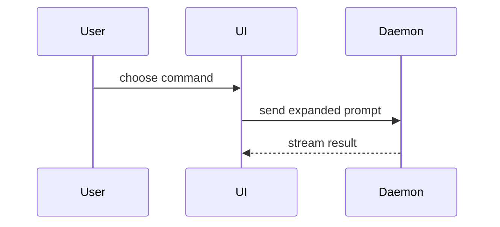

# Presentation reference

This reference adapts the Markdown-native presentation examples and selection
guidance from HumanLayer's `show-me` skill:

- Source: https://github.com/humanlayer/skills/blob/3c2629142c5d437428269b1b722b08c0b87f574d/plugins/show-me/skills/show-me/SKILL.md
- Fixed upstream commit: `3c2629142c5d437428269b1b722b08c0b87f574d`
- License: MIT, Copyright (c) 2026 HumanLayer. See
  [LICENSE.show-me](LICENSE.show-me) for the full license text.

## Select the presentation

After researching the code and drawing the component boundary, treat this file
as a palette, not a checklist. Choose prose-only or exactly one view that makes
the key point clear. Each table, diagram, pseudocode block, tree, diff, and
complete code-shape block is one view. When reproducible output is required,
use that output as the view and explain the algorithm and configuration in
prose. For a change or migration page, use one fenced diff as the sole view.
Stop after choosing; combining formats obscures the mental model.

The chosen view belongs inline in the component page, beside the short text it
supports. Standalone HTML, SVG, generated diagrams, raw HTML or JSX, and other
visual artifacts are outside this skill. Keep only the calls, files, props,
states, and boundaries needed for the page's reader question.

The examples below demonstrate presentation shape only. They are not evidence
about the repository being documented. Every label, edge, path, code fragment,
state transition, and behavioural example in an authored page must be verified
against that repository, with valid `path:line` evidence for load-bearing claims.

## Pseudocode

Use pseudocode to expose an algorithm or decision sequence without incidental
syntax.

```text
on(save)
  if content is unchanged
    return cached result
  write new content
  return fresh result
```

## Call tree

Use a call tree for runtime ownership and control flow. Stop once deeper calls no
longer help explain this component.

```text
submitForm
  createSession
    persistPrompt
    launchAgent
  navigateToSession
```

## Component tree

Use a component tree for UI structure. Include only state and module boundaries
that matter to the component's mental model.

```tsx
<SessionPage> (apps/example/src/routes/session.tsx)
  useSessionEvents()
  <SessionToolbar>
    <RunSkillButton> (packages/ui)
```

## File responsibility tree

Use a shallow file tree when responsibility and ownership across files are the
point. Describe responsibilities rather than inventorying the directory.

```text
src/
├── commands/       parses user actions
├── sessions/       owns session state
└── transport/      sends API requests
```

## Mermaid

Use Mermaid for interaction, control flow, or data flow whose relationships are
clearer as a diagram. Keep it small enough to understand with the adjacent prose.
In a `stateDiagram`, omit `[*]` start and end nodes unless the repository
explicitly defines those lifecycle facts and the adjacent prose cites them.
Tuple order, terminal-state detection, and conventional diagram decoration do
not establish an initial or final state. Apply the same evidence rule to every
branch and edge.



## Diff views for changes and migrations only

Use a diff only when the page documents a change or migration and the surrounding
shape already exists. The diff is the page's sole table or fenced block: write
formulas, old/new values, and supporting snippets as inline code or prose. Before
finishing, search the page for every fence and table separator and remove all but
the one `diff` block. A page describing only the current component uses a
current-state view instead. Match the diff family to what changes.

### Component diff

```diff
 <SessionPage>
   useSessionEvents()
   <SessionToolbar>
+    <RunSkillButton />
   <SessionTimeline>
+    <SkillResultCard />
```

### File diff

```diff
 src/
 ├── commands/
+│   └── show-me.ts       expands the slash command
 ├── sessions/
-└── transport.ts
+└── transport/
+    ├── client.ts
+    └── stream.ts
```

### Call diff

```diff
 submitForm
   createSession
     persistPrompt
+    expandSkillMention
     launchAgent
-  navigateToSession
+  navigateToSession
+    subscribeToEvents
```

### State diff

```diff
 on(save)
-  write content
+  if content is unchanged
+    return cached result
+  write new content
+  invalidate cache
```

## Complete code block

Show complete real code when most of the block is new, omitted context would hide
ownership or order, or the reader needs a copyable target shape. Keep the block
to the smallest complete unit that meets that need.

```ts
function expandSkill(command: string): string {
  const skillName = command.slice(1)
  return `use the ${skillName} skill`
}
```
